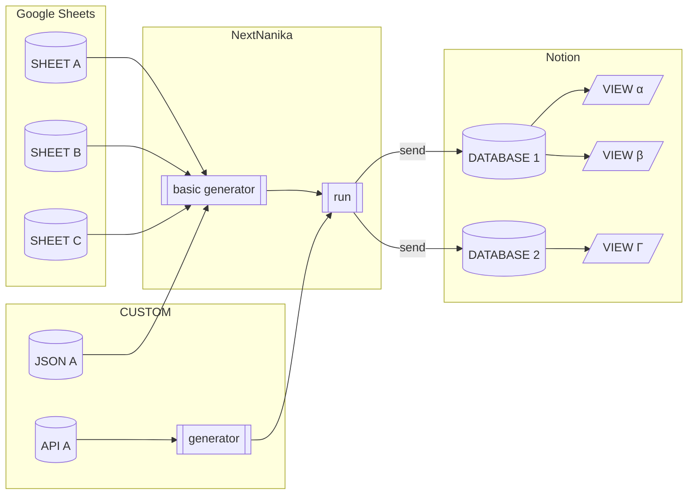

と、いうようなことを思い付いたので試してみたくなりました。

しかし、Notion の機能だけでは「繰り返しタスクを目一杯展開しておく」のは難しいのでコードを書く必要がある。どうせやるなら「時刻表だけでなく汎用的に使えるライブラリーにしてみた」というのが今回の話です。

## 時刻表になるとは

見ていただくのが早いと思うので、ここではスクリーンショットなど。内容については後述します。

**図 1-1 時刻表データベースのビューをダッシュボード風に表示**


汎用的にと風呂敷を広げたのでそれ以外の例も挙げてみます。

**図 1-2 各種イベントを含めた時間割を Notion カレンダーで表示**


## ライブラリーの概要

時刻表などは「細かい繰り返しのタスクを集めたもの」と捉えることができます。[Notion 標準でも繰り返しのタスクを扱う方法](https://www.notion.so/ja/help/database-templates)はありますが、「事前にページを作成できない」「休日などを設定できない」ようなので GAS でライブラリーを作成しました。

@[card](https://github.com/hankei6km/gas-notion-next-nanika)

このライブラリーを使うと事前に定義しておいた開始時刻などをもとに、特定の期間内の開始時刻(と終了時刻)をすべて計算し Notion のデータベースへページとして送信します。

時刻などの定義は基本的に Google スプレッドシートを使っていますが、独自の JavaScript ジェネレーターを指定できるので、やりようによっては外部 API との連携も可能です。



なお、今回は主に時刻表と時間割を題材にしていますが、それら専用のライブラリーとならないようにしたので他の用途にも応用できるかと思います。 (そのような感じで、用途は限定したくなかったのでライブラリー名に「何か」を含めています)

## 時刻表風にしてみる

駅やバス停にあるような表形式のものは難しいので、いわゆるリアルタイム時刻表風なリスト表示にする場合です。

手順についてはライブラリーの README に記述してあるので、ここでは特徴的な部分のみ抜き出します。

時刻表のデータは Google スプレッドシートで入力するようになっています。ここで必要なのは発車時刻の `HH:MM` と「急行か？」などの種別です。よって、時刻表から普通に転記できるかと思います。

**図 3-1 時刻表を Google スプレッドシートで入力**


あとは Notion の設定やスクリプトのコードを書いて定期実行するとなんだかんだで時刻表のデータベースが完成します。

**図 3-2 Notion データベースに日時付きのページが追加されていく**


データベースができてしまえばダッシュボード風なページにビューを配置したりモバイル版で利用したりできます。

**図 3-3 モバイル版でリアルタイム時刻表風に表示**


だいたいは良い感じなのですが、時刻表として使う場合「ビューがリアルタイムに更新されない」という問題があります。とくにモバイル版はリロードも面倒で、使い始めの頃は「ちょっと時間あるからコンビニ寄ってこ」と使っていたら、ビューの更新を忘れていて乗り遅れたこともありました。

::: message

休日については Google カレンダーの「日本の祝日」カレンダーを使うことで対応しています。

しかし、2024 年の夏頃に祝日カレンダーの仕様が変更されたようで、一般的に休日ではないイベントも祝日カレンダーに登録されています。

いくつか対応方法を用意しましたが、以下を参考に「日本の祝日カレンダー」を作り直し、カレンダー ID を指定するのが簡単かと思います。 (指定方法は README の「[任意の休日指定](https://github.com/hankei6km/gas-notion-next-nanika#%E4%BB%BB%E6%84%8F%E3%81%AE%E4%BC%91%E6%97%A5%E6%8C%87%E5%AE%9A)」に記載してあります)

@[card](https://qiita.com/sakaimo/items/0a0a31697dd821e775cd)

今後、Google の考える「日本の休日」がどうなるか不安な場合は(コードを作ることになりますが)別のソースからも休日を設定できます。詳しくは README の「[長期休暇や定期的なイベントなど](https://github.com/hankei6km/gas-notion-next-nanika#%E9%95%B7%E6%9C%9F%E4%BC%91%E6%9A%87%E3%82%84%E5%AE%9A%E6%9C%9F%E7%9A%84%E3%81%AA%E3%82%A4%E3%83%99%E3%83%B3%E3%83%88%E3%81%AA%E3%81%A9)」の「`opts.dayKindGetter` にロジックをもたせる」などを参照してください。 (頑張れば `.ics` などを使うとかもいけるかと思います)

:::

## 時間割風にしてみる

こちらもスプレッドシートで開始と終了時刻を入力することでそれっぽいデータベースを作成できます。

**図 4-1 時間割を Google スプレッドシートで入力**


時間割の場合は件数(ページ数)が少ないので定期実行ではなく一括で作成しておくと良いかと思います。

**図 4-2 時刻表を Notion カレンダーで表示**


また、cleanup(古いページを削除)しないでおくと、ページにメモや画像などを記録できて便利かなとも思っています。 (時間割としてはほとんど使っていないので、あくまでも「便利なんじゃないかな」という程度ですが)

**図 4-3 ページを**[**レイアウト機能**](https://www.notion.so/ja/help/layouts)**で整えてノート風に利用(範囲プロパティから下を受講時に入力しているという体の画像)**


**図 4-4 確認用のビューを作成**


あとは、設定を少し頑張ると、長期休暇や定期的なイベントなどに対応できるようにもなっています。

**図 4-5 独自の休暇カレンダーがある場合にも対応**


**図 4-6 コードを記述することで月末のイベントなどにも対応**


## 応用

いまのところ他の「何か」を具体的には思い付いてませんが、Notion の各種テンプレートに自動でタスク的なものを作成すると便利そうかなと思っています。

たとえば、[Notion の配布している習慣トラッカー](https://www.notion.so/templates/simple-habit-tracker-mobile)のチェック用ページの繰り返しを平日のみにする場合、以下のようになります。 (習慣トラッカーを使ったことはないので休日を除外して良いのかはわかりませんが、その辺はサンプルということでご勘弁を)

*   テンプレートから習慣トラッカーを作成

*   データベーステンプレートの「繰り返し」をオフ

*   データベーステンプレートを開き「作成日時」プロパティを以下のように変更

    *   名前を「開始日時」へ変更
    *   種類を「日付」へ変更

以下のようなスクリプトを定期的に実行すると開始日時が `07:00` のページが平日のみ追加されていきます。 (時刻指定の件数が少ないのでスプレッドシートは使わずに配列リテラルからジェネレーターを作成しています)

**リスト 5-1 習慣トラッカーにページを追加するスクリプト**

```javascript
async function start() {
  const props = PropertiesService.getScriptProperties()
  const apiKey = props.getProperty('NOTION_API_KEY')
  const databaseId = props.getProperty('NOTION_DATABASE_ID')

  const client = NextNanika.makeClient({ auth: apiKey })
  const generators = [
    NextNanika.makeBasicTimeRecGenerator([
      {
        dayKind: [],
        recs: [
          { name: '@date', start: { hh: 7, mm: 0 } },
        ]
      },
      {
        dayKind: ['SAT', 'SUN', 'HOL'],
        recs: [
        ]
      },
    ], [])
  ]
  const dayKindGetter = NextNanika.makeDayKindGetter(['ja.japanese.official#holiday@group.v.calendar.google.com'])
  await NextNanika.run(client, {
    databaseId,
    timeRecGenerator: generators,
    propNames: {
      name: '日付',
      time: '開始日時',
      tags: []
    },
    dayKindGetter,
    daysToProcess: 1,
    skipCleanup: true
  })
}
```

**図 5-1 平日のみページが追加される**


ただし、この方法の場合以下のようなデメリットもあります。

*   タイムスタンプの表示形式を指定できない

*   データベーステンプレートの内容を利用できない

    *   特定のプロパティに値を指定されている場合
    *   本文に内容が記述されている場合

## おわりに

GAS のライブラリーで繰り返し用のタスク(ページ)を事前作成しておくことで、Notion を時刻表などにしてみました。

いまどきは専用のサービスを使う方がよさげですが、Notion を利用する方法もビューなどで柔軟に使えるのでこれはこれで良いかなということで。
