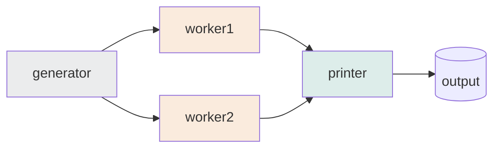
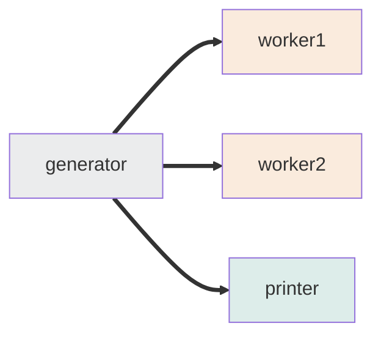
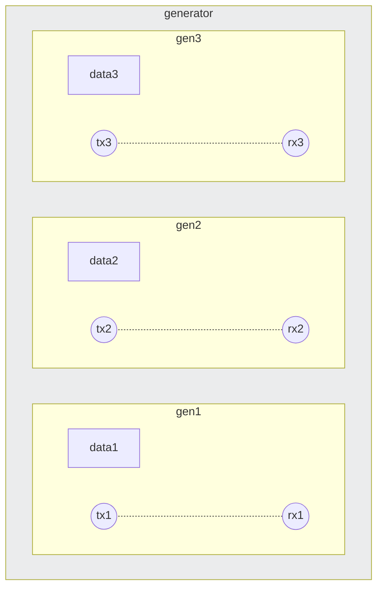
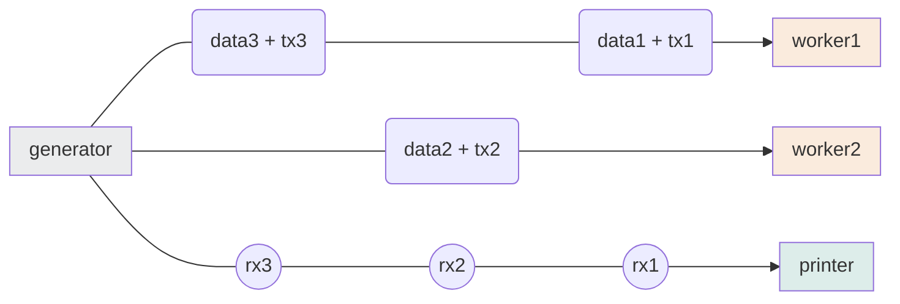
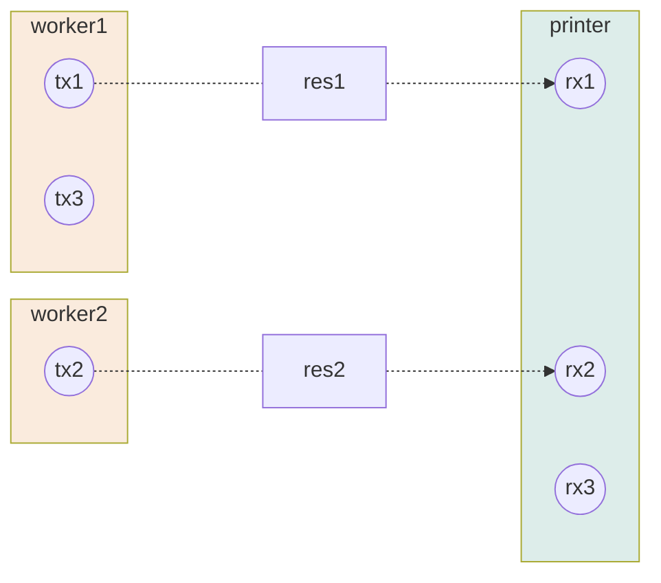

先日、Rust の勉強用に[テキスト行をクオートするツール](https://github.com/hankei6km/xquo)を作ったのですが、これには「並列処理を有効化すると行の順番が保持されない」という残念な点があります。

そこで「Go の channel で使われている手法」を参考にして出力の順番を保持されるようにしてみました。

## channel で channel を送信する(chan chan)

Go では順番保持などに「channel で channel を送信する手法」が知られています。

@[card](https://qiita.com/hogedigo/items/15af273176599307a2b2)

今回は上記記事の「[使用例 4: 順序の保証](https://qiita.com/hogedigo/items/15af273176599307a2b2#%E4%BD%BF%E7%94%A8%E4%BE%8B-4-%E9%A0%86%E5%BA%8F%E3%81%AE%E4%BF%9D%E8%A8%BC)」を参考にしてみたいと思います。

## 出力の順番を保持する方法

前述の記事では「レコード 1 件につき 1 回非同期処理を行う」ことが前提になっていたので、作成したツールとは少し構造が異なっています。

そこで、以下のようなワーカースレッドを利用した形態で出力の順番が保持される方法を考えてみます。

**図 2-1 ワーカースレッドの処理概要**



### スレッド間の channel 設定

まず、最初にジェネレータースレッドから各スレッドへメッセージを送信するための channel を設定します(ワーカースレッドからプリンタースレッドへは設定しません)。



### データと channel の生成

処理が開始されたら、ジェネレータースレッドはデータ(`data`)と対応する channel (`tx` + `rx`)を順次生成します。



### ジェネレータースレッドからの送信

`data` + `tx` のセットをワーカースレッドへ割り振り、`rx` はプリンタースレッドへ順次送信します。



### ワーカースレッドで処理しプリンタースレッドへの送信

ワーカースレッドは `data` を処理した後、`tx` を使って結果(`res` )をプリンタースレッドで待機している `rx `へ送信します。



このときプリンタースレッドでは「ジェネレータースレッドから `rx` を受けとった順番で」`res` を受信します。

もしも `data3` の処理が先に完了していても、`rx2` の受信が終わっていなければループがブロックされるので、`rx3` の受信が追いこすことはありません。

以上が順番を保持する方法になります。

## 実装してみる

実際に動作するコマンドを作成しました。

@[card](https://github.com/hankei6km/test-rust-chan-chan)

1.  ジェネレータースレッドは `0..20` の値を生成
2.  ワーカースレッドでは値を 10 倍してから `String` へ変換、このとき 0.5 秒± 0.001 秒でスリープする
3.  プリンタースレッドは変換結果を受信し表示

引数なしで実行すると前述の **図 2-1** のような通常の並列処理で実行されます。

**図 3-1 通常の処理では出力の順番は保持されない**

```shell-session
$ ./target/x86_64-unknown-linux-musl/release/test-rust-chan-chan
0
10
20
30
40
50
70
80
60
90
100
130
110
120
140
150
170
160
180
190
```

`-e` を指定すると chan chan を利用した並列処理で実行されます。

**図 3-2 chan chan では出力の順番が保持される**

```shell-session
$ ./target/x86_64-unknown-linux-musl/release/test-rust-chan-chan -e
0
10
20
30
40
50
60
70
80
90
100
110
120
130
140
150
160
170
180
190
```

:::details (ソースコード)

```rust:src/normal.rs
use std::{sync::mpsc, thread};

use crossbeam_channel::bounded;

use crate::Wait;

pub fn proc() {
    let (out_tx, out_rx) = bounded::<i32>(0);
    let (in_tx, in_rx) = mpsc::sync_channel::<String>(0);

    // generator thread
    thread::spawn(move || {
        for i in 0..20 {
            out_tx.send(i).unwrap();
        }
    });

    // worker thread
    for _i in 0..5 {
        let out_rx = out_rx.clone();
        let in_tx = in_tx.clone();
        thread::spawn(move || {
            let mut w = Wait {
                rng: rand::thread_rng(),
            };
            for i in out_rx {
                w.wait(i);

                // compute in worker
                let out = (i * 10).to_string();

                in_tx.send(out).unwrap();
            }
        });
    }
    drop(in_tx);

    // prrinter loop in main thread
    for i in in_rx {
        println!("{}", i);
    }
}
```

```rust:src/chanchan.rs
use std::{sync::mpsc, thread};

use crossbeam_channel::{bounded, Receiver, Sender};

use crate::Wait;

struct ChanChanTx<T, U> {
    payload: T,
    tx: Sender<U>,
}
struct ChanChanRx<U> {
    rx: Receiver<U>,
}

pub fn proc() {
    let (out_tx, out_rx) = bounded::<ChanChanTx<i32, String>>(0);
    // 以下の channel の容量を増やすと `normal.proc()` に近い実行時間となる(オーバーヘッド分は遅くなる)
    let (in_tx, in_rx) = mpsc::sync_channel::<ChanChanRx<String>>(0);

    // generator thread
    thread::spawn(move || {
        for i in 0..20 {
            let (tx, rx) = bounded::<String>(0);
            out_tx.send(ChanChanTx { payload: i, tx }).unwrap();
            in_tx.send(ChanChanRx { rx }).unwrap();
        }
    });

    // worker thread
    for _i in 0..5 {
        let out_rx = out_rx.clone();
        thread::spawn(move || {
            let mut w = Wait {
                rng: rand::thread_rng(),
            };
            for i in out_rx {
                w.wait(i.payload);

                // compute in worker
                let out = (i.payload * 10).to_string();

                i.tx.send(out).unwrap();
            }
        });
    }

    // prrinter loop in main thread
    for i in in_rx {
        println!("{}", i.rx.recv().unwrap());
    }
}
```

:::

コードの内容的には前節のとおりですが、Rsut で記述するときの補足など。

channel で送信される channel は [crossbeam\_channel](https://crates.io/crates/crossbeam-channel) を利用しています。

@[card](https://crates.io/crates/crossbeam-channel)

これは mpsc の [`Reciver`](https://doc.rust-lang.org/std/sync/mpsc/struct.Receiver.html) は Trait Implementations に `!Sync` が含まれるので、そのままだと `send` できないことによります。よって、[crossbeam\_channel](https://crates.io/crates/crossbeam-channel) を利用しています[^use-mpsc]。

[^use-mpsc]: mpsc を利用する場合は `Arc` と `Mutex` を使うことになります。参考:「[Rust入門](https://zenn.dev/mebiusbox/books/22d4c1ed9b0003) の Chapter 18 並列処理」「[Rustにおけるスレッド間でのデータ共有とstd::thread::scope](https://zenn.dev/toru3/articles/ce9232f53c47c8)」

**図 3-3 !Sync が含まれる**


また、ジェネレータースレッドからファンアウト的な処理を行うために利用していますが、これは chan chan とは関係なく通常処理でも同じです。

@[card](https://qiita.com/termoshtt/items/b4561180894104c1c4c2)

**図 3-4 該当部分の抜粋**

```rust
use crossbeam_channel::{bounded, Receiver, Sender};

// snip ...

struct ChanChanTx<T, U> {
    payload: T,
    tx: Sender<U>,
}
struct ChanChanRx<U> {
    rx: Receiver<U>,
}

pub fn proc() {
    let (out_tx, out_rx) = bounded::<ChanChanTx<i32, String>>(0);
    let (in_tx, in_rx) = mpsc::sync_channel::<ChanChanRx<String>>(0);

    // generator thread
    thread::spawn(move || {
        for i in 0..20 {
            let (tx, rx) = bounded::<String>(0);
            out_tx.send(ChanChanTx { payload: i, tx }).unwrap();
            in_tx.send(ChanChanRx { rx }).unwrap();
        }
    });

    // snip ...
```

あとは channel の種類ですが、速度的な条件確認のために容量を指定できる channel を使っています(とりあえずは全て `0 `を指定しています)。

*   mpsc - sync\_channel(0)
*   crossbeam\_channel - bounded(0)

## 処理時間の増加

chan chan を使った場合「channel 生成と send 回数増加」のオーバーヘッドは予想されまますが、ここでは処理フローの構造的な要因による処理時間の増加について考えてみます。

まず、前述の処理の場合、計算上の最速は以下のようになると予想されます(今回はワーカースレッドが 5 つ稼働する設定にしてあります)。

    ワーカースレッド内のスリープ時間 * 生成されるデータ数 / ワーカースレッドの数
    = ほぼ0.5秒 * 20 / 5 = ほぼ 2.0 秒

実際はここに各種オーバーヘッドなどが加算されますが、今回は待ち時間をスリープによって疑似的に作り出しているだけなのでこの数値付近に落ち着くと思われます。

### 各 channel の容量が 0 の場合

まずは各 channel の容量が 0 (send が同期的に動作する)状況で試してみます。

**図 4-1 実行結果**

```shell-session
# 通常の処理
$ time ./target/x86_64-unknown-linux-musl/release/test-rust-chan-chan > /dev/null

real    0m2.001s
user    0m0.003s
sys     0m0.000s

# chan chan による処理
$ time ./target/x86_64-unknown-linux-musl/release/test-rust-chan-chan -e > /dev/null

real    0m5.001s
user    0m0.005s
sys     0m0.000s
```

|           | 実行時間(秒) |
| --------- | ------- |
| 通常処理      | 2.001   |
| chan chan | 5.001   |

通常の処理はほぼ計算した値になっていますが、chan chan の方では遅くなっています。

これはジェネレータースレッドからプリンタースレッドへ送信する channel で待ちが発生し、ワーカースレッドを上限まで使えなくなるためです。 ( プリンタースレッドが `rx` を受け取ってくれないとジェネレータースレッドは新しい値を生成できない)

### ジェネレータースレッド / プリンタースレッド間 channel の容量を増やす

今度は待ちが発生している channel の容量を +1 しながら試してみます。

**リスト 4-1 変更する箇所**

```rust:src/chanchan.rs
// post 関数の以下の値を変更し build し直す
let (in_tx, in_rx) = mpsc::sync_channel::<ChanChanRx<String>>(1);
```

**図 4-2 値を変更したら build して実行**

```shell-session
$ cargo build --target=x86_64-unknown-linux-musl --release
   Compiling test-rust-chan-chan v0.1.0 (/workspaces/test-rust-chan-chan)
    Finished release [optimized] target(s) in 6.54s

$ time ./target/x86_64-unknown-linux-musl/release/test-rust-chan-chan -e > /dev/null

real    0m3.502s
user    0m0.000s
sys     0m0.007s
```

| 1     | 2     | 3     | 4     | 5     | 6     |
| ----- | ----- | ----- | ----- | ----- | ----- |
| 3.499 | 2.500 | 2.002 | 2.003 | 2.002 | 2.002 |

容量を増やすことで計算上の値に到達しました。なお容量 3 で到達していますが、これはジェネレータースレッドのループとプリンタースレッドの受信が遅延なく実行されるためです[^slow-generator]。実際には各種オーバーヘッドがあるので、実環境で確認しながら調整することになるかと思います。

[^slow-generator]: 試しにジェネレータースレッドのループを sleep などで遅くすると容量 4 にしないと到達しなくなります。

### 処理時間の長い値を混ぜてみる

上記の場合、各データの処理時間はほぼ同じなので理想的な並列処理になります。

ここで、データの値が偶数のときは 3 秒待つようにしみます。

**リスト 4-2 変更する箇所**

```rust:src/lib.rs
impl Wait {
    pub fn wait(&mut self, _i: i32) {
        // 以下のように変更し build し直す
        let range = if _i % 2 == 0 { 3000..3001 } else { 499..501 };
        // let range = 499..501;
        thread::sleep(Duration::from_millis(self.rng.gen_range(range)));
    }
}
```

**図 4-3 実行結果**

```shell-session
# 通常の処理
$ time ./target/x86_64-unknown-linux-musl/release/test-rust-chan-chan > /dev/null

real    0m7.999s
user    0m0.004s
sys     0m0.001s

# chan chan による処理(channel の容量は 5 にしてあります)
$ time ./target/x86_64-unknown-linux-musl/release/test-rust-chan-chan -e > /dev/null

real    0m12.003s
user    0m0.002s
sys     0m0.003s
```

|                 | 実行時間   |
| --------------- | ------ |
| 通常の処理           | 7.99   |
| chan chan による処理 | 12.003 |

実行してみると chan chan の方が遅くなります。

これは chan chan の処理では遅いデータがある場合、後ろに速いデータがあっても追い越せないことが原因です。

通常の処理では以下のように速いデータが先に表示されています(効率よく並列処理が実行されている)。

**図 4-4 データの表示**

```shell-session
$ ./target/x86_64-unknown-linux-musl/release/test-rust-chan-chan
30
10
50
70
0
40
20
110
90
60
130
150
80
170
100
120
190
140
160
```

## channel 生成と send 回数増加によるオーバーヘッド

冒頭のコマンドを chan chan 対応してみたので、変更前と後の実行時間を比べてみます。

実行環境やデータなどについては「[Rust で jemalloc を使ったら並列処理が速くなった](https://zenn.dev/hankei6km/articles/using-jemalloc-in-rust-speeds-up-parallelism#jemalloc-%E7%84%A1%E3%81%97%E3%81%A8%E6%9C%89%E3%82%8A%E3%81%A7%E3%81%AE%E6%AF%94%E8%BC%83)」で調べたときと同じです。

ただし、以下のように条件がそろっていない部分もあるので目安程度に見てください。

*   channel は容量を指定するものへ変更
*   異なる日時に Codespaces で実行している
*   システムアロケーター(jemalloc 無し)はその他のオーバーヘッドが大きい(処理データに影響されやすい)

結果は以下のとおりです。musl の jemalloc 無しでは chan chan の方が速いときも多くありますが[^data]、基本的には遅くなります。やはり channel 生成と send が増えた分のオーバーヘッドはあるようです。

[^data]: テストデータを差し替えると chan chan の方が遅くなるときもあるので、スレッドがロックされるタイミングなどの影響かなと予想しています。

**表 5-1 chan chan 対応前の結果**

|                                        | 1      | 2      | 3      | 4      | 5      | 6      |
| -------------------------------------- | ------ | ------ | ------ | ------ | ------ | ------ |
| x86\_64-unknown-linux-musl jemalloc 無し | 23.972 | 42.668 | 39.447 | 43.407 | 56.113 | 58.653 |
| x86\_64-unknown-linux-musl jemalloc 有り | 11.903 | 6.724  | 6.112  | 5.889  | 5.907  | 5.943  |
| x86\_64-unknown-linux-gnu  jemalloc 無し | 11.075 | 24.725 | 26.267 | 30.876 | 31.399 | 31.864 |
| x86\_64-unknown-linux-gnu  jemalloc 有り | 8.566  | 4.919  | 4.829  | 4.77   | 4.732  | 4.71   |

**表 5-2 chan chan 対応後の結果**

|                                        | 1      | 2      | 3      | 4      | 5      | 6      |
| -------------------------------------- | ------ | ------ | ------ | ------ | ------ | ------ |
| x86\_64-unknown-linux-musl jemalloc 無し | 21.229 | 33.035 | 43.952 | 54.154 | 55.481 | 57.397 |
| x86\_64-unknown-linux-musl jemalloc 有り | 13.188 | 8.535  | 7.700  | 8.908  | 8.898  | 8.703  |
| x86\_64-unknown-linux-gnu jemalloc 無し  | 14.696 | 27.383 | 30.797 | 45.350 | 44.607 | 42.380 |
| x86\_64-unknown-linux-gnu jemalloc 有り  | 10.090 | 7.376  | 6.491  | 7.084  | 7.166  | 7.094  |

対策としては「メッセージを送信する回数を減らす = channel 生成数を減らす」ということになるかと思います。たとえば、今回のツールは 1 回のメッセージに含める行数を変更できるので、変更すると実行時間が短縮されます。

**図 5-1 ワーカースレッド数が 2 で 1000 行まとめて送信する設定で実行**

```shell-session
$ ./target/x86_64-unknown-linux-musl/release/xquo -h
xquo 0.2.0
Quote null splited lines for Bash command line

USAGE:
    xquo [OPTIONS] < /path/to/file

OPTIONS:
    -b, --bulk-lines <BULK_LINES>
            The number of lines bundled in a single bulk [default: 100]

    << snip >>

$ time ./target/x86_64-unknown-linux-musl/release/xquo -w 2 -b 1000 < tmp/tmp_large.txt > /dev/null

real    0m6.738s
user    0m13.899s
sys     0m0.293s
```

あとは、送信される channel を毎回生成するのではなく、再利用できれば効率よくなりそうな気もしています。が、そこまで試す元気はなかったです。

## おわりに

「channel で channel を送信することで出力の順番を保持する」を Rust で試してみました。

通常の処理に比べると遅くなる傾向にありますが、出力の順番が保持されるメリットは得られました。

[先に引用した記事](https://qiita.com/hogedigo/items/15af273176599307a2b2)にもあるように channel で channel を送信するパターンはいくつかあるので、他の方法も活用していければ考とえています。
