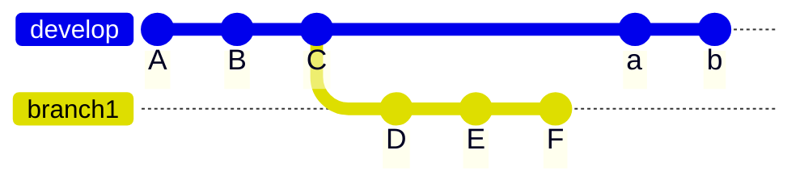
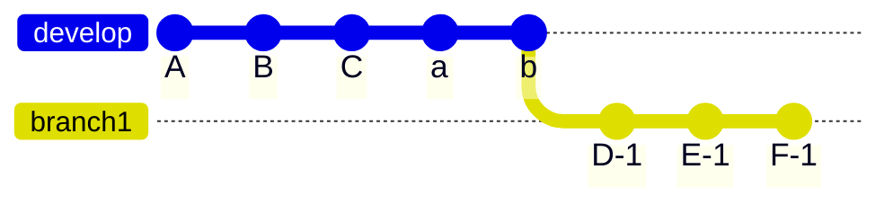
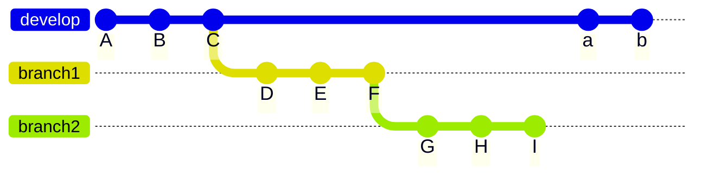
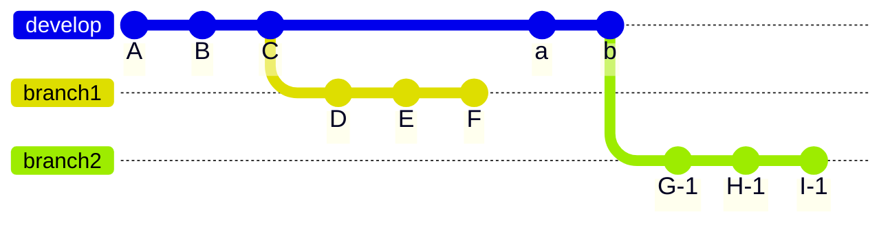
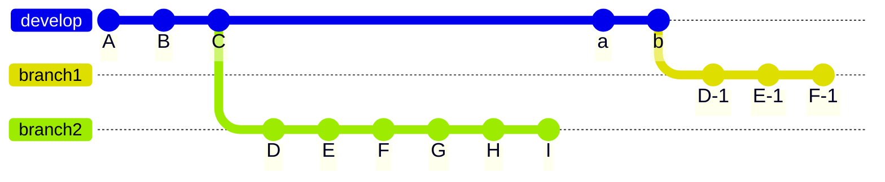
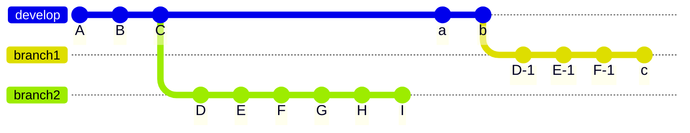
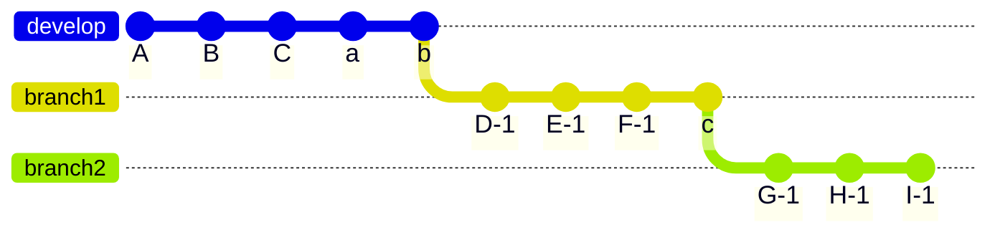
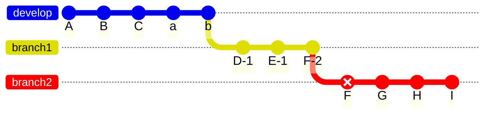
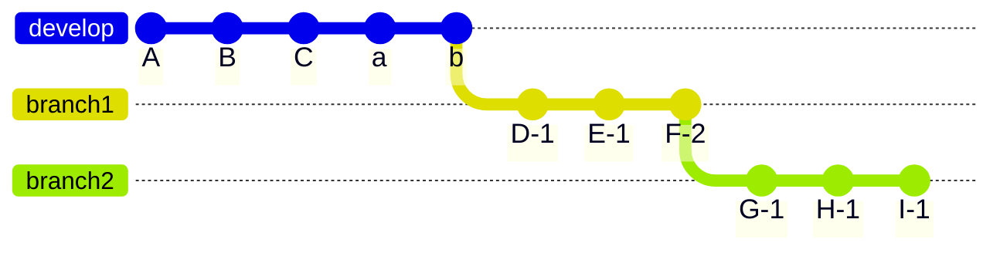

以前に [Gist で書いていたメモ](https://gist.github.com/hankei6km/4301ebc7e320b987de1f7a5b0acb994a#gistcomment-4334778)にコメントを頂いて知識が更新されたので、せっかくなので Zenn にも転載しようかと。 ([Mermaid](https://mermaid-js.github.io/mermaid/#/) の [Gitgraph Diagrams](https://mermaid-js.github.io/mermaid/#/gitgraph) を使ってみたかったというのもあります)

そのような感じで、たまに `--onto` を使おうとすると忘れているのでメモ。

<!-- textlint-disable -->

## 基本(普通に rebase)

これを



こうするには



以下のように `rebase` を使う。

```shell-session
$ git rebase develop branch1
```

現在のブランチが `branch1` だった場合はこうでも大丈夫。

```shell-session
$ git rebase develop
```

なお、実行するとコミット「`D` `E` `F`」のハッシュ値などは変更されます(この記事では変更されたコミットに枝番を付けます)。

## 例1

これを



こうするには



以下のように `--onto` を使う。

```shell-session
$ git rebase --onto develop branch1 branch2
```

意味としては、

*   `develop` へ付け替える
*   付け替えるのは `branch2`
*   `branch2` の上流(`branch2` の分岐元)は `branch1`

となります。

## 例2

これの `branch1` を `rebase` したら


こうなってしまった



### そのまま `branch2` も `rebase` する

`branch2` を新しい `branch1` へ `rebase` すると

```shell-session
$ git rebase branch1 branch2
warning: skipped previously applied commit <HASH値>
warning: skipped previously applied commit <HASH値>
warning: skipped previously applied commit <HASH値>
hint: use --reapply-cherry-picks to include skipped commits
hint: Disable this message with "git config advice.skippedCherryPicks false"
```

こうなる。


`rebase` のデフォルトの挙動では対象になるコミットの内容を読みとって比較します(詳細は[こちら](https://git-scm.com/docs/git-rebase#Documentation/git-rebase.txt---reapply-cherry-picks))。よって、`branch2` に含まれている「`D` `E` `F`」は「`D-1` `E-1` `F-1`」と同一として扱われるのでスキップされます。 (Gitst のコメントで教えてもらいました、ありがとうございます)

また、上記のスキップは `branch1` にコミットを追加していても機能します。

`branch2` の存在を忘れていて `branch1` を更新してしまった(コミット `c` ができている)



`branch2` の存在を思い出して `rebase` すると

```shell-session
$ git rebase branch1 branch2
warning: skipped previously applied commit <HASH値>
warning: skipped previously applied commit <HASH値>
warning: skipped previously applied commit <HASH値>
hint: use --reapply-cherry-picks to include skipped commits
hint: Disable this message with "git config advice.skippedCherryPicks false"
Successfully rebased and updated refs/heads/branch2.
```

コンフリクトがなければこうなる。



### `-onto` が必要な場合

`F-1` を `--amend` して `F-2` がで出来てしまった


この後に `rebase` すると `F` がスキップされないのでコンフリクトしやすい。



以下のように、`branch2` の分岐元としてコミット `F`(元の `branch1`)のハッシュ値(今回の例では `53c6b6` とする)を指定

```shell-session
$ git rebase --onto branch1 53c6b6 branch2
```

コンフリクトがなければこうなる。



<!-- textlint-enable -->
