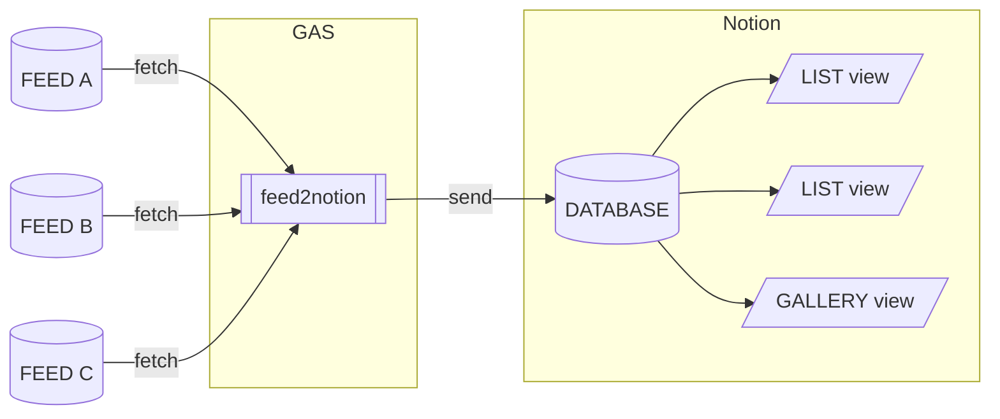

最近 [Notion] を使い始め、やはり色々とカスタイマイズしたくなりました。

最終的には [qfix-howm] の同じような感じで利用したいのですが、まずは RSS フィードを表示してみました(図 1 の右側のような感じ)。

▼ **図 1 試しに作ったダッシュボード風ページ**


## 何ができるようになるのか

[Google Apps Script] でスクリプトを作成し時間指定で実行しておくと、[Notion] のデータベースに RSS フィードの内容が送信されるようになります。



[Notion] 上では通常のデータベースとして扱えるので各種ビューを作成したり、検索ができます(description もプロパティ化してあるのでフィルターにもできます)。

▼ **図 1-1 ビューにより表示方法やフィルターを変更**


また、通知してほしいワードを登録しておくと「ワードを含む項目にユーザーメンションが追加」されます(結果として [Notion] から通知が行われます)。

▼ **図 1-2 インテグレーションからメンションされます**


## 使い方

詳細は以下のリポジトリの README に記述してあります。

@[card](https://github.com/hankei6km/gas-feed2notion)

ここでは基本的な手順のみ記載します。

1.  データベースの親となるページを作成(可能であれば通知を受け取るユーザーが作成すると設定が楽になります)
2.  [Notion] でインテグレーション(API KEY)を作成し上記ページから共有
3.  ローカルの PC からスクリプトを実行し [Notion] 上にデータベースを作成(スクリプトはリポジトリに含まれています)
4.  [Google Apps Script] でスタンドアロンのスクリプトを作成しライブラリーを実行するコードを記述

▼ **リスト 2-1 サンプルコード**

```js
function settings_() {
  const props = PropertiesService.getScriptProperties()
  const apiKey = props.getProperty('notion_api_key')
  const database_id = props.getProperty('database_id')
  const opts = {
    database_id,
    feeds: [{ name: 'feed name', url: 'feed url' }],
    limit: 10
  }
  return {
    apiKey,
    opts
  }
}

function feed2notion() {
  const settings = settings_()
  FeedToNotion.send(settings.apiKey, settings.opts)
}
```

スクリプトエディターから `feed2notion` 関数を実行と `feeds` 配列に記述した RSS フィードの内容を [Notion] へ送信します。

なお、外部サービスを利用するので初回実行時にはいつもの確認画面が表示されます。また、多くの場合は「このアプリは Google で確認されていません」が表示されるはずです。安全だと確信できたら「安全ではないページ」に移動してください。

▼ **図 2-1 初回実行時の警告**


## Transformer

[Notion] 上での表示はビューなどでカスタマイズできますが、そのときに「こういうプロパティがあれば楽なのに」ということも予想されます(例、フィード別にアイコン(emoji)を設定するなど)。

そのような場合、Transformer 関数(ジェネレーター関数)を作成することでページの作成などに介入できます。

たとえば、`og:image` の URL 取得や通知機能も Transformer によって実装しています。

この他、`yeild` する数は入力の数と一致する必要はないので、項目をスキップしたり複数に分割もできます。

▼ **リスト 3-1 通知機能のコード**

```ts
export function getWordsToMentionParamTeransFormer(
  words: (string | RegExp)[],
  userId: string
): FeedToNotion.ParamTransfomer {
  return function* (
    ite: Generator<[CreatePageParameters, FeedToNotion.FeedItem, string]>
  ): Generator<[CreatePageParameters, FeedToNotion.FeedItem, string]> {
    for (const [param, item, xmlText] of ite) {
      if (
        words.some(
          (w) =>
            item.title.match(w) ||
            item.description.match(w) ||
            item.feedName.match(w)
        )
      ) {
        param.children?.unshift({
          object: 'block',
          type: 'paragraph',
          paragraph: {
            rich_text: [
              {
                type: 'mention',
                mention: {
                  user: {
                    id: userId
                  }
                }
              }
            ]
          }
        })
      }
      yield [param, item, xmlText]
    }
  }
}
```

## おわりに

[Notion] を RSS フィードリーダーのようにする [Google Apps Script] 用ライブラリーを作ってみました。

数日使ってみた感想としては「自動的に既読にできない」「前後の記事に移動しにくい」という課題がありますが、ダッシュボード風なページで表示するとよい感じなっています。

Web クリッパーと併用してゆるく情報収集に使っていけたらなと考えています。

@[card](https://www.notion.so/ja-jp/web-clipper)

[Notion]: https://www.notion.so/

[qfix-howm]: https://sites.google.com/site/fudist/Home/qfixhowm

[Google Apps Script]: https://workspace.google.co.jp/intl/ja/products/apps-script/
