[Zenn](https://zenn.dev/zenn/articles/markdown-guide#%E3%83%80%E3%82%A4%E3%82%A2%E3%82%B0%E3%83%A9%E3%83%A0) や [GitHub](https://docs.github.com/en/get-started/writing-on-github/working-with-advanced-formatting/creating-diagrams#creating-mermaid-diagrams) の Markdown から利用できる [Mermaid](https://mermaid-js.github.io/mermaid/#/) には「[Git ブランチを表現する](https://mermaid-js.github.io/mermaid/#/gitgraph)」機能があります。

その機能を利用してみたところよい感じだったので、記述方法やカスタマイズについてなどを記事にしてみます。

## Git ブランチを表現するとは？

ドキュメントでブランチの説明などを読んでいると下記のような図(グラフ)を見かけるかと思います。

**図 1-1 AA によるブランチのグラフ**

    A---B---C---D  develop
             \
               E---F---G  topicA
                        \
                          H---I---J topicB

Mermaid の [Gitgraph Diagrams](https://mermaid-js.github.io/mermaid/#/gitgraph) を利用することにより、このような感じで表示できるようになります。

**図 1-2 Mermaid によるブランチのグラフ**

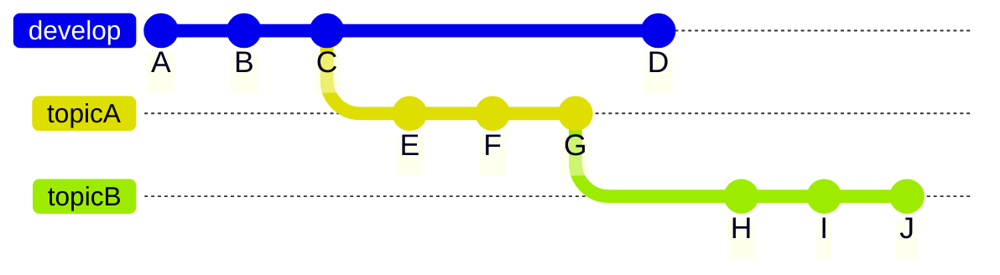

## 基本的な使い方

Mermaid 用コードブロックの先頭で `gitGraph` を記述し、Git のコマンドのような行を追加していきます。

**リスト 2-1 Mermaid での基本的な Gitgraph 記法**

    ```mermaid
    gitGraph
      commit
      commit
      commit
      branch topicA
      checkout topicA
      commit
      commit
      commit
      checkout main
      merge topicA
      commit
      branch topicB
      checkout topicB
      commit
      commit
      commit
    ```

**図 2-1 デフォルト設定で表示されるグラフ**

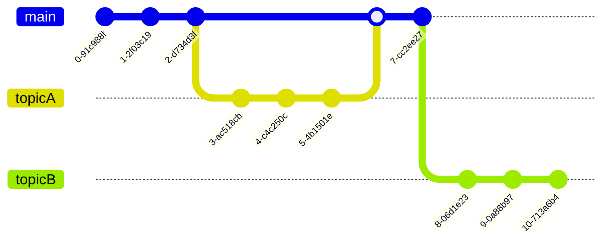

この時点でかなりよい感じですが、Commit ID(連番とハッシュ値)はソースが少しでも変わると変動してしまいました[^source]。

ドキュメント内で ID を利用する場合は明示的に指定しておくか、必要なければ非表示にしておくのがよいかと思います。

*   [Adding custom commit id](https://mermaid-js.github.io/mermaid/#/gitgraph?id=adding-custom-commit-id)
*   [Hiding commit labels](https://mermaid-js.github.io/mermaid/#/gitgraph?id=hiding-commit-labels)

[^source]: ためしにブランク文字を 1 つ追加しても変わりました。

**リスト 2-2 Commit ID を指定する**

    gitGraph
      commit id: "COMMIT-1"
      commit id: "COMMIT-2"
      commit id: "COMMIT-3"
      branch topicA
      checkout topicA
      commit id: "COMMIT-A-1"
      commit id: "COMMIT-A-2"

**図 2-2 Commit ID を指定したグラフ**

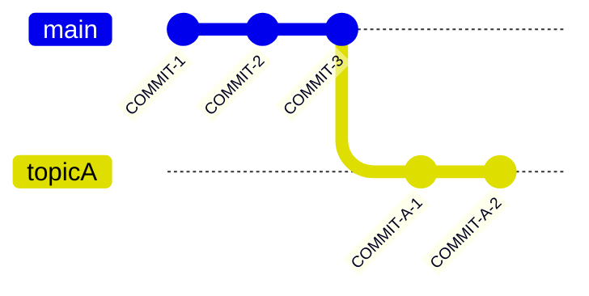

**リスト 2-3 Commit Label を非表示にする**

    %%{init: { 'gitGraph': { 'showCommitLabel': false } } }%%
    gitGraph
      commit
      commit
      commit
      branch topicA
      checkout topicA
      commit
      commit

**図 2-3 Commit Lael を非表示にしたグラフ**

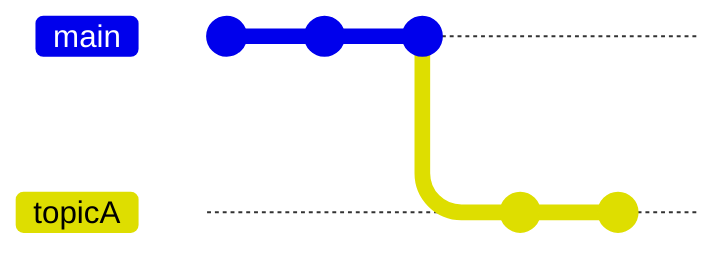

## カスタマイズ

実際に記事内で利用したときに「この辺は調整したい」という箇所がいくつかあったので、項目別にまとめてみました。

なお、カスタマイズは [Directives](https://mermaid-js.github.io/mermaid/#/directives) を使うことが多いのですが、詳細を知らなくても記述を見ればなんとなくわかると思います。ただし「`,` の扱いは厳しい」わりには「間違っていてもエラーにならないこともある(記述が無視される)」ので注意してください。

**リスト 3-1 OK**

    %%{init: { 'gitGraph': { 'showCommitLabel': false } } }%%

**リスト 3-2 NG(無視される)**

    %%{init: { 'gitGraph': { 'showCommitLabel': false, } } }%%

### テーマを変えたい

最終的には使わなかったのですが[^browser-mode]、やはり需要は高いかなということで。

[^browser-mode]: 「サービスによっては表示する環境(ブラウザーのモードなど)でデフォルトのテーマが変化する」ので色関連はあまり変更しないようにしました。

*   [Themes](https://mermaid-js.github.io/mermaid/#/gitgraph?id=themes)

**リスト 3-3 テーマを指定**

    %%{init: { 'theme': 'forest' } }%%
    gitGraph
      commit
      commit
      commit
      branch topicA
      checkout topicA
      commit
      commit
      commit
      checkout main
      merge topicA
      commit
      branch topicB
      checkout topicB
      commit
      commit
      commit

組み込みのテーマとしては次のものが利用できました。

*   `base`
*   `forest`
*   `dark`
*   `default`
*   `neutral`

**図 3-1 base**

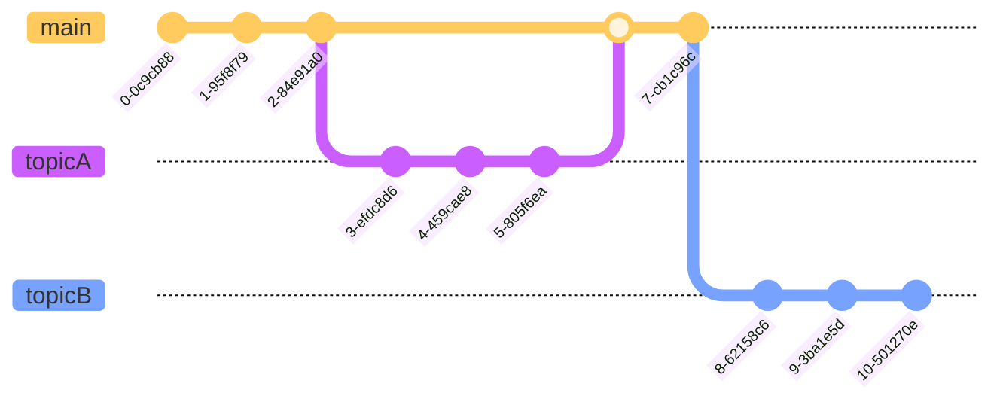

**図 3-2 forest**

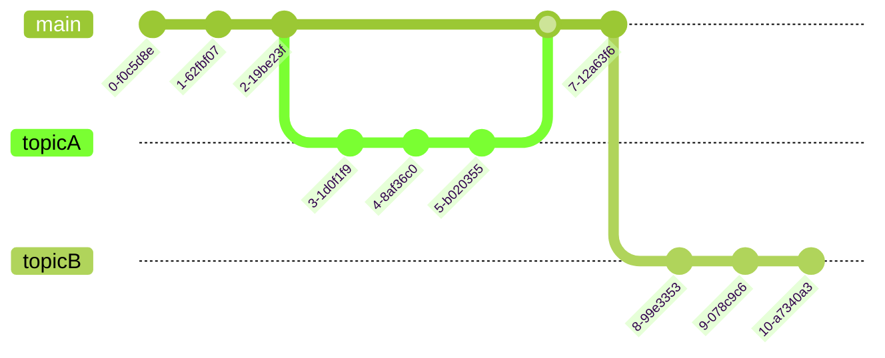

**図 3-3 dark**

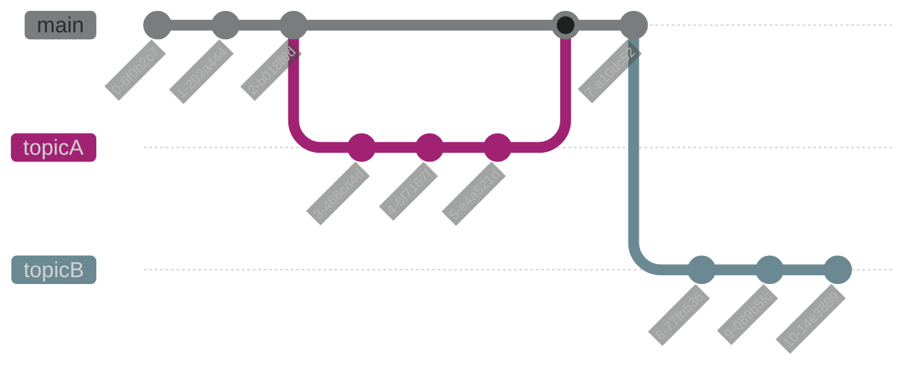

**図 3-4 default**

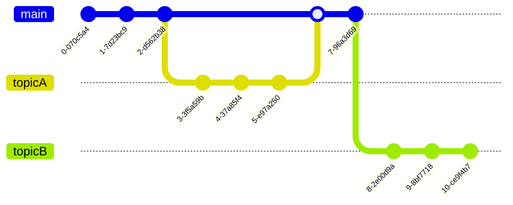

**図 3-5 neutral**

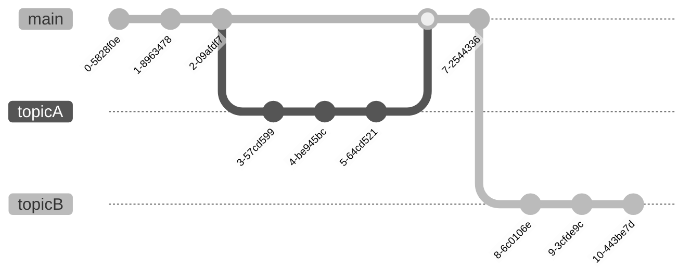

テーマを調整する場合は Directives で `themeVariables` を使います。

*   [Customize using Theme Variables](https://mermaid-js.github.io/mermaid/#/gitgraph?id=customize-using-theme-variables)

上図の `Dark` は Commit Label が見えないので調整してみます。

**リスト 3-4 Dark の Commit label を調整**

    %%{init: { 'theme': 'dark' ,'themeVariables': {
      'commitLabelColor': '#ffffff',
      'commitLabelBackground': '#ff0000'
    } } }%%

**図 3-6 dark の Commit Label を調整したグラフ**

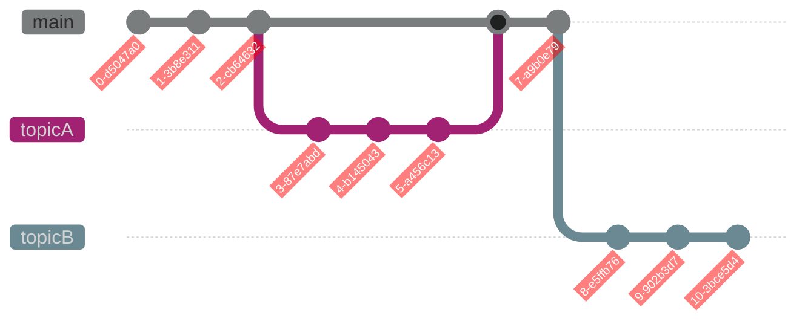

### コミットのラベルを見やすくしたい

デフォルトでは Commit ID を表示するために、フォントが小さめで斜めに回転されています。Commit ID を「`A` `B` `C`」のようにアルファベット 1 文字にしてしまうとちょっと見えにくいです。

**図 3-7 デフォルトではアルファベット 1 文字は見えにくい**

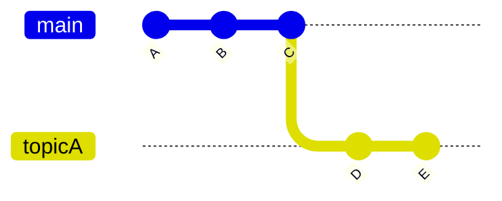

これを調整する方法です。

*   [Customizing Commit Label Font Size](https://mermaid-js.github.io/mermaid/#/gitgraph?id=customizing-commit-label-font-size)
*   [Commit labels Layout: Rotated or Horizontal](https://mermaid-js.github.io/mermaid/#/gitgraph?id=commit-labels-layout-rotated-or-horizontal)

**リスト 3-5 向きとフォントサイズを指定**

    %%{init: { 
     'gitGraph': { 'rotateCommitLabel': false},
     'themeVariables': { 'commitLabelFontSize': '18px' }
    } }%%

**図 3-8 向きとフォントサイズを指定したグラフ**

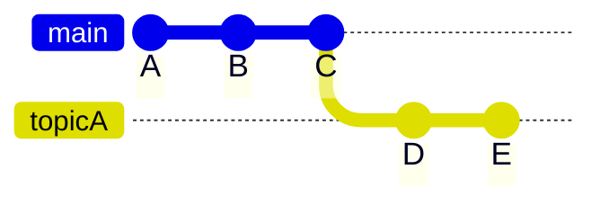

### デフォルトのブランチ名を変更したい

デフォルトは `main` になっていますが、これを変更する方法です。

*   [Customizing main branch name](https://mermaid-js.github.io/mermaid/#/gitgraph?id=customizing-main-branch-name)

**リスト 3-6 デフォルトブランチ名を指定**

    %%{init: { 
     'gitGraph': { 'mainBranchName': 'develop' }
    } }%%

**図 3-9 デフォルトブランチ名を指定したグラフ**

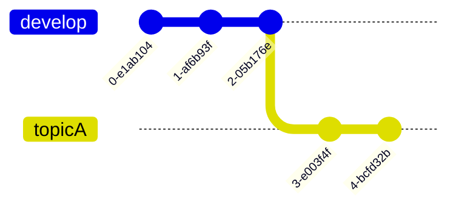

### ブランチの表示順を変更したい

ブランチの `rebase` につてい記述しているとブランチの表示順を変更したくなります。

*   [Customizing branch ordering](https://mermaid-js.github.io/mermaid/#/gitgraph?id=customizing-branch-ordering)

**図 3-10 デフォルトだと作成した順番で表示される**

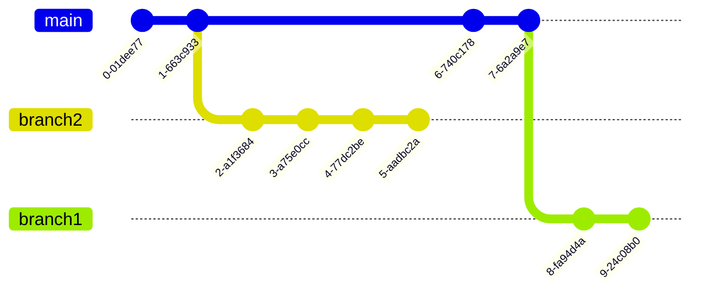

**リスト 3-7  表示順番を指定**

    gitGraph
      commit
      commit
      branch branch2 order:2
      checkout branch2
      commit
      commit
      commit
      commit
      checkout main
      commit
      commit
      branch branch1
      checkout branch1
      commit
      commit

**図 3-11 表示順番を指定したグラフ**

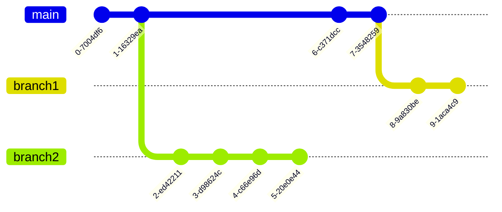

### コンフリクト風な表示にしたい

ちょっと特定の用途向けすぎですが、「`rebase` でコンフリクトした」的な表示が欲しかったので。

これ用の具体的な設定はないのですが、「赤色」「バツ印」で表示されているとそれっぽいだろうということで。

*   [Customizing branch colors](https://mermaid-js.github.io/mermaid/#/gitgraph?id=customizing-branch-colors)
*   [Modifying commit type](https://mermaid-js.github.io/mermaid/#/gitgraph?id=modifying-commit-type)

**リスト 3-8 ブランチの色とコミットタイプを設定**

    %%{init: { 
     'themeVariables': { 'git1': '#ff0000', 'gitBranchLabel1': '#ffffff' }
    } }%%
    gitGraph
      commit
      commit
      commit
      branch topicA
      checkout topicA
      commit type: REVERSE
      commit

**図 3-12 ブランチの色とコミットタイプを設定したグラフ**

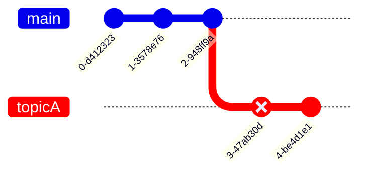

## どこで利用できる？

[Zenn](https://zenn.dev/zenn/articles/markdown-guide#%E3%83%80%E3%82%A4%E3%82%A2%E3%82%B0%E3%83%A9%E3%83%A0)[^zenn] の他に [GitHub ](https://docs.github.com/en/get-started/writing-on-github/working-with-advanced-formatting/creating-diagrams#creating-mermaid-diagrams)と [Nottion](https://twitter.com/notionhq/status/1475904428221759490) で表示されることを確認しました。基本的には Mermaid をサポートしているサービスなら表示されるはずですが、サービスによって若干の違いはあるようです。

[^zenn]: [こちらの記事](https://zenn.dev/cybozu_ept/articles/productivity-weekly-20221005)で知ったのですが Zenn では表示できない期間があったようです。この記事を書いている時点では対応されています。[mermaid.js の gitGraph が表示されない · Issue #446 · zenn-dev/zenn-community · GitHub](https://github.com/zenn-dev/zenn-community/issues/446)

たとえば、Zenn と GitHub では同じように表示されますが([これ](https://zenn.dev/hankei6km/articles/git-rebase-onto)と[これ](https://gist.github.com/hankei6km/4301ebc7e320b987de1f7a5b0acb994a)で確認)、Notion ではフォントサイズが適用されないなどの違いがありました。

**図 4-1  Notion ではフォントサイズが適用されなかった**


## プレビューなどの編集環境は？

私の場合、(Gitgraph Diagrams に限らず)Mermaid 関連は下記の方法で入力しています。どちらもプレビューと文法エラーは表示してくれるのでそれなりに編集できています。ただし、自動フォーマットは設定できていないので、インデントの扱いなどはちょっと不便です。

### VSCode

VSCode からマークダウンとして入力するときの用の拡張機能。

@[card](https://marketplace.visualstudio.com/items?itemName=bierner.markdown-mermaid)
@[card](https://marketplace.visualstudio.com/items?itemName=bpruitt-goddard.mermaid-markdown-syntax-highlighting)

**図 5-1 VSCode でのプレビュー表示とシンタックスハイライト**


**図 5-2 VSCode でのエラー表示**


### Notion

Notion はコードブロックで「分割」表示を選択するとコード入力とプレビュー表示を同時に使えます。

**図 5-3 Notion でのプレビュー表示とシンタックスハイライト**


**図 5-4 Notion でのエラー表示**


## おわりに

Mermaid の Gitgraph Diagrams を使って Git のブランチを表示してみました。

AA による表現も好きなのですが、やはり入力が少し手間です。

Gitgraph Diagrams を使うことでお手軽にわかりやすく、ドキュメント内に Git のブランチを表現できるかと思います。
