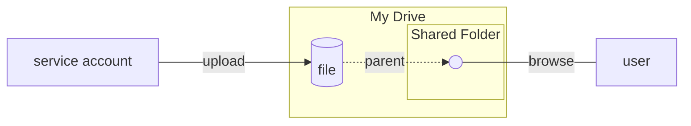
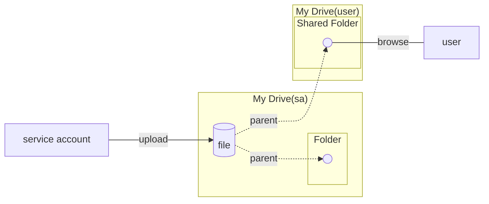
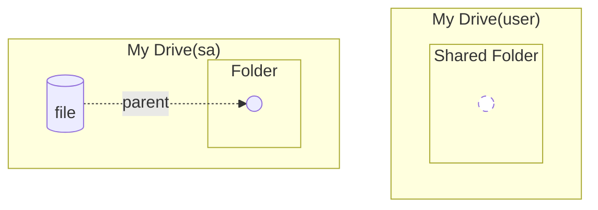

GitHub Actions から Google Drive API を使う場合「キーなし認証ができる状況ではサービスアカウントを利用するのが便利かな」と考え試しています。

その過程で少し勘違いしていたところがあったのでメモなど。なお確認は個人用のアカウント(エディション)で行っています。

## 勘違いしていた挙動

以下のような感じでサービスアカウントから(自分の)マイドライブへファイルをアップロードしようとしていました。

*   通常のユーザーがウェブ UI などでマイドライブ上にフォルダーを作成しサービスアカウントを編集者として共有する
*   スクリプトなどからサービスアカウントを利用して上記フォルダーへアップロードする
*   ユーザーはアップロードされたファイルを参照し必要なくなったら削除する

この場合、**図 1-1** のようにユーザーのマイドライブへファイルがアップロードされ、通常のファイルのように参照や削除できると考えていました。

▼ **図 1-1** *勘違いしていた挙動*



## 実際の挙動

実際は **図 2-1** のように「ファイルはサービスアカウントのマイドライブへアップロードされ、親フォルダーの 1 つとして共有フォルダーが設定される」という挙動になりました。

これは「アップロードされたファイルのオーナーがサービスアカウントになるため、ファイルの実体はサービスアカウントのマイドライブに作成される」ということかと思われます。

▼ **図 2-1** *実際の挙動*



この場合、ファイルは共有された状態なのでユーザー側から削除してもサービスアカウントのマイドライブにはファイルはそのまま残ります(**図 2-2**)。

▼ **図 2-2** *親フォルダーの設定のみ削除*



## 確認

今回は [`gdrive`] とサービスアカウントの鍵ファイルを利用することで確認してみます。なお、プロジェクト内の Google Drive API の有効化やサービスアカウントの設定などは割愛します[^setup]。

[^setup]: スクラップに簡単なメモがあります。<https://zenn.dev/hankei6km/scraps/f786cd2df1073e>

### 共有設定

通常ユーザーからウェブ UI などでフォルダーを作成しサービスアカウントと共有します(**図 3-1**)。

*図 3-1 フォルダーの共有設定にサービスアカウントを追加*

### アップロード

[`gdrive`] の `upload` コマンドでテキストファイルを共有されたフォルダーへアップロードします(**図 3-2**)。

▼ **図 3-2** *ファイルをアップロード*

```shell-session
$ cat test.txt
テストのファイル

$ ./gdrive --service-account gha-creds-test-temp.json  -c . upload --parent "1M_ehFhKd7A-ppMimBYfkYSGHr-LcoAID" --mime application/vnd.google-apps.document test.txt
Uploading test.txt
Uploaded 12Si2whpEg-Y0216SP_BKZe2ihQzgLt9McmQBoKEIJ9I at 272.0 B/s, total 1.0 KB
```

ウェブ UI で確認するとサービスアカウントがオーナーとなっています(**図 3-3**)。なお、この状態だとアクセス管理上はファイルを共有していることになっていますが、通知のメールは送信されませんでした。

*図 3-3 詳細タブのオーナー表示はサービスアカウント*

### 削除

ウェブ UI で削除してみます(**図 3-4**)。

*図 3-4 ファイルを削除*

ユーザー側のフォルダーからは削除されますが[^deleted]、オーナー(サービスアカウント)側のマイドライブを [`gdrive`] で確認するとファイルは残ったままです(**図 3-5**)。

[^deleted]: トースターの表示でも「ファイルを削除しました」とあるように、ユーザー側のゴミ箱へは移動されません。

▼ **図 3-5** *ユーザー側で削除したファイルが残っている*

```shell-session
$ ./gdrive --service-account gha-creds-test-temp.json  -c . list -q "trashed=false"
Id                                             Name     Type   Size     Created
12Si2whpEg-Y0216SP_BKZe2ihQzgLt9McmQBoKEIJ9I   test     doc    1.0 KB   2022-03-22 15:02:16
1M_ehFhKd7A-ppMimBYfkYSGHr-LcoAID              sample   dir             2022-03-22 14:44:58
```

オーナー側で削除すれば完全に消えます(**図 3-6**)。

▼ **図 3-6** *オーナー側での削除*

```shell-session
$ ./gdrive --service-account gha-creds-test-temp.json  -c . delete 12Si2whpEg-Y0216SP_BKZe2ihQzgLt9McmQBoKEIJ9I
Deleted 'test'

$ ./gdrive --service-account gha-creds-test-temp.json  -c . list -q "trashed=false"
Id                                  Name     Type   Size   Created
1M_ehFhKd7A-ppMimBYfkYSGHr-LcoAID   sample   dir           2022-03-22 14:44:58
```

:::message
サービスアカウントを削除することでも削除できますが、これはサービスアカウントのマイドライブ内のファイルも全て消えます。
:::

## オーナーを自分(通常ユーザー)にする

サービスアカウントがオーナーでも困ることもなさそうですが、普段はウェブ UI で使うようなファイルの場合だと取り回しが少しよくなさそうです[^trash]。よってオーナーを自分にして、なおかつサービスアカウントから編集もできる方法を考えてみます。

[^trash]: 間違って削除した場合、ユーザー側のゴミ箱には移動しないので少し面倒など。

### 自分でファイルを作成しておく

再作成を頻繁に行わないような場合は「あらかじめウェブ UI などでファイルを作成しておき、共有設定でサービスアカウントを編集者にしておく」ことで対応できます。別途アプリを設定しなければ手動対応になりますが、手順的には簡単だと思われます。

### transferOwnership を使う

自動化を考えると Google Drive API を使いたくなります。その場合は [`Permissions.create`] で `transferOwnership` を使うことでオーナーを変更できました。

これは [`gdrive`] だと方法が不明だったので、自作のツール([`guratan`])を使って確認しています。

```shell-session
$ ./gdrive --service-account gha-creds-test-temp.json  -c . upload --parent "1M_ehFhKd7A-ppMimBYfkYSGHr-LcoAID" --mime application/vnd.google-apps.document test.txt
Uploading test.txt
Uploaded 1h8NZ3TkKDtXw7Nux3FWgZVe7YM8HO9rChRtBiTZAZ8o at 322.0 B/s, total 1.0 KB

$ GOOGLE_APPLICATION_CREDENTIALS=./gha-creds-test-temp.json npx guratan share --file-id 1h8NZ3TkKDtXw7Nux3FWgZVe7YM8HO9rChRtBiTZAZ8o --type user --role owner --email-address xxxxxxxxxxx --transfer-ownership 
```

コマンドを実行すると以下のようにオーナーが変更されます。

*図 4-1 詳細タブのオーナー表示は自分*

なお、この方法をサービスアカウントで利用すると確認のメールは送信されずいきなりオーナーが変わります。その後に **図 4-2** のメールが送信されます(API のオプションとしてはこのメールの送信は必須でした)。

*図 4-2 変更のメール*

その影響なのかは不明ですが制限がわりとあるようです。

> *   For consumer users the transfer of ownership from the service account to the user is allowed, but restricted: **Only for documents of Google mimeType the owner can be changed.**

@[card](https://stackoverflow.com/a/63779108)

オーナーを変更するファイルの MIME Type は [Google Workspace and Drive MIME Types] のいずれかでないとエラーになりました。たとえば `text/plain` や`application/pdf` などではエラーになります(**図 4-3**)。

この辺はなんでもアリにしてしまうと `moveToNewOwnersRoot` との組み合わで「`.ほにゃららrc`」的な自動実行用ファイルをこっそり挿入できてしまうとかなのかなと[^silent]。

[^silent]: こっそりという意味では共有しているフォルダーへのアップロードも個人的には似たような感じますが(こちらはさらに通知メールを送信しない)、事前にユーザー側の設定があるから OK 扱いなのかな？

▼ **図 4-3** *text/plain ではエラーとなる*

```shell-session
$ ./gdrive --service-account gha-creds-test-temp.json  -c . upload --parent "1M_ehFhKd7A-ppMimBYfkYSGHr-LcoAID" --mime text/plain test.txt
Uploading test.txt
Uploaded 1WONynFnpVHv1k0J_v1tDx5fg1_9t-LA4 at 17.0 B/s, total 25.0 B

$ GOOGLE_APPLICATION_CREDENTIALS=./gha-creds-test-temp.json npx guratan share --file-id 1WONynFnpVHv1k0J_v1tDx5fg1_9t-LA4 --type user --role owner --email-address hankei6km@gmail.com --transfer-ownership 
Error: [{"domain":"global","reason":"invalidSharingRequest","message":"Bad Request. User message: \"You can't change the owner of this item.\""}]
```

上記のよう制限があるので全ての場合に適用できませんが、ファイルの種類に問題がなければ自動化はできそうです。

:::message alert

誰に対してもいきなりオーナーにできてしまうので変更先の指定には注意が必要です。

:::

:::message
サービスアカウントが編集者になった後でも「既にオーナーになっているユーザーへの変更(実質何もしない)」はできてしまいました。これは便利そうな感じですが「(実質何もしないのだけど)変更の通知メールが毎回送信される」のでこの辺も注意した方がよさそうです。
:::

### その他

エディションによっては前述の引用元にあるように、オーナーの変更ではなく共有ドライブや権限の委任などの方法になるようです。

## おわりに

サービスアカウントの特性を考えるとオーナーになることは自然な挙動に思えますが、自動的にマイドライブのフォルダーへファイルが追加されると通常のファイルように扱ってしまいがちです。

とくに削除は「削除したと思っていたらサービスアカウントのマイドライブには残っている」、あるいは「サービスアカウントを削除するとごっそり消える」ことになるので、気を付けたいところです。

[`gdrive`]: https://github.com/prasmussen/gdrive

[Google Workspace and Drive MIME Types]: https://developers.google.com/drive/api/guides/mime-types

[`Permissions.create`]: https://developers.google.com/drive/api/v3/reference/permissions/create

[`guratan`]: https://github.com/hankei6km/guratan
