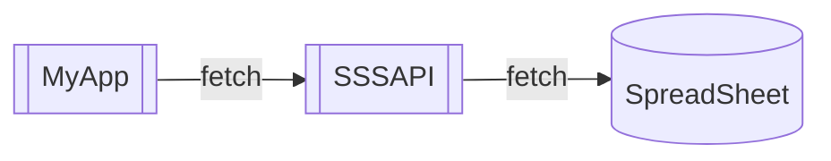
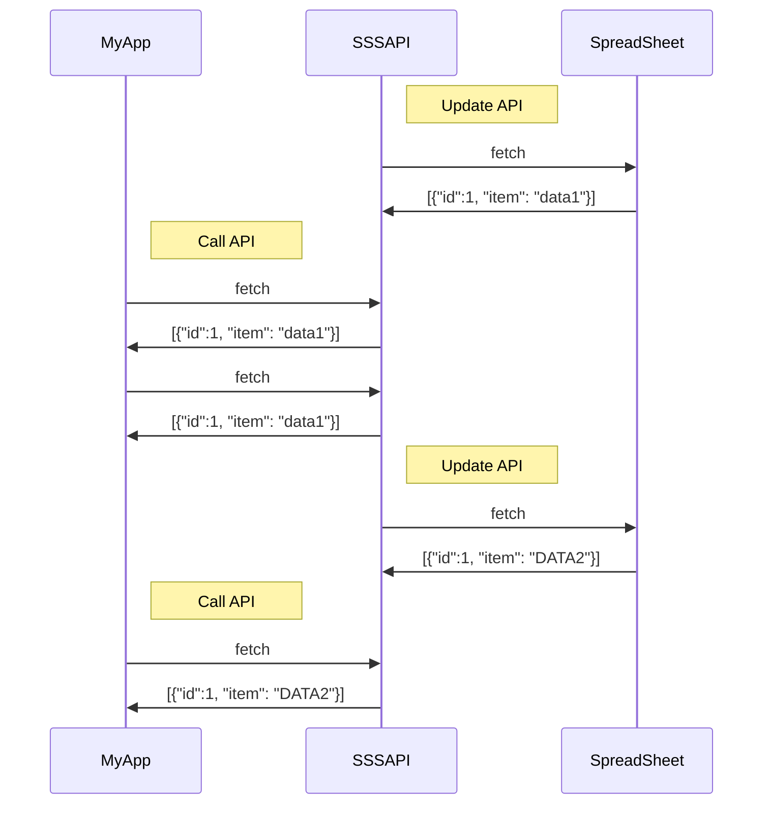
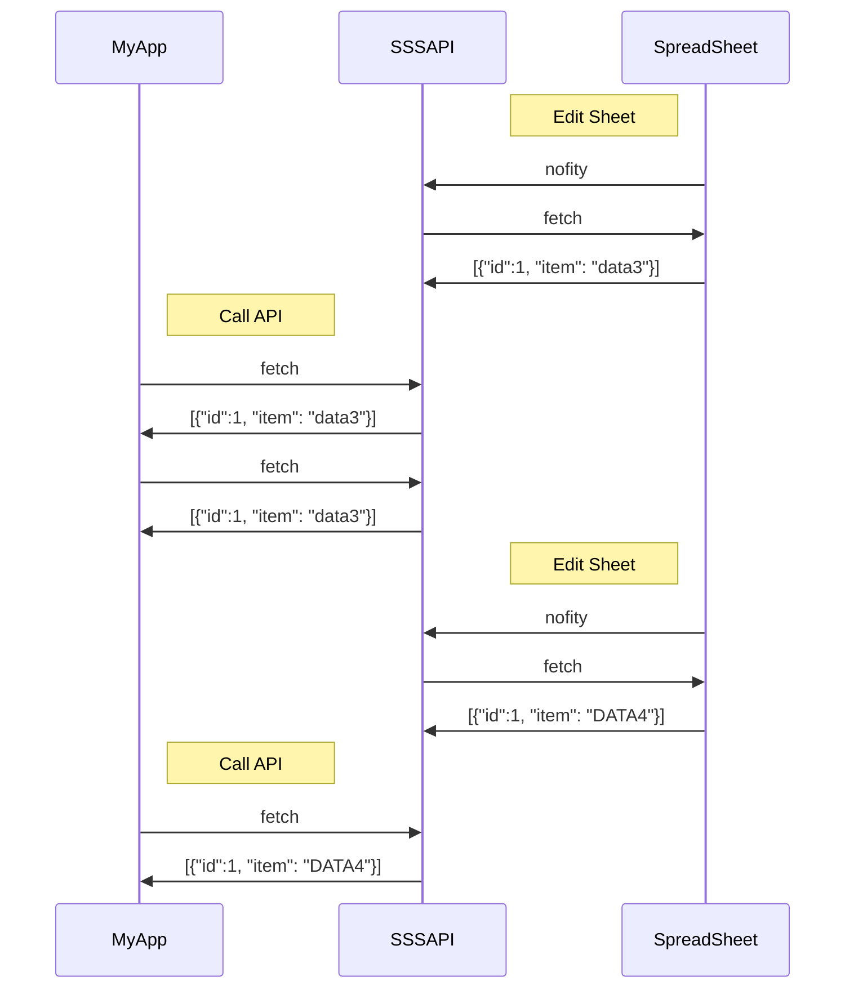

先日、[SSSAPI] の記事[^article]をみかけて面白そうだったのでスクラップでメモしながら試してみました。

@[card](https://zenn.dev/hankei6km/scraps/d721b82416d6ac)

上記スクラップは少し長くなってしまったので、この記事では特徴的なところをピックアップしてみます。

なお、「ノーモデル」というワードは勢いで使っただけで、そのような技術用語はありません(ないですよね？)。その辺はおおらかな気持ちで流していただければと。

[^article]: <https://zenn.dev/kira_puka/articles/f9496a6a847799>

## SSSAPI は追加スコープ(spreadsheets.\*)を要求しない

もちろんサインイン関連などは必要ですが、このようなサービスで定番の「Google スプレッドシートのすべてのスプレッドシートの参照、編集、作成、削除」などは要求されませんでした。

*図 1-1 すべてのスプレッドシートへの権限は要求されない*

ではファイルへのアクセスはどうなっているのかというと「スプレッドシートを [SSSAPI] のシステムアカウントと共有」することで解決していました(図 1-2)。

*図 1-2 共有設定に [SSSAPI] のシステムアカウントを追加*

スプレッドシート毎に設定するのも少し面倒ですが[^folder]、ドライブ全体ではなくファイル単位で共有を設定できるので気分的な安心感はあります。

[^folder]: 試した限りではフォルダーの共有でも動作しましたがドキュメントには記載がないのでやって良いのかは不明です。

## SSSAPI はステートフルである

「Google スプレッドシートの API 化」という一文を見たとき、データ要求時に毎回スプレッドシートを読みに行く(ステートレスな)サーバーレスファンクション的なものを想像しました(図 2-1)。



▲ *図 2-1 サーバーレスファンクション的なフロー*

実際の挙動としては API を(手動または自動更新で)ビルドすると「その時点のスプレッドシートを読み込み API のステートにする」という構成でした(図 2-2、図 2-3)[^durabble]。

*図 2-2 コンソールから「Update」ボタンで API をビルド*



▲ *図 2-3 ステートの遷移状態(手動)*

自動更新にする場合はコンソールから API Option を変更します(図 2-4)。これでスプレッドシートを更新すると [SSSAPI] 側に通知が届きビルドされるようになります(図 2-5)([連続して更新すると数分待つこともある](https://zenn.dev/link/comments/b7b89ab024221b))。

*図 2-4 設定により自動更新も可能*



▲ *図 2-5 ステートの遷移状態(自動)*

この構成は「スプレッドシートの更新にあわせて他サービスの処理を開始したい」ような場合、[SSSAPI] のビルド状況がわかりにくいのは難点ですが、パフォーマンスや耐障害性では有利だと予想できます[^csr]。

また、完了タイミングが読めない複数の更新を 1 つのレスポンスにしたい(いわゆるファンイン的なフロー)の場合、API を任意のタイミングでビルドできるのは使い勝手が良いと思われます[^trigger]。

*図 2-6 複数の担当者が入力するシート*

```json
[
  {
    "担当者": "田中",
    "入力時刻": "2022-01-13 10:00",
    "状況": "異常無し"
  },
  {
    "担当者": "佐藤",
    "入力時刻": "2022-01-13 11:00",
    "状況": "設備 A にノイズ"
  },
  {
    "担当者": "林",
    "入力時刻": "2022-01-13 15:00",
    "状況": "異常無し"
  }
]
```

▲ *図 2-7 API レスポンス*

*図 2-8 新規に入力を開始する(API は更新待ち)*

```json
[
  {
    "担当者": "田中",
    "入力時刻": "2022-01-13 10:00",
    "状況": "異常無し"
  },
  {
    "担当者": "佐藤",
    "入力時刻": "2022-01-13 11:00",
    "状況": "設備 A にノイズ"
  },
  {
    "担当者": "林",
    "入力時刻": "2022-01-13 15:00",
    "状況": "異常無し"
  }
]
```

▲ *図 2-9 API レスポンスは前日の状態を維持*

*図 2-10 入力完了したので API を更新*

```json
[
  {
    "担当者": "田中",
    "入力時刻": "2022-01-14 10:30",
    "状況": "異常無し"
  },
  {
    "担当者": "佐藤",
    "入力時刻": "2022-01-14 13:00",
    "状況": "異常無し"
  },
  {
    "担当者": "林",
    "入力時刻": "2022-01-14 11:00",
    "状況": "異常無し"
  }
]
```

▲ *図 2-11 API レスポンスが切り替わる*

この他に(利用プランにより件数が変わりますが) Build log には以前のステート(API のレスポンス)が残っていることから履歴を確認できます(図 2-12、図 2-13)。

*図 2-12 ビルドのログを確認できる*

*図 2-13 ステートを表示*

[^durabble]: この構成を知ったときに Azure の [Durable Functions](https://docs.microsoft.com/ja-jp/azure/azure-functions/durable/durable-functions-overview) が思い浮かびました(なんとなく似ているかなと)。

[^csr]: おそらくですが、[SSSAPI] は動的な更新に軸足を置いているように思われるので(どこかの時点更新が完了していればよいので)、速度以外にその辺も関係しているのかなと。

[^trigger]: API ビルドを起動する Webhook 的なものが欲しくなってきます。

## SSSAPI はノーモデルである

[各種 Headless CMS を試したとき](https://zenn.dev/hankei6km/articles/test-collage-cms-content)に「どのサービスでも最初にモデルを定義する必要」がありました。

ノーコードツールなどでも言えるようですが「モデルを定義することは難易度が高い」ので、最初にこれがあるのはハードルを高くする要因なのかなと感じていました。

または「管理画面の構成はどうしてもモデルの定義に引っ張られる」部分が多く「編集者用の管理画面を作る管理画面があればいいのに」とも考えていました[^builder]。

そのような中で[SSSAPI 利用事例](https://sssapi.app/articles/20211020_usacese_news)のスクリーンショット(図 3-1)を見たとき、「一目で意図が把握できる」説得力がありちょっとした衝撃を受けました。

*図 3-1 「スプシとSSSAPIでお知らせや更新情報をサクッと作成する」より引用*

このスクリーンショットから「[SSSAPI] ではデータの入力が先にあり、モデルはデータにより形作られていく[^card-sheet]」ことが理解出来ます。また「管理画面で苦労するならスプレッドシートを使う」という思い切りの良さも感じます。

このように書くと「おおざっぱな(フラットな)レイアウトしかできないのでは」と思われそうですが、実際に試してみると管理画面の構造に制約されない柔軟なデータ入力が可能でした。

まず、[SSSAPI] では 1 レコード内に[構造化された(配列なども含む)データ](https://sssapi.app/help/api_option/#%E3%83%89%E3%83%83%E3%83%88%E5%8C%BA%E5%88%87%E3%82%8A%E3%81%AE%E3%83%95%E3%82%A3%E3%83%BC%E3%83%AB%E3%83%89%E3%82%92%E3%83%8D%E3%82%B9%E3%83%88%E3%81%AB%E5%A4%89%E6%8F%9B)の入力が可能です(図 3-2、図 3-3)。

*図 3-2 構造化されたフィールド*

```json
[
  {
    "category": "フルーツ",
    "item": [
      {
        "code": "F001",
        "name": "りんご"
      },
      {
        "code": "F002",
        "name": "みかん"
      },
      {
        "code": "F003",
        "name": "バナナ"
      }
    ]
  },
  {
    "category": "ドリンク",
    "item": [
      {
        "code": "D001",
        "name": "コーヒー"
      },
      {
        "code": "D003",
        "name": "紅茶"
      }
    ]
  }
]
```

▲ *図 3-3 API レスポンス*

また、フィールド(セル)に式や関数などを指定し、結果を通常の値のように利用もできます。以下は計算結果でソートしている例です(図 3-4、図 3-5 )。

*図 3-4 金額フィールドは計算結果がセットされている*

```json
[
  {
    "品名コード": "E230",
    "個数": 3,
    "単価": 130,
    "金額": 390
  },
  {
    "品名コード": "A089",
    "個数": 5,
    "単価": 90,
    "金額": 450
  },
  {
    "品名コード": "S001",
    "個数": 10,
    "単価": 80,
    "金額": 800
  },
  {
    "品名コード": "R001",
    "個数": 6,
    "単価": 230,
    "金額": 1380
  }
]
```

▲ *図 3-5 金額フィールドでソートされているレスポンス*

そしてスプレッドシートがそのまま API になるということは「レコードを手動で並べ替える」ことも可能になっています [^oreder-manually]。

*図 3-6 レコード移動前*

*図 3-7 レコード移動後*

```json
[
  {
    "品名コード": "A089",
    "個数": 5,
    "単価": 90,
    "金額": 450
  },
  {
    "品名コード": "S001",
    "個数": 10,
    "単価": 80,
    "金額": 800
  },
  {
    "品名コード": "E230",
    "個数": 3,
    "単価": 130,
    "金額": 390
  },
  {
    "品名コード": "R001",
    "個数": 6,
    "単価": 230,
    "金額": 1380
  }
]
```

▲ *図 3-8 API レスポンス*

[^builder]: それこそ AppSheet などのノーコードツールを使えよという話ではありますが。

[^card-sheet]: この辺はカード型データベースとスプレッドシートの違いのような感覚になるのかなと。

[^oreder-manually]: レコードの一覧画面から並べ替えができる Headless CMS は意外と少ないです、[試した中では](https://zenn.dev/hankei6km/articles/test-collage-cms-content) microCMS だけでした。他では複数のモデルを参照関係にするなどの対応が必要でした。

    参考: [Use Reference Fields to Manually Order Content With Contentful and Gatsby](https://betterprogramming.pub/use-reference-fields-to-manually-order-content-with-contentful-and-gatsby-e5808861d875)

## おわりに

[SSSAPI] を試してみてみました。

感想としてはまず「お手軽で使いやすい」がありますが、その他にも「アクセス許可の方針」や「API をビルドするまでステートが保持される」といった予想外(予想以上)の部分も多く、奥が深いとも感じました。

モデルについていえば、ある程度の規模になれば事前にしっかりとしたモデルの定義は必要ですし、ステージングやスケジュールなどを管理する画面も必要になってきます。

それでもスプレッドシートで機能を代替することにより、多くの人が直観的にデータ入力を行えるのは [SSSAPI] の大きな特徴といえるのでないでしょうか。

なお、今回は特徴的な部分を記述しましたが [AppSheet との連携なども試してみた](https://zenn.dev/link/comments/b1eee62ec4f8a4)ので、その辺もいずれ記事にできればと考えています。

[SSSAPI]: https://sssapi.app/
