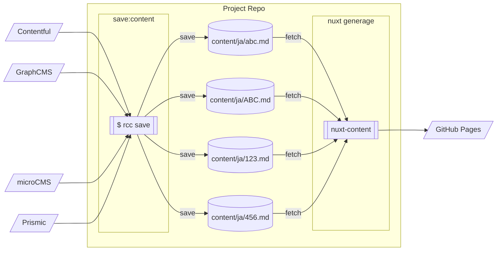

リモート CMS(Headless CMS) で作成したコンテンツを [nuxt-content](https://content.nuxtjs.org/ja) で利用するツール([remote-cms-content](https://github.com/hankei6km/remote-cms-content))を作っています[^remote]。

その検証としてテスト用のページを作っているのですが、良い機会なので各 CMS の RichText 系フィールドで作成したものをまとめてみました。

@[card](https://hankei6km.github.io/test-collage-cms-content/)

[^remote]: 本来 nuxt-content はローカルの `.md` ファイルなどを扱うものですが、リモートの CMS 上で作成したコンテントも使いたいと思って試行錯誤しています。<https://hankei6km.github.io/mardock/deck/nuxt-content-and-remote-cms>

## 構成

サンプルページ作成の構成です。

各 CMS 内のコンテンツは remote-cms-content(`rcc` コマンド) でファイルへ保存後 `nuxt generate` で静的に生成し、GitHub Pages へデプロイしています。



コンテンツは `.md` として保存しますが、今回は HTML 出力のサンプルなので本文は以下のように HTML で記述された状態にしています(実質は FrontMatter + HTML です)。

```markdown:contentful_plain.md
---
_RowNumber: -1
id: contentful-plain
createdAt: 2021-12-17T10:05:42.131Z
updatedAt: 2021-12-17T10:05:42.131Z
title: Contentful のサンプルとメモ
description: Contentful 上で実際に RichText で入力し HTML として取得したときのサンプルと編集についてのメモ。
category: サンプル
menuTitle: Contentful
position: 2
---
<p>Contentful 上で実際に RichText で入力し HTML として取得したときのサンプルと編集についてのメモ。</p>

...snip
```

## サンプルページ一覧

以下の一覧からページを直接開くことができます。それぞれのページに作成時のメモもあります(このページ下部のメモと同じ内容です)。

### Contentful

[](https://hankei6km.github.io/test-collage-cms-content/contentful-plain/)

[Contentful のサンプルページ。](https://hankei6km.github.io/test-collage-cms-content/contentful-plain/)

### GraphCMS

[](https://hankei6km.github.io/test-collage-cms-content/graphcms-plain/)

[GraphCMS のサンプルページ。](https://hankei6km.github.io/test-collage-cms-content/graphcms-plain/)

### microCMS

[](https://hankei6km.github.io/test-collage-cms-content/microcms-plain/)

[microCMS のサンプルページ。](https://hankei6km.github.io/test-collage-cms-content/microcms-plain/)

### Prismic

[](https://hankei6km.github.io/test-collage-cms-content/prismic-plain/)

[Prismic のサンプルページ。](https://hankei6km.github.io/test-collage-cms-content/prismic-plain/)

## メモ

各 CMS の RichText 系フィールドについてメモしていたものです。

HTML 関連の内容は標準的な取得(変換)方法の場合で記述しています。他の方法で取得(変換)した場合は異なる内容になることもあります。

なお、行数が多くなってしまったので折りたたんでいます。

### Contentful

:::details メモ。

#### API レスポンスでの形式

RitchText はオブジェクト(AST)としてレスポンスに含まれる。

データは Contentful のライブラリーで HTML へ変換できるが、Content Delivery API(REST) と GraphQL API で扱いが異なる。

*   [Rendering linked assets and entries in the Rich Text field](https://www.contentful.com/blog/2021/04/14/rendering-linked-assets-entries-in-contentful/)
*   [Rich Text field tips and tricks from the Contentful DevRel team](https://www.contentful.com/blog/2021/05/27/rich-text-field-tips-and-tricks/)

#### 日本語入力

試した限りでは以下のようになる。

*   Windows - プリエディットが消えたり、確定できないことが多い
*   Linux + Fcixt + Mozc - プリエディットが消えたり、確定できないことが多い
*   Linux + Fcixt + SKK - 時々怪しいが概ね入力可能

~~同様の事例があまりヒットしないので PC 側の処理落ちの可能性もあるが~~、基本的に RichText での日本語入力は実用的でない。

日本語入力については問い合わせされた方の記事がありました。それによるとサービス側の不具合だそうです。

*   [【Gatsby + Contentful】 僕のRich Textに救済を](https://zenn.dev/take77/articles/a266a75bf12c23#rich-text%E3%81%A8%E6%97%A5%E6%9C%AC%E8%AA%9E%E5%85%A5%E5%8A%9B%E3%81%AF%E4%BA%8C%E4%BA%BA%E4%B8%89%E8%84%9A%E3%81%8C%E3%81%A7%E3%81%8D%E3%81%AA%E3%81%84)

#### モバイル対応

レスポンシブ対応していないので画面の拡大と縮小で対応(操作性はきびしい)。

ただし RichText への入力はカーソル位置がズレたり保存ができないなどの問題がある(試したソフトキーボードは S-Shoin だけなので他のキーボードでは違う結果になる可能性もある)。

#### キーボードショートカット

基本的な文字装飾などが可能。`Ctrl` + `S` はセーブに割り当てされていない(オートセーブ機能がある)。

[What are the keyboard shortcuts for the Rich Text editor?](https://www.contentful.com/faq/rich-text/#what-are-the-keyboard-shortcuts-for-the-rich-text-editor)

#### コピー & ペースト

RichText 内ではテキストとともに画像などの埋め込みや書式もコピー＆ペーストできる。

外部のソースからのペーストもできるが、改行が含まれていたりパラグラフが閉じていると余分な改行を付加されるようなことがある。

また、No-Break Space (U+00A0)はそのままペーストされてしまうので、通常の空白と見分けがつかなくなる。

外部ソースからのペーストは、書式なしおよび改行なしの状態で行うことが安全だと思われる。

なお、外部ソースからのペーストが非推奨とされているかは不明。

Google Docs からは問題ないことになっている。

[Rich Text field tips and tricks from the Contentful DevRel team](https://www.contentful.com/blog/2021/05/27/rich-text-field-tips-and-tricks/)

#### 改行

改行の入力は基本的にパラグラフの区切りとなる。`ctrl` + `enter` は改行となる(`<br>` ではない)。

#### 連続した空白

空白を連続して入力した場合、単純に空白の連続となる。

#### リンク

通常の Web(url)の他にキュメントやメディアへのリンクも UI 上では設定できるが、ライブラリー標準の変換ではリンクとして扱われない。Custom Renderer を作成する必要がある。

リンク元の文字列に画像を含めることはできない(設定すると画像が削除される)。画像へのリンクは CustomRenderer 等での対応が必要。

#### 画像

バックエンドは Contentful 独自？

アップロードは Asset の UI か RichText の Embed ボタン(Asset のダイアログが表示される)から行う。ローカルのファイル以外にも Filestack の UI により Google Drive 等からもアップロード可能。

再アップロード(Asset 内のファイル入れ替え)後は、RichText に埋め込まれた画像も入れ替わる。

画像を `img` タグとして扱うには Custom Renderer を作成する必要がある。`Alt` の指定は Custom Renderer の作りによるが、通常は Media Library でファイル別に設定したメタ情報を用いる。

Media Library で画像を編集可能。

*   画像の編集で Image API は利用されない

    *   Media Library 内の元ファイルを上書きすることになる

*   Crop によるサイズ変更は部分的に切り出すことも可能

    *   位置合わせはマウスで操作できる

*   Custom Renderer で Image API を利用することにより元ファイルを残して表示時に変更することも可能

    *   ただし、編集 UI は利用できない

画像のサイズを `width` `height` 属性へ設定するしないは Custom Renderer の作り方次第。

Media Library の UI 上から、画像を参照している Entry を確認できる(API でも可能)。

画像にもステージングが適用される。画像が DRAFT のときにドキュメント(Entry)を Publish すると警告が表示され、それでも Publish すると API での取得時にエラーとなる。

#### 埋め込み

他のサービスを埋め込む UI は提供されていないが、埋め込み用の Model と対応する Custom Renderer を作成することで対応可能。

#### フルスクリーン

RichText の編集フィールドのみをブラウザー内に表示させることはできない。

:::

### GrahpCMS

:::details メモ。

#### API レスポンスでの形式

取得するフィールドによって HTML Markdown AST などの形式で受信できる。

例: RichText の API ID が `content` の場合 `content.html` で HTML を取得。

#### 日本語入力

*   PC(試したのは Windows) での日本語の入力は通常通り行える

以下、主観での内容。

バリデーション関係からからなのか、RichText に限らずテキスト入力全般的に引っかかりがあるように感じる(PC のスペックにもよると思われるが)。その中で、RichText の日本語入力はレスポンスが良いように感じる。

#### モバイル対応

レイアウト的に操作はできるが、日本語入力が不自然なタイミングで確定されてしまう(試したソフトキーボードは S-Shoin だけなので他のキーボードでは違う結果になる可能性もある)。

#### キーボードショートカット

RichText の編集フィールドにフォーカスがあたっている場合は CTRL + s で下書き保存をできるが、その他の操作(文字の装飾を指定するなど)は不明。

#### コピー & ペースト

RichText 内ではテキストとともに画像や書式もコピー＆ペーストできる。

外部のソースからのペーストもできるが、対応していない書式は無視される。また、画像はリンクへ置き換わる。 ただし、No-Break Space (U+00A0)はそのままペーストされてしまうので、通常の空白と見分けがつかなくなる。 なお、外部ソースからのペーストが非推奨とされているかは不明。

#### 改行

改行の入力は基本的にパラグラフの区切りとなる。

以下の場合は異なる挙動となる。

*   `Shift` + `Enter` は `<br>`
*   コードブロックの中では改行

#### 連続した空白

空白を連続して入力した場合、単純に空白の連続となる。

#### クラス名

任意の領域にクラス名を指定できる。ただし、クラスを入れ子にできない。

#### リンク

リンクはサイト(url)用でドキュメント等は指定できないが、各種属性を指定できる。

リンク元の文字列に画像を含めても画像にリンクは設定されない。画像にリンクを設定する方法は不明。

#### 画像

バックエンドは Filestack を利用していると思われる。

アップロードは Asset の UI か RichText のリボン(Asset のダイアログが表示される)から行う。ローカルのファイル以外にも Filestack の UI により Google Drive 等からもアップロード可能。

また、アップロード時に Crop などが行えるが、この場合は加工されたファイルがアップロードされる。

画像を再アップロード(Asset 内のファイル入れ替え)すると、RichText に埋め込まれた画像も入れ替わる。

RichText を HTML として出力すると img タグとして、Markdown として出力すると Image ノードとして扱える。 文字列のパラグラフには含まれない。

`Alt`は RichText の編集画面で指定する。

RichText から画像を編集することも可能。

*   サイズ変更などは Filestack で行われるので元ファイルはそのまま残る

*   サイズ変更は `widht`と `height` を自由に指定できるが以下のような挙動となる

    *   実際に取得される画像の縦横比は変更されない

*   サイズ変更を繰り返すと URL にパラメーターが蓄積されてしまう

    *   蓄積されたパラメーターは順番に実行されているので仕様？

*   画像フォーマットを指定できる

画像のサイズは `width` `height` 属性に設定される。

ファイル名が `title` 属性として設定される。変更方法などは不明。

Media Library(Assets) の UI 上から、画像を参照しているドキュメントを確認できない(API でもできない)。 画像にもステージングが適用される(DRAFT などが指定される)が、参照元が PUBISHED になれば画像が DRAFT でも PUBLISHED 扱いになる。

nuxt-image の provider では対応されていない(パラメーターがクエリーによる指定でないので対応は難しいように思われる)。

#### テーブル

テーブルを作成できる。ヘッダーや行と列数を変更することも可能。HTML での出力ではセル内のパラグラフをわけることができるが、Markdown として出力すると 1 つのパラグラフとなる。

#### iframe

外部サービスを埋め込むことに使うと思われるが、接続が拒否されたりで詳細は不明。

#### フルスクリーン

RichText の編集フィールドのみをブラウザー内に表示させることができる。

:::

### microCMS

:::details メモ。

#### API レスポンスでの形式

RichEditor の出力は HTML またはオブジェクト(現在ベータ版)としてレスポンスに含まれる。

オブジェクトの形式と変換ライブラリーの有無は現時点では不明。

#### 日本語入力

PC(試したのは Windows) での日本語の入力は通常通り行える。ただし、コードブロック直後での漢字変換(プリエディット)がコードブロックを上書きしてしまうなど、若干の不安定さはある。

#### モバイル対応

レスポンシブ対応されている。日本語の入力も通常通り行える(試したソフトキーボードは S-Shoin だけなので他のキーボードでは違う結果になる可能性もある)。

ただし、RichEditor では装飾アイコンの領域があるので、ディスプレイが小さいデバイスだと編集領域が数行程度となる。

#### キーボードショートカット

`ctrl`+ `s` で下書き保存をできる。その他の操作(文字の装飾を指定など)は不明だが、マークダウン記法を使えるため見出しなどの指定はキーボード入力から行える。

#### コピー & ペースト

RichText 内ではテキストとともに画像や書式もコピー＆ペーストできる。装飾されている文字をペーストすると指定されていないはずの背景色を付加されていることがある。

外部のソースからのペーストもできるが、対応していない書式は無視される。画像はドキュメントの一部としては無視されるが、エクスプローラー等からファイルとしてをペーストした場合はアップロードされる(ブラウザーなどで画像としてコピーされたものは無視される)。

No-Break Space 文字(U+00A0)はそのままペーストされてしまうので、通常の空白と見分けがつかなくなる。

また、書式なしでペースト(Windows では `ctrl` + `shift` + `v` でペースト)した文字列の中に連続した空白があるとこれも No-Break Space へ置き換わる。

なお、microCMS では他ソースから RichEditor へのペーストは非推奨となっている。

#### 改行

改行の入力は API スキーマの設定で挙動が変更される(HTML 出力の場合)。

デフォルトでは `<br>` となるが、設定の変更でパラグラフの区切りにもできる。今回はパラグラフの区切りとする設定でコンテンツを作成している。

以下の場合は設定とは異なる挙動となる。

*   コードブロックの中では改行
*   引用の中では `<br>`
*   空行は常に `<br>` (パラグラフの区切りとしている場合は`<p>` で囲まれる)

`Shift` + `Enter` で改行しても挙動は変更されない。

#### 連続した空白

空白を連続して入力した場合、単純に空白の連続となる。

#### & のエスケープ

「＆gt;」など一部の文字実態参照として成立する文字列の場合、編集フィールド上に`＆gt;` と入力すると `&` がエスケープされない(ここでは全角で＆を入力して回避している)。サポートに確認してみたがこれは仕様とのこと。

#### 見出し

heading タグにはランダムな文字列が `id` 属性として自動的に設定される(目次作成用)。

#### リンク

通常の Web(URL)のみ設定可能。メディアライブラリのファイルには設定できない(microCMS では API を通さないでメディアファイルの URL を扱うことは非推奨とされている)。

リンク元の文字列に画像を含めても画像にリンクは設定されない(後述の画像設定パネルで個別に指定は可能)。

#### 画像

バックエンドには imgix が利用されている。

アップロードは以下の方法が使える(アップロード元はローカルファイルのみ)。

*   メディアライブラリーの UI
*   RichEditor へファイルをドロップ
*   RichEditor へクリップボード経由で画像ファイルをペースト
*   RichEditor のリボン(メディアライブラリのダイアログが表示される)

再アップロード(メディアライブラリー内のファイル入れ替え)後は、RichEditor に埋め込まれた画像も入れ替わる。

RichEditor へ埋め込まれた画像は HTML 出力時には `img` タグとして扱える。

文字列とは同じパラグラフになる。

`Alt` は RichEditor の画像設定パネルから指定する。

画像設定パネルから画像のサイズを変更可能。

*   サイズ変更は imgix で行われるので元ファイルはそのまま残る
*   width と height の比率は固定
*   ズーム等で自由な位置を切り出すことはできない

画像設定パネルからはリンクも設定できる。

画像のサイズは `width` `height` 属性に設定される(API スキーマの設定を変更する必要がある)。

メディアライブラリーの UI 上から、画像を参照しているドキュメントを確認できる(現状は API からはできない)。

画像にステージング(下書き or 公開)は適用されない。公開として扱われる。

#### 埋め込み

YouTube などの外部サービスを埋め込むことができる。

#### フルスクリーン

RichEditor の編集フィールドのみをブラウザー内に表示させることは厳密にはできないが、表示領域を広げることはできる(サイトバーや一部のボタンが隠れない、チャットアイコンが重なっている状態)。

:::

### Prismic

:::details メモ。

#### API レスポンスでの形式

RitchText は配列データとしてレスポンスに含まれる。

データは Prismic のライブラリーで HTML へ変換できる。

HTML Serializer などを記述することで変換内容をカスタマイズすることも可能(例: Preformatted を \<pre>\<code> へ変換するなど)。

#### 日本語入力

*   PC(試したのは Windows) での日本語の入力は通常通り行える
*   ただし、RichText 編集画面で Alt を編集する場合は日本語の入力ができない

#### モバイル対応

レスポンシブ対応されていない、また日本語入力が不自然なタイミングで確定される(試したソフトキーボードは S-Shoin だけなので他のキーボードでは違う結果になる可能性もある)。

#### キーボードショートカット

RichText の編集フィールドにフォーカスがあたっている場合は CTRL + s で下書き保存をできるが、その他の操作(文字の装飾を指定するなど)は不明。

#### コピー & ペースト

RichText 内ではテキストとともに書式もコピー＆ペーストできる。

画像もコピーできるがテキストと同時に範囲選択できないときがある、リンクの指定が解除されるなどの問題がある。

外部のソースからのペーストもできるが、対応していない書式は無視される。

ただし、No-Break Space 文字(U+00A0)はそのままペーストされてしまうので、通常の空白と見分けがつかなくなる。

なお、外部ソースからのペーストが非推奨とされているかは不明。

#### 改行

改行の入力は基本的にパラグラフの区切りとなる。

以下の場合は異なる挙動となる。

*   Shift + Enter では \<br />
*   Pre formatted の中では HTML Serializer の実装による

#### 連続した空白

空白を連続して入力した場合、単純に空白の連続となる。

#### リンク

通常の Web(url)の他にドキュメントやメディアへのリンクも UI 上では設定できるが、ドキュメントへのリンクは PATH が null となる。対応として Link Resolver を作成する必要がある。

リンク元の文字列に画像を含めても画像にリンクは設定されない。画像は単独で設定する必要がある。

#### 画像

バックエンドには imgix が利用されている。

アップロードは Media Library の UI か RichText のリボン(Media Library のダイアログが表示される)から行う。アップロード元はローカルファイルのみ。

再アップロードの機能はないと思われる。

RichText へ埋め込まれた画像は変換ライブラリーを利用することで img タグとして扱える。

文字列のパラグラフには含まれない。

Alt は以下のように指定する。なお、空白にしたままだと null がセットされる(GraphQL で取得しているから？)。

*   Media Library 上で指定する(画像ファイルのデフォルトの Alt になる)
*   RichText の編集画面で指定する

Picture Editor で画像のサイズを変更可能。

*   サイズ変更は imgix で行われるので元ファイルはそのまま残る
*   width と height の比率は自由に設定できる
*   元サイズと比率が異なる場合はマウス操作で位置あわせできる
*   ズーム等で自由な位置を切り出すことはできない

画像のサイズは width height 属性に設定されない。

Media Library の UI 上から、画像を参照しているドキュメントを確認できない(API でもできない)。

画像にステージングは適用されない。PUBLISHED として扱われる。

#### 埋め込み

YouTube などの外部サービスを埋め込むことができる。

#### rtl

rtl を指定できるが以下のようになる。

*   API レスポンスでは direction の指定が rtl になっている
*   HTML で変換したものにはスタイルは設定されていない

おそらく HTML Serializer で対応する必要がある。

#### フルスクリーン

RichText の編集フィールドのみをブラウザー内に表示させることはできない。

:::

## おわりに

今回は各種ヘッドレス CMS の RichText 系フィールドを HTML として取得してみました。この部分だけでも各サービスの違いが感じられ面白かったです。

*   フィールド機能の拡張方法
*   出力フォーマットの切り替え(変換)方法
*   装飾機能の種類や改行と空白文字の扱い
*   モバイル環境含め日本語入力への対応

等々。 RichText 以外にもプレビューやマルチロケール(多言語対応)の考え方の違いなど少しメモしてあるので 、その辺もいずれ書くことができればと。
