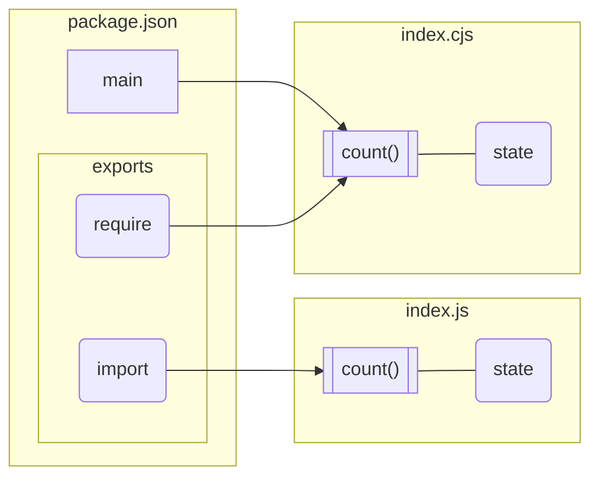
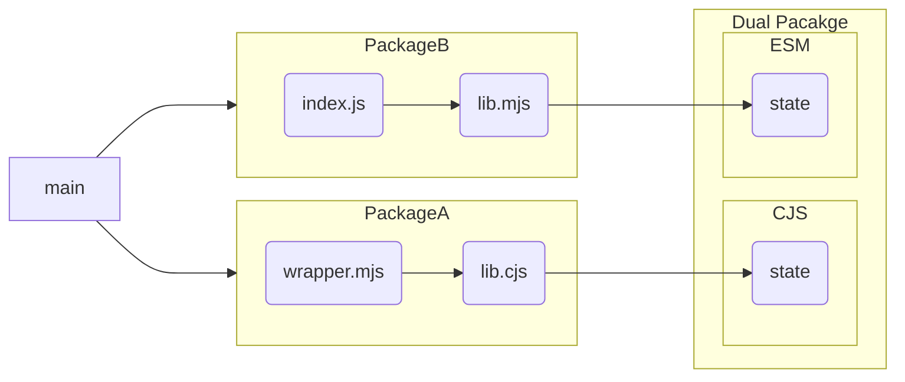

自作モジュールを native ESM 対応するとき、CJS でもエクスポートすることにしたので「[Dual package hazard](https://nodejs.org/api/packages.html#dual-package-hazard) はどのように発生するのか」を試してみました。

## 問題のあるモジュール

[test-dual-package-hazard](https://github.com/hankei6km/test-dual-package-hazard) は [Approach #2: Isolate state](https://nodejs.org/api/packages.html#approach-2-isolate-state) を意識して作成し、`main` と `exports` が定義されています。

@[card](https://github.com/hankei6km/test-dual-package-hazard)

```json:package.json
{
  "type": "module",
  "main": "dist/index.cjs",
  "exports": {
    "require": "./dist/index.cjs",
    "import": "./dist/index.js"
  },
}
```

しかし、`index.cjs` はモジュールのステートを考慮せずに単純にコードを変換しただけです。つまり関数のインスタンスとともにステータスも分離された状態になっています。



## 問題を表面化させる読み込み

以下のモジュールは `.js`(ejs)と `.cjs` からそれぞれ `import` と `require` で `@hankei6km/test-dual-package-hazard` を利用しています。

@[card](https://github.com/hankei6km/test-dual-package-hazard-main)

```javascript:src/count1.js and src/count2.js
import { count, loadedAt } from '@hankei6km/test-dual-package-hazard'
export { count, loadedAt }
```

```javascript:src/count3.cjs and src/count4.cjs
const { count, loadedAt } = require('@hankei6km/test-dual-package-hazard')
exports.count=count
exports.loadedAt=loadedAt
```

```javascript:main.js
#!/usr/bin/env node
import{ format } from './util.cjs'
import { count as count1, loadedAt as loadedAt1 } from './count1.js'
import { count as count2, loadedAt as loadedAt2 } from './count2.js'
import { count as count3, loadedAt as loadedAt3 } from './count3.cjs'
import { count as count4, loadedAt as loadedAt4 } from './count3.cjs'

console.log(`count1 === count2 ${count1 === count2}`)
console.log(`count2 === count3 ${count2 === count3}`)
console.log(`count3 === count4 ${count3 === count4}`)

console.log('')
console.log(format('count1', loadedAt1(), count1()))
console.log(format('count2', loadedAt2(), count2()))
console.log(format('count3', loadedAt3(), count3()))
console.log(format('count4', loadedAt4(), count4()))
```

## 結果

上記ではそれぞれ `@hankei6km/test-dual-package-hazard` をインポートしていますが、その方法により関数のインスタンスとステータスが異なる状態になっています。

```shell-session
$ npm run start

count1 === count2 true
count2 === count3 false
count3 === count4 true

count1: loadedAt: 2021-12-10T09:30:53.925Z count: 0
count2: loadedAt: 2021-12-10T09:30:53.925Z count: 1
count3: loadedAt: 2021-12-10T09:30:53.935Z count: 0
count4: loadedAt: 2021-12-10T09:30:53.935Z count: 1
```

## おわりに

実際にやってみて思ったことは「モジュールを直接利用する場合、Dual package hazard を狙って起こそうとすると `.js` と `.csj` を使い分けたりで意外と難しい」ということでした。

おそらく、意図せずに発生するのは [Approach #1: Use an ES module wrapper Dual Package](https://nodejs.org/api/packages.html#approach-1-use-an-es-module-wrapper) が混在するようなときかなと予想しています。



こうなると `main` 側からは対応が難しいので、モジュールを Dual Package 化する場合は気をつけねばと思いました。
