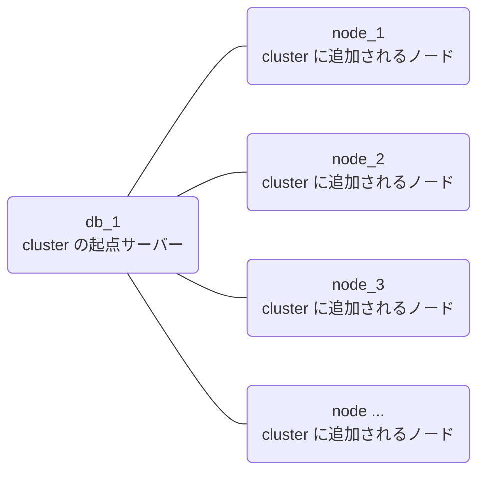
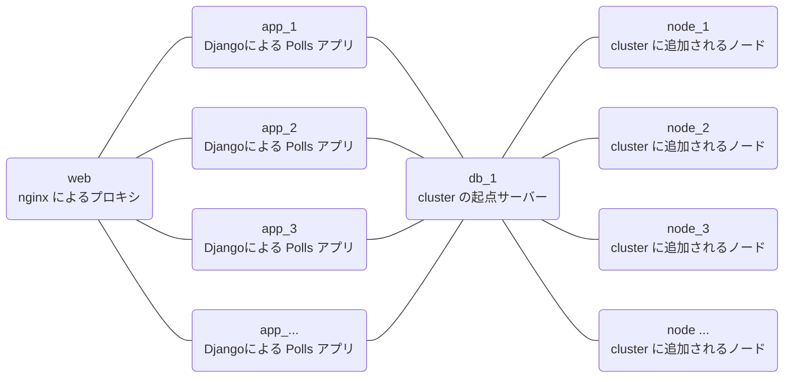

Docker Compose の `--scale` で「実際に何か動かしてみよう」と mvSQLite を利用してみたところ、Time travel などが予想以上に面白かったので記事にしてみました。

## mvSQLite とは？

表題から推測できるように**分散する SQLite** なのですが、他にも特徴があるので詳細は README の Features を読んでいただくのが良いかと(丸投げ)。

@[card](https://github.com/losfair/mvsqlite)

<!-- textlint-disable -->

> *   **Full feature-set from SQLite**: mvsqlite integrates with SQLite using either a custom [VFS](https://www.sqlite.org/vfs.html) layer or [FUSE](https://en.wikipedia.org/wiki/Filesystem_in_Userspace) at your choice. Since it is a layer "below" SQLite itself, all of SQLite's features are available.
> *   **Time travel**: Checkout the snapshot of your database at any point of time in the past.
> *   **Scalable reads and writes**: Optimistic, fine-grained concurrency with [BEGIN CONCURRENT](https://www.sqlite.org/cgi/src/doc/begin-concurrent/doc/begin_concurrent.md)-like semantics. See [this page](https://github.com/losfair/mvsqlite/wiki/Concurrency-and-conflict-check) for details.
> *   **Get the nice properties from FoundationDB, without its limits**: [Correctness](https://apple.github.io/foundationdb/testing.html), [really fast and scalable](https://apple.github.io/foundationdb/performance.html) distributed transactions, synchronous and asynchronous replication, integrated backup and restore. Meanwhile, there's no [five-second transaction limit](https://apple.github.io/foundationdb/known-limitations.html) any more, and a SQLite transaction can be \~39x larger than FDB's native transaction.
> *   **Drop-in addition**: Use either `LD_PRELOAD` or FUSE to plug mvSQLite into your existing apps. [Read the docs](https://github.com/losfair/mvsqlite/wiki/Integration)

<!-- textlint-enable -->

あとは、もう少し詳細な日本語の記事もあります。

@[card](https://techfeed.io/entries/63047e14486dac5c0342eb6d)
@[card](https://dev.classmethod.jp/articles/introduce-mvsqlite/)

## 試してみる機能

mvSQLite にはいろいろな機能がありますが、今回は以下のところを試してみたいと思っています。

*   `sqlite3` コマンドからの利用
*   Time travel を利用したバックアップなど
*   Docker Compose の `--sacel` を利用した冗長性の確認など
*   それっぽい環境(Django アプリケーション)を構築しての利用

## FoundationDB の Cluster を構成する

mvSQLite を利用するには土台となる FoundationDB を動かす必要があります。

単一サーバーで動かすなら [mvSQLite の README の Try it](https://github.com/losfair/mvsqlite#try-it) にあるようにインストールすれば動作します[^container]。しかし、今回は冗長性なども試してみたいので、Cluster の Node を Docker Compose の`--scale` で増減できるようにしてみました。

[^container]: README だと `dpkg` でインストールした後は FoundationDB のサービスが開始されている前提で記述されています。通常はこれでよいのですが、Container ではサービスを何らかの方法で開始させる必要があります。具体体には `service foundationdb start` を実行します。

**図 3-1**



設定方法は [FoundationDB のドキュメント](https://apple.github.io/foundationdb/building-cluster.html)の通りなので詳細は割愛しますが、 Node を増やす方法などで少しハマってしまいました。その辺を少し。

*   `fdb.cluster` を各 Node へ配布する方法が別途必要

    *   ➜ マウントしたディレクトリー経由でコピーした

*   `fdbcli` で冗長性モードを変更するには事前にプロセス(Node)を稼働させている必要がある

    *   ➜ 後から Node が追加されるはずという前提で `configure` が成功するまで繰り返す

*   `fdb.cluster` 内でのサーバー指定は IP アドレスベース(少なくとも起点サーバーの IP アドレスは固定されていないと面倒)

    *   ➜ `docker-compose.yml` で network を作成し、起点サーバー(`db`)の IP アドレスを固定

*   複数の Node を起動しても Cluster には 1 台しか追加されなかった

    *   ➜ Node 側では直接`fdbserver` を起動すると何故か解決した

設定した `Dockerfile` などは以下のリポジトリの devcontainer から使えるようにしてあります。Codespace を作成するか、clone して VSCode の Remote - Containers などから開くことで使えるようになっています。

@[card](https://github.com/hankei6km/test-mvsqlite-in-container)

:::message
かなり雑な設定になっています。必要なスペックやパフォーマンス的なことは全く考慮していませんので、その辺の参考にはなりません。
:::

:::message
devcontainer では直接 `docker-compose.yml` を扱わず、一旦 Terminal を開いてから `dokcer-compose` を使うようになっています。
:::

以下、簡単に確認など。

各サービスは `compose/docker-compose.yml` に定義してあります。Terminal から `docker-compose up --build --scale node=3` のようにすると開始できます。 ([冗長性を ](https://apple.github.io/foundationdb/configuration.html#configuration-choosing-redundancy-mode)[`triple`](https://apple.github.io/foundationdb/configuration.html#configuration-choosing-redundancy-mode)[ にしてあるので Node は最低でも 2 つ必要です](https://apple.github.io/foundationdb/configuration.html#configuration-choosing-redundancy-mode))

**図 3-2 各サービスを開始**

```shell-session
$ cd compose
$ docker-compose up --build --scale node=3
Creating network "compose_cluster" with driver "bridge"                                                 
Building db                                                                                              
[+] Building 0.7s (11/11) FINISHED                                                                       
 => [internal] load build definition from Dockerfile                                                0.3s

<snip...>

 => => writing image sha256:57f503609138b203acb7a7693c08e805a4567354fd266a92317645924ad8fc15        0.0s
 => => naming to docker.io/library/compose_node                                                     0.0s
Creating compose_node_1 ... done
Creating compose_node_2 ... done
Creating compose_node_3 ... done
Creating compose_db_1   ... done
Attaching to compose_db_1, compose_node_3, compose_node_1, compose_node_2
db_1    | /etc/init.d/foundationdb: line 94: log_daemon_msg: command not found
db_1    | /etc/init.d/foundationdb: line 100: log_end_msg: command not found
db_1    | /etc/foundationdb/fdb.cluster is now using address 192.168.10.10
node_1  | waiting cluster...
node_2  | waiting cluster...
node_3  | waiting cluster...
node_2  | FDBD joined cluster.
node_1  | FDBD joined cluster.
node_3  | FDBD joined cluster.
db_1    | ERROR: Not enough processes exist to support the specified configuration
db_1    | Type `configure FORCE <TOKEN...>' to configure without this check
db_1    | retry...
db_1    | Configuration changed
db_1    | running...
```

各サービスが開始されたあと FoundationDB の状態を確認すると冗長性モードが `triple` になり、各 Node が追加されていることを確認できます。 (開始直後の `Replication health` は `(Re)initializing automatic data distribution` のときもあります)

**図 3-3 状態の確認**

```shell-session
$ cd compose/
$ docker-compose exec -u vscode db bash          
vscode ➜ ~ $ fdbcli                                 
Using cluster file `/etc/foundationdb/fdb.cluster'.                                                      
                          
The database is available.                                                                               
                                                    
Welcome to the fdbcli. For help, type `help'.                                                            
fdb> status details                                 
                                                    
Using cluster file `/etc/foundationdb/fdb.cluster'.
                                                                                                         
Configuration:                                                                                           
  Redundancy mode        - triple
  Storage engine         - memory-2                 
  Coordinators           - 1                        
  Usable Regions         - 1   
                                                    
Cluster:                                            
  FoundationDB processes - 4   
  Zones                  - 4                                                                             
  Machines               - 4                                                                             
  Memory availability    - 6.1 GB per process on machine with least available                   
  Fault Tolerance        - 0 machines                                                                    
  Server time            - 08/30/22 07:16:42        
                                                    
Data:                                                                                                    
  Replication health     - Healthy                                                                       
  Moving data            - 0.000 GB                                                                      
  Sum of key-value sizes - 0 MB                                                                          
  Disk space used        - 315 MB                   
                          
Operating space:                                    
  Storage server         - 1.0 GB free on most full server                                               
  Log server             - 13.1 GB free on most full server

Workload:                                           
  Read rate              - 17 Hz                    
  Write rate             - 0 Hz
  Transactions started   - 5 Hz                     
  Transactions committed - 0 Hz                     
  Conflict rate          - 0 Hz
                                                                                                         
Backup and DR:                                                                                           
  Running backups        - 0                                                                             
  Running DRs            - 0                                                                             
                                                    
Process performance details:                        
  192.168.10.2:4500      (  2% cpu;  5% machine; 0.000 Gbps;  0% disk IO; 0.2 GB / 6.1 GB RAM  )         
  192.168.10.3:4500      (  3% cpu;  5% machine; 0.000 Gbps;  0% disk IO; 0.2 GB / 6.1 GB RAM  )         
  192.168.10.4:4500      (  1% cpu;  5% machine; 0.000 Gbps;  0% disk IO; 0.2 GB / 6.1 GB RAM  )         
  192.168.10.10:4500     (  1% cpu;  5% machine; 0.000 Gbps;  0% disk IO; 0.2 GB / 6.2 GB RAM  )         
                                                    
Coordination servers:     
  192.168.10.10:4500  (reachable)                   
                                                                                                         
Client time: 08/30/22 07:16:42                                                                           
                                                    
fdb>
```

この状態で `docker-compose up --build --scale node=5 -d` のように Node の数を変更すると自動的に構成が変更されます。 (`status` を見ると `Machines` などが変更されていることを確認できます)

## mvSQLite の各機能を試す

FoundationDB の Cluster を設定できたので [Try it](https://github.com/losfair/mvsqlite#try-it) にある手順を検証できるようになりました。上記コンテナの `/home/vscode/mvsql` に mvSQLite 関連のファイルとスクリプトを配置してあるので、それらを使って試してみます。

### 基本的な機能を試す

mvSQLite を利用するには mvstore を開始しておく必票があります。今回は自動起動していないので以下のように開始します。

**図 4-1 db コンテナ内で開始スクリプトを実行(以後コンテナ内で作業します)**

```shell-session
$ cd compose/
$ docker-compose exec -u vscode db bash
vscode ➜ ~ $ cd  mvsqlite/
vscode ➜ ~/mvsqlite $ sh start_mvsql.sh 
  2022-08-30T07:45:43.040113Z  INFO mvstore: server initialized
    at mvstore/src/main.rs:173

  2022-08-30T07:45:43.082736Z  INFO mvstore::server: timekeeper started
    at mvstore/src/server.rs:651
```

mvSQLite で table などを作成するには namespace(SQLite のデータベース的なもの)が必要です。今回は `test` namespace を作成するスクリプトを配置してあります。

**図 4-2 namespace の作成**

```shell-session
vscode ➜ ~/mvsqlite $ sh create_test_ns.sh 
HTTP/1.1 200 OK
content-length: 2
date: Tue, 30 Aug 2022 07:49:07 GMT

okvscode ➜ ~/mvsqlite $
```

namespace は mvstore に構築された VFS 上で作成されているため、通常の SQLite アプリケーションからはアクセスできません。この問題は `LD_PRELOAD` を利用し SQLite アプリケーションへライブラリーを挿入することで解決されています。

**リスト 4-1 sqlite3 で mvSQLite ライブラリーを読み込むようにしているサンプル**

```bash
export RUST_LOG=info MVSQLITE_DATA_PLANE="http://localhost:7000"

# "test" is the key of the namespace we created earlier
LD_PRELOAD=../libmvsqlite_preload.so LD_LIBRARY_PATH=. ./sqlite3 test
```

これもスクリプトを用意してあるので、以下のように試すことができます。

**図 4-3 mvSQLite 用に sqlite3 を開始**

```bash
vscode ➜ ~/mvsqlite $ sh sqlite_mv.sh
SQLite version 3.39.2 2022-07-21 15:24:47
Enter ".help" for usage hints.
sqlite>
```

コマンドが開始されれば普通に利用できます(ログレベルを `info` にしてあるので各種メッセージが表示されています)。

**図 4-4 sqlite3 での操作**

```shell-session
sqlite> create table tbl1 (col1,text);
  2022-08-30T07:56:50.989143Z  INFO mvsqlite: mvsqlite initialized, sector_size: 8192
    at mvsqlite/src/lib.rs:76                       
                                                                                                         
  2022-08-30T07:56:50.990110Z  WARN mvfs::vfs: read_exact_at called without a transaction, offset: 0, len
: 100                     
    at mvfs/src/vfs.rs:316                                                                                                                                                                                          2022-08-30T07:56:51.059195Z  INFO mvfs::vfs: transaction committed, version: "000000003ba17ac50000", du
ration: 29.890849ms, num_pages: 2, read_version: "00000000000000000000", last_version: "00000000000000000
000"                      
    at mvfs/src/vfs.rs:527                          
                                                    
sqlite> insert into tbl1 (col1) values('data1');                                                         
  2022-08-30T07:57:08.668556Z  INFO mvfs::vfs: identity write ignored, page: 0
    at mvfs/src/vfs.rs:374

  2022-08-30T07:57:08.739434Z  INFO mvfs::vfs: transaction committed, version: "000000003caf52cd0000", du
ration: 25.058098ms, num_pages: 1, read_version: "000000003ba17ac50000", last_version: "000000003ba17ac50
000"
    at mvfs/src/vfs.rs:527

sqlite> insert into tbl1 (col1) values('data2');
  2022-08-30T07:57:28.828886Z  INFO mvfs::vfs: identity write ignored, page: 0
    at mvfs/src/vfs.rs:374

  2022-08-30T07:57:28.895057Z  INFO mvfs::vfs: transaction committed, version: "000000003de2ce120000", du
ration: 29.354651ms, num_pages: 1, read_version: "000000003caf52cd0000", last_version: "000000003caf52cd0
000"
    at mvfs/src/vfs.rs:527

sqlite> select * from tbl1;
data1|
data2|
sqlite>
```

ただし、 `LD_PRELOAD` は**動的リンクされているときにだけ**使うことができます。たとえば、ディストリビューションのパッケージからインストールされた `sqlite3` コマンドは静的にリンクされていることが多いのでその場合は利用できません。

これについては次の FUSE モードで回避できます。

### FUSE モードを試す(namespace をマウントする)

上記の `LD_PRELOAD` では静的にリンクされているアプリケーションに対応できません。

この対応のため(なのかはわかりませんが[^fuse])、Linux 用には FUSE モードが用意されています。FUSE モードでは namespace がファイルとしてマウントされるので SQLite アプリケーションから通常のデータベースファイルのように扱えます。

@[card](https://github.com/losfair/mvsqlite/wiki/Integration#fuse-mode)

ただし、early-stage beta の中でも experimental ということなので「注意して使ってね」ということのようです。

> This is an experimental feature. Data corruption is possible. DO NOT USE in production.

[^fuse]: LiteFS にインスパイアされているそうなので違うかな？

    > This is a Linux-only integration mode inspired by [LiteFS](https://github.com/superfly/litefs): the user mounts a virtual filesystem instead of injecting code into the application.

    LiteFS とはなんぞやは、「[LiteFS入門](https://zenn.dev/laiso/articles/6b4ef36768cd2c)」が参考になりました。

少し前置きが長くなりましたが、実際に試してみます。こちらもコマンドが長いのでスクリプトファイルを用意しました。

**リスト 4-2 mount\_mvsql.sh**

```bash
RUST_LOG=info ./mvsqlite-fuse --data-plane http://localhost:7000 \
  --mountpoint ./my_databases \
  --namespaces "mydb=test"
```

以下のように実行すると指定した namespace の一覧が `./my_database` にマウントされます[^privileged]。

[^privileged]: Container 内で FUSE を利用するため `docker-compose.yml` で `privileged` を指定してあります。

**図 4-5 スクリプトを実行してマウント**

```shell-session
vscode ➜ ~/mvsqlite $ sh mount_mvsql.sh 
{"timestamp":"2022-08-30T08:15:43.656639Z","level":"INFO","fields":{"message":"Mounting ./my_databases","log.target":"fuser::session","log.module_path":"fuser::session","log.file":"/home/runner/.cargo/registry/src/github.com-1ecc6299db9ec823/fuser-0.11.0/src/session.rs","log.line":70},"target":"fuser::session"}
```

別の Terminal から `docker-compose exec` して `ls` コマンドを使うと**マウントされているところが確認でき…、ません**。これはマウントしても**通常のファイルとしては扱える状態にしていないため**だそうです。

**図 4-6 ls してもマウントポイントの情報は取得できない**

```shell-session
vscode ➜ ~/mvsqlite $ ls -l my_databases
ls: cannot access 'my_databases': No such file or directory
vscode ➜ ~/mvsqlite $
```

確認できない状態でも**ファイルが存在しているということにして sqlite3 を実行**すれば利用できます。

**図 4-7 何事もなかったように実行する**

```shell-session
vscode ➜ ~/mvsqlite $ sqlite3 my_databases/mydb
SQLite version 3.31.1 2020-01-27 19:55:54
Enter ".help" for usage hints.
sqlite> select * from tbl1;
data1|
data2|
sqlite>
```

上記の `sqlite3` はパッケージからインストールしたものをそのまま使用していますが、namespace を利用できています。

利用後にアンマウントする場合は `fusermount -u` を使います。

**図 4-8 アンマウント**

```shell-session
vscode ➜ ~/mvsqlite $ fusermount -u my_databases
vscode ➜ ~/mvsqlite $ ls -l my_databases/
total 0
vscode ➜ ~/mvsqlite $
```

FUSE を挟むのでパフォーマンスへの影響などがありそうですが、動作が安定すれば既存アプリケーションから利用しやすくなると思われます。

### Time travel を試す

mvSQLite では namespace へ接続するときに任意の snapshot(version)を指定できます。

前述(**図 4-4** **sqlite3 での操作**)の実行例で `data1` を `insert` したときに表示されている version を使う場合、接続先を以下のように変更します。

**リスト 4-3 接続先を `test@000000003caf52cd0000` へ変更**

```bash
#!/bin/sh

export RUST_LOG=info MVSQLITE_DATA_PLANE="http://localhost:7000"

cd /home/vscode/mvsqlite/sqlite-amalgamation-3390200
LD_PRELOAD=../libmvsqlite_preload.so LD_LIBRARY_PATH=. ./sqlite3 test@000000003caf52cd0000
```

接続先を先を変更した状態で sqlite3 を実行してみます。

**図 4-9 Time travel の使用例**

```shell-session
vscode ➜ ~/mvsqlite $ sh sqlite_mv.sh 
SQLite version 3.39.2 2022-07-21 15:24:47
Enter ".help" for usage hints.
sqlite> select * from tbl1;
  2022-08-30T08:07:17.653520Z  INFO mvsqlite: mvsqlite initialized, sector_size: 8192
    at mvsqlite/src/lib.rs:76

  2022-08-30T08:07:17.654368Z  WARN mvfs::vfs: read_exact_at called without a transaction, offset: 0, len: 100
    at mvfs/src/vfs.rs:316

data1|
sqlite>
```

最新の状態では `data2` も `insert` されているはずですが `select` すると `data1` しか表示されません。また、snapshot はロックされているので状態は保持されるようになっています。

**図 4-10 更新するとエラーになる**

```shell-session
sqlite> insert into tbl1 (col1) values ('data3');               
  2022-09-03T11:51:22.033508Z  INFO mvfs::vfs: identity write ignored, page: 0
    at mvfs/src/vfs.rs:409

  2022-09-03T11:51:22.072646Z  WARN mvclient: client error, status: 409 Conflict, text: 
    at mvclient/src/lib.rs:635

  2022-09-03T11:51:22.072714Z  WARN mvfs::vfs: transaction conflict, dirty_page_count: 1
    at mvfs/src/vfs.rs:579

Runtime error: database is locked (5)
sqlite>   
```

この挙動からパッと思いつくのはやはりバックアップでしょうか。

試しに `.dump` を実行してみると snapshot の内容となりました。

**図 4-11 `.dump` を実行**

```shell-session
sqlite> .dump
PRAGMA foreign_keys=OFF;
BEGIN TRANSACTION;
CREATE TABLE tbl1 (col1,text);
INSERT INTO tbl1 VALUES('data1',NULL);
COMMIT;
sqlite>
```

また、`.backup` も実行できました。ただし `LD_PRELOAD` を使っている場合は、(これが正しい動作なのかは不明ですが)保存先も namespace になります。Cluster の外に保存したい場合は、現状では FUSE モードを使うことになりそうです。

**図 4-12 snapshot をマウントして `.backup` を実行**

```shell-session
# バックアップする
vscode ➜ ~/mvsqlite $ sqlite3 my_databases/snapshot
SQLite version 3.31.1 2020-01-27 19:55:54
Enter ".help" for usage hints.
sqlite> select * from tbl1;
data1|
sqlite> .backup main /tmp/backup.db
sqlite> .exit

# バックアップファイルを利用してみる
vscode ➜ ~/mvsqlite $ sqlite3 /tmp/backup.db 
SQLite version 3.31.1 2020-01-27 19:55:54
Enter ".help" for usage hints.
sqlite> select * from tbl1;
data1|
sqlite> 
```

FoundationDB のバックアップ機能を使うかの検討は必要かと思いますが、SQLite アプリケーションでもいわゆる**オンライン状態でのバックアップ**を取りやすくなるかと予想しています。 (この辺は後で少し試します)

という風に面白い機能なのですが、snapshot (version)を管理するコマンドなどについてはわかりませんでした(実装はこれから？)。

### 操作中に Node を落としてみる

FoundationDB による分散機能をまじめに試すと長くなりそうなので、Insert スクリプト(**リスト 4-4**)[^as-string]の処理中に Node を落としてみます。冗長性に関連する機能が mvSQLite から利用できているなら停止しないはずです。

[^as-string]: SQL 文を文字列として組み立てている点はご容赦いただければと。

**リスト 4-4 insert\_rows.sh**

```bash
#!/bin/sh

export RUST_LOG=info MVSQLITE_DATA_PLANE="http://localhost:7000"

cd /home/vscode/mvsqlite/sqlite-amalgamation-3390200

gen_insert () {
  for i in $(seq 200) ; do
    echo "insert into tbl1 (col1) values('data${i}');"
  done
}

gen_insert | LD_PRELOAD=../libmvsqlite_preload.so LD_LIBRARY_PATH=. ./sqlite3 test
```

**図 4-13 処理中に Node を停止**


上図では時系列が少しわかりにくいですが、 `node_4` `node_5` `node_6` が停止されてもとくに問題なく処理を継続できていました。

## Django から利用してみる

`sqlite3` で確認できたので実際のアプリケーションからも利用してみたくなります。そこで、[Django のチュートリアル](https://docs.djangoproject.com/ja/4.1/intro/tutorial01/)を見ながら突貫で polls アプリケーションを作成しました(突貫なので中途半端な実装になってます)。

**図 5-1 構成図**



設定は以下のように行っています。

*   Django から mvSQLite を利用する場合は `LD_PRELOAD` が使える
    *   `mysite/settings.py` の `DATABASES` は接続先を namespace へ変更
    *   `python manage.py` などは以下のように実行させる(`app_*` からは `db` へのみ接続)
    ```bash
    export RUST_LOG=info MVSQLITE_DATA_PLANE="http://db:7000"
    LD_PRELOAD=/opt/libmvsqlite_preload.so python manage.py runserver 0.0.0.0:8000
    ```

*   `db` サービスで稼働させる `mvstore` は `--data-plane` に外向きの IF を指定
    *   `app_*` から接続させるため
    *   セキュリティ的には後述の hash による制限を設定すべきだが今回は割愛

*   `migrate` などは `db` サービスで実行
    *   `db` サービスの Container にも Django の環境をインストールしている

*   mvSQLite が準備できているかの確認は別途仕組みを作成
    *   とりあえず namespace が存在していれば良いとした

こちらも devcontainer 付きでリポジトリにしてあります。

@[card](https://github.com/hankei6km/test-mvsqlite-django)

:::message
Debug モードのままで SECRET もべた書きになっています。clone してそのまま GitHub へアップロードすると GitGuardian から「Django Secret Key exposed on GitHub」的なメールがくると思います。
:::

以下のように `docker-compose up --build --scale app=5 --scale node=5` などでサービスを開始できます。 (`up` した後、少し長めに表示が止まります )

**図 5-2 アプリケーション開始**

```shell-session
$ cd compose/                                                                                      
$ docker-compose up --build --scale app=5 --scale node=5
Creating network "compose_cluster" with driver "bridge"
Building db
[+] Building 1.2s (13/13) FINISHED
 => [internal] load build definition from Dockerfile                                                0.2s
 => => transferring dockerfile: 38B                                                                 0.0s 

<snip...>
```

VSCode で実行している場合、利用可能になれば Port が Foward されます。

**図 5-3 Port が Forward される**


最初の起動時には Super User を作成する必要があります。 `db` サービスの Container にスクリプトを配置してあるので、以下のように実行できます。

**図 5-4 スーパーユーザー作成**

```shell-session
$ cd compose/
$ docker-compose exec db sh /opt/create-superuser.sh
  2022-09-05T04:42:02.691379Z  INFO mvsqlite: mvsqlite initialized, sector_size: 8192
    at mvsqlite/src/lib.rs:93

  2022-09-05T04:42:02.692390Z  WARN mvfs::vfs: read_exact_at called without a transaction, offset: 0, len: 100
    at mvfs/src/vfs.rs:345

Username (leave blank to use 'root'): admin
Email address: admin@example.com
Password: 
Password (again): 
  2022-09-05T04:42:17.890450Z  INFO mvfs::vfs: identity write ignored, page: 0
    at mvfs/src/vfs.rs:409

  2022-09-05T04:42:17.971273Z  INFO mvfs::vfs: transaction committed, version: "000000002886a1230000", duration: 36.88486ms, num_pages: 3, read_version: "000000001417483a0000", last_version: "000000001417483a0000"
    at mvfs/src/vfs.rs:566

Superuser created successfully.
```

準備ができたら `http://127.0.0.1:8080/admin/` へアクセスすることで管理画面が表示されます。

**図 5-5 管理画面へアクセス**


Question を登録すると `http://127.0.0.1:8080/polls/` を利用できます。ログを確認してみるとリクエストは適度に `app_*` へ割り振られていますが、とくに不整合などはなく動作しているようです。

**図 5-6 Polls の利用とログ表示**


試しに `app_5` と `node_5` を落としてからブラウザーをリロードしてみましたが、これも問題はないようです。

**図 5-7 いくつかのサービスを停止した状態**


Debug モードで動いているでの実運用とは事情が異なりますが、SQLite 用の設定ほぼそのままで分散された(冗長性のある)データベースを利用できるようになりました。 (Django なら普通に MySQL や PostgreSQL を使いなさいという声が聞こえてきそうですが…)

## Time travel で Django のバックアップ

Time travel の機能を使って Django のバックアップを以下のように採取してみます。

1.  snapshot を指定して namespace へ接続
2.  `python manage.py dumpdata` でダンプを保存

@[card](https://qiita.com/hayato1130/items/c4400dd04f8da5ad9390)

**リスト 6-1 バックアップ用スクリプト**

```bash
#!/bin/sh

set -e 

test -z "${1}" && echo "require snapshot(version) string(ie. bash backup.sh 0003af..." && exit 1

cd /opt/mysite

export RUST_LOG=info MVSQLITE_DATA_PLANE="http://db:7000"
NS_SNAPSHOT="${1}" LD_PRELOAD=/opt/libmvsqlite_preload.so python manage.py dumpdata > /opt/mysite/dump.json
```

実行するとホスト側に `mysite/dump.json` が作成されます。

**図 6-1 バックアップ実行例**

```shell-session
$ docker-compose exec db sh /opt/backup.sh 000000008b5ae82e0000
  2022-09-05T09:02:54.590912Z  INFO mvsqlite: mvsqlite initialized, sector_size: 8192
    at mvsqlite/src/lib.rs:93

  2022-09-05T09:02:54.591886Z  WARN mvfs::vfs: read_exact_at called without a transaction, offset: 0, len: 100
    at mvfs/src/vfs.rs:345

$ ll ../mysite/dump.json 
-rw-rw-rw- 1 root root 6613 Sep  5 09:02 ../mysite/dump.json
```

試しに `docker-compose down` してからリストアしてみましたが、バックアップした内容で動作しています。

**図 6-2 データ削除にリストア実施**


互換性の問題などはありそうですが、Time travel の特性を利用できればバックアップの選択肢は増えると思われます[^media-files]。

[^media-files]: データベース以外に外部のメディアファイルなどがあれば、それらも考慮する必要はあります。

## セキュリティ

セキュリティ上の注意点として、サーバーとして動作する 2 つの Port について記述がありました。

@[card](https://github.com/losfair/mvsqlite/wiki/Security)

> **Data plane**. There is no authentication by default, and anyone can access any database provided that they know the namespace key. But the user can opt-in to the *hashproof* security mechanism described in the next section.
>
> **Admin API**. This does not have any built-in security, and all clients are assumed to be trusted. Please ensure you have a secure API gateway in front of the Admin API.

Data plane については namespace の名前(key)に以下のような hash 値を連結しておくとアクセスを制限できるようです。

1.  秘密の 16 進文字列を決める
2.  16 進文字列を HEX encode してから blake3 の hash 値を求める
3.  namespace の名前に `:hash 値`のように連結する

Hash 値の求め方がちょっとわかりにくかったのですが、Wiki の例にあった `deadbeef` の場合だと以下の方法でできました。

**図 7-1 Hash 値を求める**

```shell-session
# https://github.com/BLAKE3-team/BLAKE3 から b3sum_linux_x64_bin をダウンロードしておく
$ echo -n -e '\xde\xad\xbe\xef' | ./b3sum_linux_x64_bin 
53147f3ce49ed4f60dfa5b9654c36ba6103c11f5737df3dabd4cbd296c4161bd
```

Admin API については外部へ露出させないことが唯一の保護方法のようです。

## 考慮点

今回「それっぽい環境」を作ってみた視点で少し考慮点的なものを書いてみます。

### FoundationDB

分散 DB としての性能を引き出すには FoundationDB のノウハウが必票になります。個人的な印象になってしまいますが、情報は少なく感じたのでその辺がネックになるかもしれません。

たとえば今回試した環境(**図 5-1 構成図**)の場合、`db` に集中している処理を分散させるために[**各種構成要素**](https://apple.github.io/foundationdb/kv-architecture.html)**や ****`mvstote`**** をどのように配置するか**は手探りになるかと思われます。

### ヘルスチェックなど

`LD_PRELOAD` や FUSE モードでライブラリー的な互換性は保たれています。しかし、運用的な部分では考えることが多くなりそうな感じもしています。

たとえば、システム全体を開始するとき「namespace は利用できる状態か？」などをチェックする仕組みが必要になります。

### セキュリティ

今回のような構成にする場合、どうしてもアプリケーションサーバーとデータベースサーバーで通信が必要になります。

mvSQLite には Data plane を保護する機能がありますが、FoundationDB まで絡んでくると「どのポートをどういうふうに保護できるのか？」などを考慮する必要がでてきます。

下記のようなこともあるので、ちょっと注意は必要かなと[^ufw]。

@[card](https://qiita.com/ohhara_shiojiri/items/08909bfaed8073af57f0)

[^ufw]: ufw の設定を変更していないのに「接続できてしまった、どういうこと？」となったことはあったので、わりと「あるある」なのかなと。

## おわりに

mvSQLite で分散と冗長性(scale)や Time travel を試してみました。

今回は軽く使ってみただけですが、既存 SQLite アプリケーションとの互換の取り方が扱いやすと感じました(とくに FUSE モード)。また、機能面では Time travel が**シンプルだけどバックアップなどに応用できて**良いとも思いました。

分散データベースという文脈で注目される mvSQLite ですが、単一サーバーで構成しても面白い(運用しやすくなる)のかなと考えています。

あとは直接関係ないですが、SQLite 関連で下記のような記事もありました。

@[card](https://www.publickey1.jp/blog/22/chromesqlitewebassemblysqlitewebweb_sql_api.html)

最近、SQLite 関連がちょっと熱い感じです。
