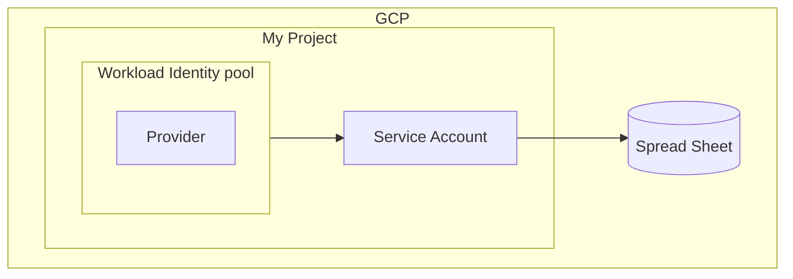
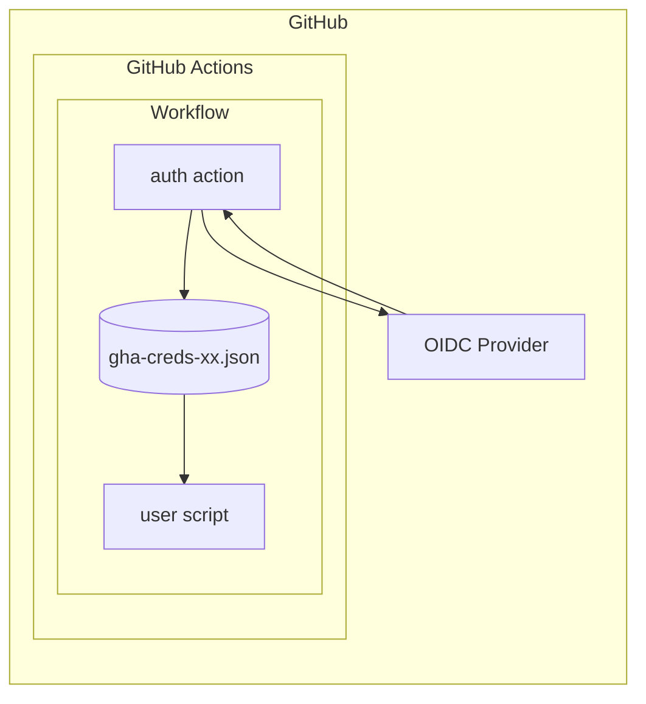

GitHub Actions から Node.js のスクリプトで Google Spread Sheet を更新したくなりました。

そこで、以前から気になっていた Google Actions からのキーなし認証を試してみることにしました。

## GitHub Actions からのキーなし認証とは

私のキーなし認証に対する理解は「守衛の人(GCP)に『〇〇さん(GitHub のリポジトリ)は名刺の確認ができたら来客用の入館証を渡しちゃってください』と連絡しておく」みたいな感じ？くらいなので、詳細は以下を参照していただければと。

@[card](https://zenn.dev/miyajan/articles/github-actions-support-openid-connect)
@[card](https://github.blog/changelog/2021-10-27-github-actions-secure-cloud-deployments-with-openid-connect/)

## GCP(Google Spread Sheet) を GitHub Actions から使う場合

大雑把な理解で書くと、GCP で「キーなし認証」利用するときは「サービスアカウントを利用する」ただし「鍵は事前作成せずに OIDC Provider を信頼する設定を使う」ようになっていました。

よって GitHub Actions からの利用ではリポジトリへ SECRET を追加するのではなく、GCP 側で「アクセスを許可するリポジトリなどを指定する」ことになります。

@[card](https://cloud.google.com/blog/ja/products/identity-security/enabling-keyless-authentication-from-github-actions)

### GCP 側の構成要素

前述の資料などで出てきたワードを Google Spread Sheet を利用する場合にあてはめると、だいたい以下のようになります。

*   「OIDC Provider を信頼する設定」は Workflow Identity Pool + Provider(から Service Account への接続設定)
*   「ロール」は Service Account (の権限設定)
*   「リソース」は Spread Sheet



ここで Workload Identity というワードが出てきましたが、これはコンソールからサービスアカウントの鍵を追加するとき表示されているアレです。

*▲ 図 2-1 鍵の追加画面で表示されるアレ*

### GitHub Actions 側の構成要素

GitHub Actions 側では Google の公式 Action([`google-github-actions/auth`]) を使うことでワークフロー実行時に鍵ファイルが自動的に保存されます[^key-file]。

また、クライアントアプリで [`googleapis`] を使っていれば保存された鍵ファイルを容易に利用できます[^auth-lib]。

よって、利用者側からしてみると「裏で発生しているやりとりはあまり意識しない」ですむようになっています。

1.  auth action([`google-github-actions/auth`]) が OIDC Provider を利用する
2.  OIDC Provider は認証用の情報(リポジトリ名など)を GCP へ渡し、信頼されたらトークンを受け取れる
3.  auth actiosh はトークンを受け取ったら鍵ファイルを作成し `gha-creds-xx.,json`として保存する
4.  user script(Spread Sheet を操作するアプリ)が [`googleapis`] を使っていれば `gha-creds-xx.jso` が利用される

[^key-file]: 保存されたファイルはチェックアウトされたルート(ワークスペース)に置かれるので他のステップから利用できます。また有効期限が短く設定されています。

[^auth-lib]: 実際には [`googleapis`] が利用している [`google-auth-library-nodejs`] が処理しています。



## 具体的な設定

利用する構成要素が出そろったので具体的に設定してみます。

### GCP 側での設定

#### サービスアカウントの設定

コンソールや [`gcloud`] から普通に作成したものが利用できます。

▼ *図 3-1 `gcloud` コマンドで作成する場合*

```shell-session
$ gcloud iam service-accounts create "${SA_NAME}" --display-name="${DISP_NAME}" \
      --project="${PROJECT_ID}"

$  gcloud iam service-accounts describe "${SA_NAME}@${PROJECT_ID}.iam.gserviceaccount.com" \
      --project="${PROJECT_ID}" \
      --format="value(email)"
```

ただし、サービスアカウントはそのままだと Google Drive 上のファイル(スプレッドシート)へアクセスする権限がありません[^share]。これは Drive 上で普通にファイルまたはフォルダーを共有することで対応します。

[^share]: そのままの状態でも「リンクを知っている全員」がアクセスできるファイルは利用できます。

*▲ 図 3-2 共有設定でサービスアカウンを追加*

#### Workload Identity 連携の設定

コンソールからも設定できますが、[`gcloud` ] を利用した汎用的な手順を記載されている方がいらっしゃるので、そちらを利用させていただくのが安全でよいかと思われます。

@[card](https://zenn.dev/vvakame/articles/gha-and-gcp-workload-identity#gcp%E5%81%B4%E3%81%A7%E3%82%84%E3%82%8B%E3%81%93%E3%81%A8)

ただし、Google Spread Sheet を使う場合は上記手順の他に、プロジェクト内で Sheet API を有効にする必要があります。具体的には上記手順の後に以下のコマンドを実行します。

```shell-session
# Google Sheets API を有効にする
$ gcloud services enable sheets.googleapis.com --project "${PROJECT_ID}"
```

なお、(キーなし認証固有の話ではないのですが)個別のサービスアカウントに対して Sheet API の利用を制限する方法が不明でした。よって、API を有効にするとプロジェクト内のサービスアカウントは一律で Sheet API を利用できるようになります。

設定が完了するとコンソールでは以下のようになります。

*▲ 図 3-3 Pool などが作成される*

*▲ 図 3-4 Pool と Service Account が接続されている*

####

### GitHub Actions(ワークフロー)側での設定

#### リポジトリから鍵ファイルを除外

[`google-github-actions/auth`]は受け取ったトークンを鍵ファイルとして保存しますが、そのときのディレクトリーは「チェックアウトされたリポジトリのルート」になります。そのため、ワークフローでリリースなど何らかの成果物を作成する場合「鍵ファイルを含めない」ように注意する必要があります[^token-format][^upload-credentials]。

その一環としてアクションのドキュメントでは `gha-cred-*.json` を `.gitignore` に指定するように記載されています。

    # Ignore generated credentials from google-github-actions/auth
    gha-creds-*.json

@[card](https://github.com/google-github-actions/auth#prerequisites)

[^token-format]: 設定により[ファイルとして保存する以外の利用方法](https://github.com/google-github-actions/auth#generating-oauth-20-access-tokens)もあります。ですが、ドキュメントを見た印象では標準の方法を推しているようなので、それに従うのが無難かと思われます。

[^upload-credentials]: クレデンシャルが含まれたファイルを[アップロードしてしまった場合の例](https://zenn.dev/hankei6km/articles/credentials-contained-files-on-github-actions#%E3%82%A2%E3%83%83%E3%83%97%E3%83%AD%E3%83%BC%E3%83%89)。

#### ワークフローの記述

以下のような感じで Google の公式 Action([`google-github-actions/auth`]) を実行するステップを追加します。

▼ *リスト 3-1 追加するステップ*

```yaml
- id: "auth"
  name: "Authenticate to Google Cloud"
  uses: "google-github-actions/auth@v0.6.0"
  with:
    # 外部から切り替えできるように secret にしてある.
    workload_identity_provider: ${{ secrets.WORKLOAD_IDENTITY_PROVIDER }}
    service_account: ${{ secrets.SERVICE_ACCOUNT }}
```

Action への入力(`with`) は以下のようになります。

*   `with.workload_identity_provider` - リスト 3-2 のコマンドで取得できます
*   `with.service_account` - はサービスアカウントのメールアドレスです

▼ *リスト 3-2 workload\_identity\_provider 用の値を取得するコマンド*

```shell-session
$ gcloud iam workload-identity-pools providers describe "${PROVIDER_NAME}" \
    --project="${PROJECT_ID}" --location="global" \
    --workload-identity-pool="${POOL_NAME}" \
    --format="value(name)"
```

また、[`google-github-actions/auth`] は `id-token` の権限が必要なので `permissions` を変更します。

```yaml
permissions:
  contents: "read"
  id-token: "write"
```

:::details (クリックでワークフロー全体を表示)

```yaml:.github/workflows/test.yaml
name: test
on:
  push:
  workflow_dispatch:

jobs:
  oidc:
    environment: oidc

    permissions:
      contents: "read"
      id-token: "write"

    runs-on: ubuntu-latest

    steps:
      - uses: actions/checkout@v3

      - name: Use Node.js 16.xx
        uses: actions/setup-node@v1
        with:
          node-version: 16.x

      - name: Cache node modules
        uses: actions/cache@v2
        env:
          cache-name: cache-node-modules
        with:
          path: ~/.npm
          key: ${{ runner.os }}-build-${{ env.cache-name }}-${{ hashFiles('**/package-lock.json') }}
          restore-keys: |
            ${{ runner.os }}-build-${{ env.cache-name }}-
            ${{ runner.os }}-build-

      - name: Install modules
        run: npm ci

      - name: Build
        run: npm run build

      - id: "auth"
        name: "Authenticate to Google Cloud"
        uses: "google-github-actions/auth@v0.6.0"
        with:
          # 外部から切り替えできるように secret にしてある.
          workload_identity_provider: ${{ secrets.WORKLOAD_IDENTITY_PROVIDER }}
          service_account: ${{ secrets.SERVICE_ACCOUNT }}

      - name: Update spread sheet
        run: node dist/index.js
        env:
          # 外部から切り替えできるように secret にしてある.
          SPREADSHEET_ID: ${{ secrets.SPREADSHEET_ID }}
```

:::

#### 認証用コードの記述

前述したように [`googleapis` ] は保存された鍵ファイルを利用できますが、これは環境変数 `GOOGLE_APPLICATION_CREDENTIALS` でファイル名を渡すことで実現されます。

> Using the `GOOGLE_APPLICATION_CREDENTIALS` env var
>
> You can start process with an environment variable named `GOOGLE_APPLICATION_CREDENTIALS`. The value of this env var should be the full path to the service account credential file:

@[card](https://github.com/googleapis/google-api-nodejs-client#service-account-credentials)

よって「環境変数経由でサービスアカウントの鍵ファイルを利用する」ようにコードを記述します。具体的には以下のように `GoogleAuth` インスタンス作成時「鍵の設定をしない」ようにします。

▼ *リスト 3-3 認証部分の抜粋*

```ts
const auth = new google.auth.GoogleAuth({
  scopes: SCOPES,
});
const authClient = await auth.getClient();
const sheets = google.sheets({ version: "v4", auth: authClient });
```

これを利用して今回は「スプレッドシートへ現在時刻を追加した後にシートから値を取得する」処理を記述しています。

:::details (クリックでコードを表示)

```ts:src/index.ts
import { google } from "googleapis";
import { GoogleAuth } from "google-auth-library";
import { JSONClient } from "google-auth-library/build/src/auth/googleauth";

const SCOPES = ["https://www.googleapis.com/auth/spreadsheets"];
async function main(auth: GoogleAuth<JSONClient>) {
  const authClient = await auth.getClient();

  const sheets = google.sheets({ version: "v4", auth: authClient });
  try {
    const spreadsheetId = process.env["SPREADSHEET_ID"];
    const sheetName = "Data";

    // スプレッドシートへ値を追加.
    const now = Date.now();
    const request = {
      spreadsheetId,
      range: `${sheetName}!A2:C`,
      valueInputOption: "USER_ENTERED",
      insertDataOption: "INSERT_ROWS",
      resource: {
        majorDimension: "ROWS",
        values: [["now", now, new Date(now).toString()]],
      },
      auth: authClient,
    };
    await sheets.spreadsheets.values.append(request);

    // スプレッドシートから値を取得.
    const res = await sheets.spreadsheets.values.get({
      spreadsheetId,
      range: `${sheetName}!A2:C`,
    });
    const rows = res.data.values;
    if (rows && rows.length) {
      console.log("label, now, date");
      rows.map((row) => {
        console.log(`${row[0]}, ${row[1]}, ${row[2]}`);
      });
    } else {
      console.log("No data found.");
    }
  } catch (err) {
    console.log("The API returned an error: " + err);
    process.exit(1);
  }
}
const auth = new google.auth.GoogleAuth({
  scopes: SCOPES,
});
main(auth);
```

:::

## 実行してみる

設定が完了していれば通常のワークフローとして実行できます。今回は `push` のときに実行していますが、とくに問題なくスプレッドシートを更新できました。

*▲ 図 4-1 時刻などが書き込まれています*

なお、ログを参照すると環境変数に鍵のファイル名が設定されていることも確認できます。

▼ *図 4-2 スクリプトを実行するステップに環境変数がセットされている*

    2022-03-14T10:33:02.7335693Z ##[group]Run node dist/index.js
    2022-03-14T10:33:02.7336081Z node dist/index.js
    2022-03-14T10:33:02.7389253Z shell: /usr/bin/bash -e {0}
    2022-03-14T10:33:02.7389487Z env:
    2022-03-14T10:33:02.7389844Z   CLOUDSDK_AUTH_CREDENTIAL_FILE_OVERRIDE: /home/runner/work/test-sheet-api/test-sheet-api/gha-creds-88eea19cf35d57a7.json
    2022-03-14T10:33:02.7390328Z   GOOGLE_APPLICATION_CREDENTIALS: /home/runner/work/test-sheet-api/test-sheet-api/gha-creds-88eea19cf35d57a7.json
    2022-03-14T10:33:02.7390774Z   GOOGLE_GHA_CREDS_PATH: /home/runner/work/test-sheet-api/test-sheet-api/gha-creds-88eea19cf35d57a7.json
    2022-03-14T10:33:02.7391114Z   CLOUDSDK_PROJECT: united-time-339314
    2022-03-14T10:33:02.7391382Z   CLOUDSDK_CORE_PROJECT: united-time-339314
    2022-03-14T10:33:02.7391645Z   GCP_PROJECT: united-time-339314
    2022-03-14T10:33:02.7391892Z   GCLOUD_PROJECT: united-time-339314
    2022-03-14T10:33:02.7392149Z   GOOGLE_CLOUD_PROJECT: united-time-339314
    2022-03-14T10:33:02.7392670Z   SPREADSHEET_ID: ***

## ローカルでの動作確認

スクリプトに機能を追加する場合、動作確認としてローカルでもスプレッドシートを更新したくなります。

このような場合の一般的な手順はわからなかったのですが、環境変数 `GOOGLE_APPLICATION_CREDENTIALS` を利用していれば、テスト用サービスアカウントで作成した鍵を利用できます。

```shell-session
$ GOOGLE_APPLICATION_CREDENTIALS=./gha-creds-test-temp.json  node --loader ts-node/esm src/index.ts 
(node:2032946) ExperimentalWarning: --experimental-loader is an experimental feature. This feature could change at any time
(Use `node --trace-warnings ...` to show where the warning was created)
label, now, date
now, 1647253845647, Mon Mar 14 2022 10:30:45 GMT+0000 (Coordinated Universal Time)
now, 1647253983301, Mon Mar 14 2022 10:33:03 GMT+0000 (Coordinated Universal Time)
now, 1647313710368, Tue Mar 15 2022 03:08:30 GMT+0000 (Coordinated Universal Time)
```

とはいっても鍵の作成はあまりよろしくないので、以下を参考に鍵の入れ替え手順などは整えておくのがよいかと思われます。

@[card](https://cloud.google.com/blog/ja/products/gcp/help-keep-your-google-cloud-service-account-keys-safe)

なお、上記で紹介されている [Keyrotator](https://github.com/Googlecloudplatform/keyrotator) を試そうとしたのですが実行できなかったので、今回は以下のようなスクリプトを利用しました。

1.  テストしたいときに実行する
2.  スクリプトは `gha-cred-*.json` 作成後に Enter 押下待ちとなる[^filename]
3.  Enter 待ちの間に `gha-cred-*.json` をテストで利用する
4.  テストが終わったら Enter を押下して鍵を削除する

[^filename]: ファイル名を `gha-creds-*.json` のようにしておくと `.gitignode` の指定でリポジトリへ含まれることをある程度は防止できます。

:::details (クリックで実行例などを表示)

▼ *リスト 5-1 一時的に利用する鍵のスクリプト*

```bash:sa-temp-key.sh
#!/bin/bash
set -e

PROJECT_ID="<project id>"
SA_EMAIL="<service account email>"
FILE_BASE_NAME="temp"

FILE_NAME="gha-creds-test-${FILE_BASE_NAME}.json"

gcloud iam service-accounts keys create "${FILE_NAME}" \
  --project="${PROJECT_ID}" \
  --iam-account="${SA_EMAIL}"

echo ""
read -r -p "enter to delete key"

gcloud iam service-accounts keys delete "$(jq < "${FILE_NAME}" ".private_key_id" -r)" \
  --project="${PROJECT_ID}" \
  --iam-account="${SA_EMAIL}" --quiet

rm "${FILE_NAME}"
```

▼ *リスト 5-2 スクリプトの実行例*

```shell-session
$ sh sa-temp-key.sh
created key [xxxxxxxxxxxxxxxxxxxxxxxxxxxxxxxxxxxxxxxx] of type [json] as [gha-creds-test-temp.json] for [xxxxx-xxxx@xxxxxxxxxxxxxxxxxx.iam.gserviceaccount.com]

enter to delete key
You are about to delete key [xxxxxxxxxxxxxxxxxxxxxxxxxxxxxxxxxxxxxxxx] for service account [xxxxx-xxxx@uxxxxxxxxxxxxxxxxx.iam.gserviceaccount.com].

Do you want to continue (Y/n)?  y

deleted key [xxxxxxxxxxxxxxxxxxxxxxxxxxxxxxxxxxxxxxxx] for service account [xxxxx-xxxx@xxxxxxxxxxxxxxxxxx.iam.gserviceaccount.com]
```

▼ *リスト 5-3 削除された鍵を利用した場合*

```shell-session
$ GOOGLE_APPLICATION_CREDENTIALS=./gha-creds-test-temp.json  node --loader ts-node/esm src/index.ts 
(node:2033396) ExperimentalWarning: --experimental-loader is an experimental feature. This feature could change at any time
(Use `node --trace-warnings ...` to show where the warning was created)
The API returned an error: Error: invalid_grant: Invalid JWT Signature.
```

:::

## おわりに

ワークフロー内でクレデンシャルを含むファイルを扱うとき「リポジトリの SECRET で対応するのは結構厳しい」と考えていました。今回は「その辺の手間を軽減できるかな」とキーなし認証を試してみたところおおよそ期待通りでした。

[`googleapis`] が対応しているサービス(API)ならスプレッドシート以外でも同じような手順で対応できると思われるので、今後もキーなし認証が使える状況であれば利用していきたいと考えています。

[`google-github-actions/auth`]: https://github.com/google-github-actions/auth

[`googleapis`]: https://www.npmjs.com/package/googleapis

[`google-auth-library-nodejs`]: https://github.com/googleapis/google-auth-library-nodejs

[`gcloud`]: https://cloud.google.com/sdk/gcloud

[`openssl`]: https://www.openssl.org/
