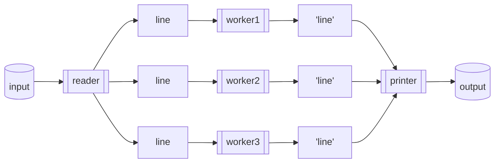

Rust を使ってみたくなり、勉強のために簡単な CLI ツールを作ってみました。

@[card](https://crates.io/crates/xquo)
@[card](https://github.com/hankei6km/xquo)

そして無謀にも「どうせなら並列処理も試してみよう」と挑戦してみたのですが、ワーカースレッドを複数にするとガクっと遅くなってしまいました。

**図 1 経過時間の比較**

```shell-session
# ワーカースレッドが 1 の場合
$ time ./target/x86_64-unknown-linux-musl/release/xquo -w 1 < tmp/tmp_large.txt > /dev/null

real    0m25.902s
user    0m30.587s
sys     0m1.637s


# ワーカースレッドが 2 の場合
$ time ./target/x86_64-unknown-linux-musl/release/xquo -w 2 < tmp/tmp_large.txt > /dev/null

real    0m45.006s
user    1m35.825s
sys     0m2.187s
```

real と user の値を見ると並列化はできているようですが、何かボトルネックがあるように見えます。そこで対策を調べてみました。

## どのようなツールを作ったのか

以下のようなテキスト行をクオートするツールを作りました(詳細などは [REAME.md](https://github.com/hankei6km/xquo/blob/main/README.md) を見てください)。

**図 1-1 find と vim のパイプに xquo(今回作ったツール) を挟む**

```shell-session
$ find . -type f -print0 | xquo | vim "+%s/^/ls -l /" -
```

**図 1-2 クオートされたファイル名が取り込まれる**

    ls -l './123'$'\\n''abc.txt'
    ls -l './123'"'"'abc.txt'
    ls -l './123 abc.txt'
    ls -l './123"abc.txt'

このようなツールなので、処理の多くの部分が文字列の操作になります。また、文字列は `String` で連結(`format!`)や置換しています。

**リスト 1-1 処理の一部抜粋**

```rust
fn quote(&self, line: String) -> String {
    format!("'{}'", self.replace(self.wrap_single_quote(line)))
}
```

## 並列処理の実装方法

今回のツールでどのように並列処理を行っているかの説明です。

Go の channel を使った並列処理は好きなのと、下記の記事で Rust も channel があるのは見ていたので、今回もワーカースレッドを使った並列化をしようと考えました。

@[card](https://zenn.dev/tfutada/articles/16766e3b4560db)

とは言っても Rust の場合は Multi-Producer Single-Consumer (MPSC) です。[Go by Example: Worker Pools](https://gobyexample.com/worker-pools) のように実装する場合は少し捻る必要があります。

@[card](https://qiita.com/termoshtt/items/b4561180894104c1c4c2)

自前で実装してもよいのですが [crossbeam](https://crates.io/crates/crossbeam) が定番かなという感じだったのでファンアウト的な部分ではそちらを利用しています。

@[card](https://crates.io/crates/crossbeam)

これで、以下のように複数のワーカースレッドで文字列をクオートできるようになりました。

**図 2-1 実装した並列処理の概要**



パッと見で速くなりそうな感じですが、現実は冒頭の通りでワーカースレッドが複数になると遅くなります。

## どの辺に問題がありそうか？

今回作ったツールは行単位で文字列(`String`)を操作しています。

たとえば 1000000 行のテキストだった場合、文字列の連結(`format!`)が最低でも 1000000 回は実行されます(テキストの内容によってはさらに置換も複数回実行される)。

Rust の `String` 関連のメソッドを詳しく調べたわけではなのですが、各種処理は `String` オブジェクトを用意(ビープ領域を確保)してから加工が実行されていると思われます。

その証拠というわけでもないですが、`x86_64-unknown-linux-gnu` と `x86_64-unknown-linux-musl` でビルドした場合に musl 用は遅くなります。
(musl はアロケーターが遅いとよく見かける)

よって、今回のツールは小刻みにヒープの領域を確保していて、そこがボトルネックになっている可能性が高いと予想されます。

## 何故に並列処理だと遅くなるのか

ヒープ操作の効率が悪いといっても「直列に操作したときの話」であって「並列化すれば遅いなりにも短縮されるのでは」と思いたくなります。

これについては、少し脇にそれますが「musl 用にビルドすると遅くなる」のも気になっていたので調べてみると「システムアロケーターが要因として挙げられている」ことが多い感じでした。

その線でさらに調べていくと「jemalloc を使うとよい」という話が出てきます。

@[card](https://www.reddit.com/r/rust/comments/gdycv8/why_does_musl_make_my_code_so_slow/)

jemalloc が良いという理由はいくつかありますが、複数 CPU コアで複数スレッドのときに排他を抑制する(らいしい)というのがあります。

これは逆の視点でみると「システムアロケーターを使うとスレッドの排他制御に影響される」とも言えます。

## jemalloc を試してみる

Rust で jemalloc を使う場合、現在では [tikv-jemallocator](https://crates.io/crates/tikv-jemallocator) の利用が定番のようです([jemallocator](https://crates.io/crates/jemallocator) の後継という位置付けらしい)。

@[card](https://til.toshimaru.net/2021-12-01)
@[card](https://blog.rust-lang.org/2019/01/17/Rust-1.32.0.html#jemalloc-is-removed-by-default)

[tikv-jemallocator](https://crates.io/crates/tikv-jemallocator) を使うには、依存関係を追加しグローバルのアロケーターとして指定するだけです。 (今回は optional にしていますが、この辺については後で出てきます)

**リスト 5-1 Cargo.toml に依存関係を追加**

```toml
[dependencies]
tikv-jemallocator = { version = "0.5", optional = true }
```

**リスト 5-2 main.rs でグローバルのアロケーターとして指定**

```rust
#[cfg(feature = "jemalloc")]
use tikv_jemallocator::Jemalloc;

#[cfg(feature = "jemalloc")]
#[global_allocator]
static GLOBAL: Jemalloc = Jemalloc;
```

ただし、設定は簡単なのですが、ビルドには少し準備が必要なこともあります。

今回は Ubuntu ベースのイメージで環境を作っているので、musl 用に [tikv-jemallocator](https://crates.io/crates/tikv-jemallocator) をコンパイルするには `musl-tools` が必要になります。

**図 5-1 musl-tools をインストール**

```shell-session
$ sudo apt-get install musl-tools
```

以上で準備は完了です。

この状態でビルドした場合、以下のように複数ワーカースレッドの方が速くなります。

**図 5-2 jemalloc ありでビルドし経過時間比較**

```shell-session
$ cargo build --release --target=x86_64-unknown-linux-musl --features=jemalloc
    Finished release [optimized] target(s) in 0.05s

# ワーカースレッドが 1 の場合
$ time ./target/x86_64-unknown-linux-musl/release/xquo -w 1 < tmp/tmp_large.txt > /dev/null

real    0m11.900s
user    0m13.200s
sys     0m1.091s

# ワーカースレッドが 2 の場合
$ time ./target/x86_64-unknown-linux-musl/release/xquo -w 2 < tmp/tmp_large.txt > /dev/null

real    0m6.770s
user    0m14.947s
sys     0m0.963s
```

## jemalloc 無しと有りでの比較

jemalloc を利用した実行ファイルをビルドできるようになったので、無しのときと有りのときで実行時間を比較してみます。

また、せっかくなのでターゲットも `x86_64-unknown-linux-musl` と `x86_64-unknown-linux-gnu` を利用してみます。

比較方法などは以下のとおりです。

*   `date` コマンドの real の値を比較
*   値は 2 回実行して速い方を採用[^codespaces]

[^codespaces]: サンプル数が少ないですが、Codepaces 上で混雑状況も影響するのため傾向を見る程度にしてあります。

**図 6-1 実行環境は Codespaces で、テスト用のファイルは以下のように作成**

```shell-session
$ grep "model name" /proc/cpuinfo 
model name      : Intel(R) Xeon(R) Platinum 8272CL CPU @ 2.60GHz
model name      : Intel(R) Xeon(R) Platinum 8272CL CPU @ 2.60GHz
model name      : Intel(R) Xeon(R) Platinum 8272CL CPU @ 2.60GHz
model name      : Intel(R) Xeon(R) Platinum 8272CL CPU @ 2.60GHz

$ for i in $(seq 10000000) ; do echo "test'${i}"$'\b'"''${i}" ; done | tr '\n' '\0' > tmp/tmp_large.txt
```

**図 6-2 ビルドと計測用コマンドの例**

```shell-session
$ cargo build --release --target=x86_64-unknown-linux-musl --features=jemalloc
    Finished release [optimized] target(s) in 0.05s

$ time ./target/x86_64-unknown-linux-musl/release/xquo -w 1 < tmp/tmp_large.txt > /dev/null
```

結果は以下のとおりです。jemalloc を使うことで並列化の効果を得ることができました。また、ターゲット間の差が縮まっていることも確認できました(musl でアロケーターが遅いという点も解消されている)。

**表 6-1 実行時間一覧(単位は秒)**

|                                        | 1      | 2      | 3      | 4      | 5      | 6      |
| -------------------------------------- | ------ | ------ | ------ | ------ | ------ | ------ |
| x86\_64-unknown-linux-musl jemalloc 無し | 23.972 | 42.668 | 39.447 | 43.407 | 56.113 | 58.653 |
| x86\_64-unknown-linux-musl jemalloc 有り | 11.903 | 6.724  | 6.112  | 5.889  | 5.907  | 5.943  |
| x86\_64-unknown-linux-gnu  jemalloc 無し | 11.075 | 24.725 | 26.267 | 30.876 | 31.399 | 31.864 |
| x86\_64-unknown-linux-gnu  jemalloc 有り | 8.566  | 4.919  | 4.829  | 4.77   | 4.732  | 4.71   |

**グラフ 6-1 ターゲットと jemalloc 有無によるグラフ**


:::message
作成したツール([xquo](https://github.com/hankei6km/xquo))の処理を更新したので、実行時間が最新版とは異なっています。

現時点(2022-07-28)の値は「[Rust でも chan chan](https://zenn.dev/hankei6km/articles/channel-channel-in-rust#channel-%E7%94%9F%E6%88%90%E3%81%A8-send-%E5%9B%9E%E6%95%B0%E5%A2%97%E5%8A%A0%E3%81%AB%E3%82%88%E3%82%8B%E3%82%AA%E3%83%BC%E3%83%90%E3%83%BC%E3%83%98%E3%83%83%E3%83%89)」に掲載してありますが、傾向(jemalloc ありにしないと並列処理が遅い)としては同じになります。
:::

## 考慮点

個人的な感想としては「jemalloc 使うだけでこんなに改善できるなんて魔法のようじゃないか」という感じですが、その手の話にはやはりなにかしらのデメリットがあるものです。

### ビルドできるようになるまでがわりと面倒

さきほど、musl 用のビルドのために Ubuntu へ `musl-tools` をインストールしましたが、`musl-tools` が必要とわかるまでに結構時間がかかりました。

また、ビルド環境とターゲットの組み合わせによってはうまくいかないこともありました。

ターゲットやビルド環境が明確になっているならよいのですが、明確でないならターゲットなどで分岐するか optional にするような検討が必要になります。

以下は、試した範囲でうまくいかなった例です。

#### alpine + `x86_64-unknown-linux-musl`

relase ビルドは成功しますが、debug ビルドは`pthread_getname_np` が定義されていないエラーになる。

#### alpine + `x86_64-unknown-linux-gnu`

configure がエラーになる。Ubuntu で `musl-tools` をインストールしていないときと同じようなメッセージなので、ビルド用に何かしらのパッケージが必要と思われます。

### ビルド時間

Codespaces の 4 コア環境では [tikv-jemallocator](https://crates.io/crates/tikv-jemallocator) のコンパイルに 1 分くらいかかります。

**図 7-1 jemalloc 無しと有りでのビルド時間比較**

```shell-session
$ cargo clean --target=x86_64-unknown-linux-musl --release
$ cargo build --target=x86_64-unknown-linux-musl --release
   # snip....
   Compiling xquo v0.1.1 (/workspaces/xquo)
    Finished release [optimized] target(s) in 44.67s

$ cargo clean --target=x86_64-unknown-linux-musl --release
$ cargo build --target=x86_64-unknown-linux-musl --release --features=jemalloc
   # snip....
   Compiling xquo v0.1.1 (/workspaces/xquo)
    Finished release [optimized] target(s) in 1m 51s
```

GitHub Actions などで target を変更しながらテストする場合、matrix などでうまく処理しないとちょっと厳しい感じです。

### ビルドされたファイルのサイズ

以下のように増加します。

**図 7-2 ビルドされたファイルのサイズ比較**

```shell-session
$ cargo build --target=x86_64-unknown-linux-musl --release
   Compiling xquo v0.1.1 (/workspaces/xquo)
    Finished release [optimized] target(s) in 6.04s
$ ls -l target/x86_64-unknown-linux-musl/release/xquo
-rwxrwxrwx 2 vscode vscode 4946304 Jul 21 15:53 target/x86_64-unknown-linux-musl/release/xquo
$ strip target/x86_64-unknown-linux-musl/release/xquo
$ ls -l target/x86_64-unknown-linux-musl/release/xquo
-rwxrwxrwx 2 vscode vscode 1087624 Jul 21 15:53 target/x86_64-unknown-linux-musl/release/xquo

$ cargo build --target=x86_64-unknown-linux-musl --release --features=jemalloc
    Finished release [optimized] target(s) in 0.04s
$ ls -l target/x86_64-unknown-linux-musl/release/xquo
-rwxrwxrwx 2 vscode vscode 10734216 Jul 21 15:50 target/x86_64-unknown-linux-musl/release/xquo
$ strip target/x86_64-unknown-linux-musl/release/xquo
$ ls -l target/x86_64-unknown-linux-musl/release/xquo
-rwxrwxrwx 2 vscode vscode 1792880 Jul 21 15:55 target/x86_64-unknown-linux-musl/release/xquo
```

### その他

Rust では 1.32.0 から jemalloc がデフォルトでなくなりました。

@[card](https://blog.rust-lang.org/2019/01/17/Rust-1.32.0.html#jemalloc-is-removed-by-default)

この要因としてはファイルサイズ増加の他、いろいろ問題が起きやすいというのがあるようです。

> Finally, while jemalloc *usually* has great performance, that's not always the case. Additionally, it adds about 300kb to every Rust binary. We've also had a host of [other issues](https://github.com/rust-lang/rust/issues/36963#issuecomment-252029017) with jemalloc in the past. It has also felt a little strange that a systems language does not default to the system's allocator.

また、musl のシステムアロケーターの方が速いという話もあるようです。

@[card](https://users.rust-lang.org/t/optimizing-rust-binaries-observation-of-musl-versus-glibc-and-jemalloc-versus-system-alloc/8499)

## どのくらい利用されているのか

長い物には巻かれたい方なので、jemalloc はどのくらい利用されているのか少し確認してみました。

[crates.io](https://crates.io/) で [jemallocator](https://crates.io/crates/jemallocator) と [tikv-jemallocator](https://crates.io/crates/tikv-jemallocator) の Dependents を見ると、それぞれ 85 件と 16 件と出てきます。これが多いのか少ないのかはわかりませんが、大量のレコードを処理するコマンドでは利用されている印象です。

@[card](https://crates.io/crates/jemallocator/reverse_dependencies)
@[card](https://crates.io/crates/tikv-jemallocator/reverse_dependencies)

たとえば、下記の記事で挙げられていた中では「[fd](https://github.com/sharkdp/fd)」と「[ripgrep](https://github.com/BurntSushi/ripgrep)」で利用されていました。

@[card](https://zenn.dev/kujirahand/articles/a6f8e58ef58489)

## おわりに

Rust で並列処理が遅くなったときの対策に jemalloc を使ってみました。

ビルドできるようになるまで少し手間ですが「ワーカースレッドでヒープの領域確保を小刻みに行う必要がある」場合は、効果を見込める結果となりました。

たとえば「JSONL のストリームを行単位に複数ワーカースレッドでパースしたい」などで有効かと予想しています。

ただし、考慮点でも少し触れましたが jemalloc の利用はそれなりにデメリットもあります。利用する前に「ヒープの確保と開放の回数を減らせないか？」などの確認はした方が良いかもしれません。
