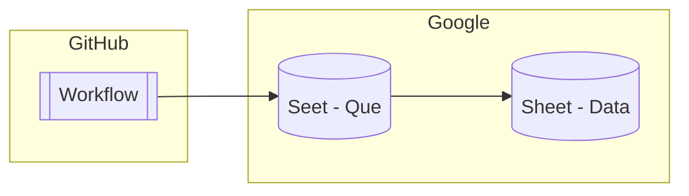

[GitHub Actions のスケジュールトリガーを使ったとき](https://zenn.dev/hankei6km/articles/automatically-update-github-profile#%E5%AE%9A%E6%9C%9F%E7%9A%84%E3%81%AA%E5%AE%9F%E8%A1%8C)「実行されるまで結構バラつきがある」と感じたので [Google Data Portal]\(Data Source)で可視化してみました。

▼ **図 1 サンプル画面**


## 何を可視化しているのか

毎時 13 分と 43 分にワークフローを開始し、以下の項目を Google スプレッドシートへ送信しています。

*   待機時間 -「ワークフロー実行情報が作成された時刻」から「指定されていた開始時刻」を引いたもの
*   準備時間 -「ジョブが開始された時刻」から上記の「ワークフロー実行情報が作成された時刻」を引いたもの
*   経過時間 -「ジョブ実行後の現在時刻」から上記の「ジョブが開始された時刻」を引いたもの

少しわかりにくいですが、おおよそ以下のような関係です。

1.  ワークフロー実行情報が作成された時刻
2.  ジョブが開始された時刻
3.  ジョブ実行後の現在時刻


そしてスプレッドシートへ記録された内容を Google Data Portal で可視化しています。

## どのように可視化しているか

### 利用している技術

*   [GitHub Actions] - 今回の観測対象でありワークフローとジョブの実行基盤
*   [zx] - ジョブ内での各種時刻などを収集するスクリプトで利用
*   [GitHub CLI] - ジョブ内からワークフローの情報を取得するために利用
*   [Google Sheets API] - GitHub Actions から Google スプレッドシートへ記録を送信するために利用
*   [Workload Identity 連携] - GCP でキーなし認証を実現するために利用
*   [Google Apps Script] - GitHub Actions のジョブ実行時間を短縮させるためスプレッドシート側でも処理を入れています
*   [Google Data Portal] - 記録の可視化に利用

### ワークフロー実行情報の取得

ワークフローの情報などは [GitHub CLI] で取得しています。実行中に自分自身の情報を取得できるかわからなかったのですが、`${{ github.run_id }}` の値から取得できました。

▼ **リスト 2-1 zx から GitHub CLI でワークフローの情報を取得**

```ts
const outCreatedAt =
  await $`gh run view ${runId} --json createdAt --jq ".createdAt"`
```

▼ **リスト 2-2 ジョブの情報を取得**

```ts
const outStartedAt =
  await $`gh api '/repos/{owner}/{repo}/actions/runs/${runId}/jobs' --jq ".jobs[0].started_at"`
```

### スプレッドシートへ送信

送信側は単純に [Google Sheets API] で Append しています。認証は前述のように[Workload Identity 連携]で[キーなし認証を利用しています](https://zenn.dev/hankei6km/articles/update-google-spread-sheet-from-github-actions)。

▼ **リスト 2-3 スプレッドシートへ送信**

```ts
const request = {
  spreadsheetId,
  range: `${sheetName}!A2:F`,
  valueInputOption: 'USER_ENTERED',
  insertDataOption: 'INSERT_ROWS',
  resource: {
    majorDimension: 'ROWS',
    values
  },
  auth: authClient
}
const addRes = await sheets.spreadsheets.values.append(request)
```

### 2 つのスプレッドシート

GitHub からの送信を受け付けるスプレッドシートと永続的に保存するスプレッドシートを分けています。

▼ **図 2-1 受信と保存のスプレッドシート**



いくつか理由があるのですが、スプレッドシートで保持しているレコード数が増えたときに Append などの速度がどれくらい低下するか読めなかったというのが大きいです。

そのため以下のようなスクリプトを作成し、2 時間毎に `moveData_` 関数を実行しています。

▼ **図 2-2 受信用のシートは常に数レコードに保たれる**


:::details (クリックでリストを表示)
▼ **1受信した値の編集と転記**

```js
/**
 * ミリ秒を返す.
 * @param {number} days
 * @param {number} hours
 * @param {number} mins
 * @param {number} secs
 * @param {number} millis
 * @returns {number}
 */
function mills_(days, hours, mins, secs, mills) {
  return (days * 21600 + hours * 3600 + mins * 60 + secs) * 1000 + mills
}

/**
 * 指定された sheet へ値を挿入する.
 * 
 * @param {SpreadsheetApp.Sheet} dstSheet- 挿入先 sheet.
 * @param {any[][]} data - 値.
 * @returns {number 挿入した値の行数.
 */
function insertValues_(dstSheet, data) {
  const dataRows = data.length
  dstSheet.insertRows(2, dataRows)
  dstSheet.getRange(2, 1, dataRows, 7).setValues(data)
  return dataRows
}

/**
 * 値を移動させる.
 * @param {string} srcSheetName - 移動元 sheet の名前.
 * @param {string} dstSheetName - 移動先 sheet の名前(下記の spread sheet でもこの名前の sheet が移動先になる).
 * @param {string} spreadSheetIdExt - 他の spread sheet の id.
 */
function moveData_(srcSheetName, dstSheetName, spreadSheetIdExt) {
  const timeout = 30
  // const srcSheetName = "gather"
  // const srcSheetName = "dev"
  // const dstSheetName = "log"

  let err

  const lock = LockService.getDocumentLock();
  try {
    lock.waitLock(1000 * timeout);

    try {
      const ss = SpreadsheetApp.getActiveSpreadsheet()
      const ssExt = SpreadsheetApp.openById(spreadSheetIdExt)
      const srcSheet = ss.getSheetByName(srcSheetName)
      const removed = BlankRows.deleteBlankRows(srcSheet) // 空行ができる可能性があるので除去している.

      const srcRange = srcSheet.getDataRange()
      if (srcRange.getValues().length > 1) {
        const dstSheet = ss.getSheetByName(dstSheetName)
        const dstSheetExt = ssExt.getSheetByName(dstSheetName)
        const data = srcSheet.getDataRange().getValues().slice(1).sort(([aRunId], [bRunId]) => bRunId - aRunId).map(row => {
          // 設定されていた開始時刻を求める.
          const createdAt = new Date(row[3])
          const hh = createdAt.getUTCHours()
          // 開始時刻よりも前の時間の場合は日付をまたいでいるときと想定.
          // 24 時間遅延した場合は考えない.
          const across = row[1] > hh
          const date = createdAt.getUTCDate() - (across ? 1 : 0)
          const ts = new Date(0)
          ts.setUTCFullYear(createdAt.getUTCFullYear())
          ts.setUTCMonth(createdAt.getUTCMonth())
          ts.setUTCDate(date)
          ts.setUTCHours(row[1])
          ts.setUTCMinutes(row[2])
          // 計算はログ利用側で行う.
          // const base = mills_(0, row[1], row[2], 0, 0)
          // const delta = mills_(across ? 1 : 0, hh, now.getUTCMinutes(), now.getUTCSeconds(), now.getUTCMilliseconds()) - base
          return [...row, ts.getTime()]
        })
        const dataRows = insertValues_(dstSheet, data)
        insertValues_(dstSheetExt, data)

        srcSheet.deleteRows(2, dataRows)
        console.log(`data(${data.length}) has been moved.`)
      } else {
        err = `data is not appended.`
      }

      // 空行を削除していたらエラーとするが処理自体は完了している.
      console.log(removed)
      if (removed.length > 0) {
        err = `blank row(s) is detected: ${JSON.stringify(removed)}`
      }

    } catch (e) {
      err = e
    }

  } catch (e) {
    err = `Could not obtain lock after ${timeout} seconds.`
  } finally {
    lock.releaseLock()
  }

  if (err) {
    throw new Error(err)
  }
}
```

:::

### 保存した記録の可視化

初めて [Google Data Portal] を使ったのもあり、ここが一番苦労しました。

グラフやスコアカードなどを作成すること自体はネットを検索するといろいろ出てくるので、その辺は少し苦労したら対応できました。

▼ **図 2-3 編集画面**


その一方で時刻の扱いは試行錯誤することになりました。とくにタイムゾーンの扱いがよくわからなかったのでパラメーターで足し算引き算しています。

そのためタイムゾーンではなく時差と表示しています。また、「30 分ずらすような処理は省略」「範囲選択の UI などには反映されない」と少し機能が足りていないところもあります。

▼ **図 2-4 計算式で「時差」を考慮**


## 結果

上記のような過程を経て以下のようになりました。

▼ **図 3-1 日本時間で表示**


@[card](https://datastudio.google.com/reporting/ff19291b-248e-43ac-9bbd-b6a1c56b6644)

時差の指定の他、対象期間の変更などにも対応しています。

▼ **図 3-2 対象期間の指定**


▼ **図 3-3 曜日の指定(曜日順には並んでいません)**


▼ **図 3-4 リスト表示**


## その他

### エラーの頻度

現時点で 1 ヶ月くらい動かしていますが、把握してい限りでは何度かエラーが発生しました。参考までに一覧を記載します。

::: details (クリックで一覧表示)

| run id                                                                              | 場所     | エラー                                                                                                                                                                                                             |
| ----------------------------------------------------------------------------------- | ------ | --------------------------------------------------------------------------------------------------------------------------------------------------------------------------------------------------------------- |
| [1975007658](https://github.com/hankei6km/gha-now-to-sheet/actions/runs/1975007658) | Google | The API returned an error: Error: The service is currently unavailable.(エラーチェックをミスしていたのでジョブは正常終了している)                                                                                                           |
| [2000191043](https://github.com/hankei6km/gha-now-to-sheet/actions/runs/2000191043) | GitHub | The hosted runner: Hosted Agent lost communication with the server. Anything in your workflow that terminates the runner process, starves it for CPU/Memory, or blocks its network access can cause this error. |
| [2000282870](https://github.com/hankei6km/gha-now-to-sheet/actions/runs/2000282870) | GitHub | The hosted runner: Hosted Agent lost communication with the server. Anything in your workflow that terminates the runner process, starves it for CPU/Memory, or blocks its network access can cause this error. |
| [2000420308](https://github.com/hankei6km/gha-now-to-sheet/actions/runs/2000420308) | GitHub | The hosted runner: Hosted Agent lost communication with the server. Anything in your workflow that terminates the runner process, starves it for CPU/Memory, or blocks its network access can cause this error. |
| [2000543773](https://github.com/hankei6km/gha-now-to-sheet/actions/runs/2000543773) | GitHub | The hosted runner: Hosted Agent lost communication with the server. Anything in your workflow that terminates the runner process, starves it for CPU/Memory, or blocks its network access can cause this error. |
| [2021740092](https://github.com/hankei6km/gha-now-to-sheet/actions/runs/2021740092) | GitHub | GitHub Actions has encountered an internal error when running your job.                                                                                                                                         |
| [2021823739](https://github.com/hankei6km/gha-now-to-sheet/actions/runs/2021823739) | GitHub | GitHub Actions has encountered an internal error when running your job.                                                                                                                                         |
| -                                                                                   | GitHub | 2022-03-22 15:43 UTC で指定していたトリガーが実行されていない。 <https://www.githubstatus.com/incidents/83lq7ftk19r5>                                                                                                                |
| [2057934604](https://github.com/hankei6km/gha-now-to-sheet/actions/runs/2057934604) | GitHub | The API returned an error: failed to get run: HTTP 404: Not Found (<https://api.github.com/repos/hankei6km/gha-now-to-sheet/actions/runs/2057934604>)                                                           |
| [2064168504](https://github.com/hankei6km/gha-now-to-sheet/actions/runs/2064168504) | Google | The API returned an error: Error: The service is currently unavailable.                                                                                                                                         |
| [2082477256](https://github.com/hankei6km/gha-now-to-sheet/actions/runs/2082477256) | Google | The API returned an error: Error: The service is currently unavailable.                                                                                                                                         |
| [2106211831](https://github.com/hankei6km/gha-now-to-sheet/actions/runs/2106211831) | GitHub | The API returned an error: failed to get run: HTTP 404: Not Found (<https://api.github.com/repos/hankei6km/gha-now-to-sheet/actions/runs/2106211831>)                                                           |

:::

## おわりに

[GitHub Actions] のスケジュール実行に関連する各種時刻を [Google Data Portal] で可視化してみました。

可視化した内容については「待ち時間に偏りが結構ある」「時間帯によっては 1 時間以上待ちになる」などが把握できたので、スケジュールを設定するときの参考にしようと考えています。

また、実装面でいうと [GitHub Actions] から Google スプレッドシートへの送信は「キーなし認証が使えるようになってハードルが下がった」ということが感じられました。

スプレッドシートへとりあえず保存しておけば可視化の方法はいろいろあるので、CI で実行しているベンチマークなどを可視化したいような場合にも応用できそうな感じです。

[GitHub Actions]: https://github.co.jp/features/actions

[zx]: https://github.com/google/zx 

[GitHub CLI]: https://cli.github.com/

[Google Sheets API]: https://developers.google.com/sheets/api

[Workload Identity 連携]: https://cloud.google.com/iam/docs/workload-identity-federation?hl=ja

[Google Apps Script]: https://workspace.google.co.jp/intl/ja/products/apps-script/

[Google Data Portal]: https://marketingplatform.google.com/intl/ja/about/data-studio/
