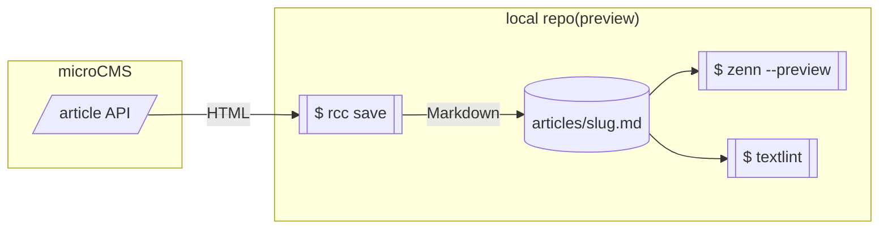
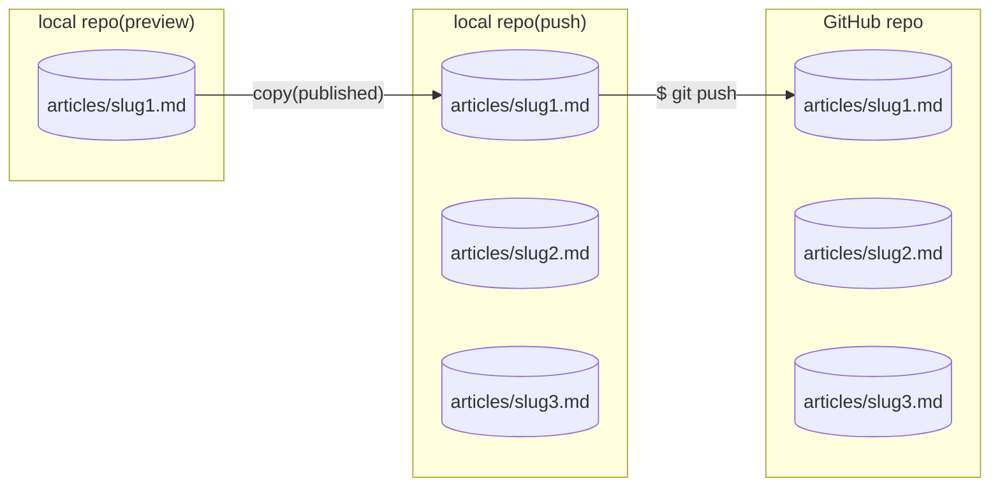
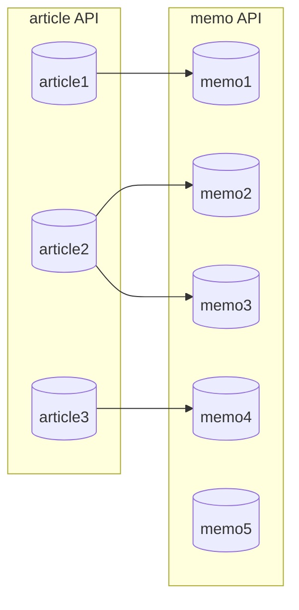
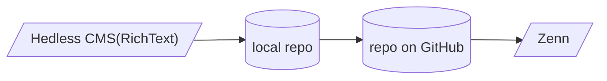

Zenn を使うにあたり、記事の作成を HeadlessCMS(今回は [microCMS](https://microcms.io/) を利用) + 自作のツール([remote-cms-content](https://github.com/hankei6km/remote-cms-content))で行うことにしました。

この記事はその検証も兼ねて作成したものです。

## 構成

まだテスト段階で手動による実行部分も多いので、簡単な構成のみ記述します。

### 編集とプレビュー

以下のように記事(article)用 API を作成しリッチエディタ記述、ある程度まとまったら保存用スクリプトを実行しローカルにダウンロードします(手動で実行)。

保存用スクリプトで利用している `rcc` コマンドはマッピング設定を用意することで、受信データを FrontMatter + Markdown へ変換する機能を持っています。

変換機能により Zenn 形式で保存されたファイルは [zenn-cli](https://zenn.dev/zenn/articles/install-zenn-cli) と [textlint](https://github.com/textlint/textlint) でプレビューとチェックが行えます(チェック結果の確認はスクリプトの出力を目視で行う)。



:::details スクリーンショットとマッピング設定。

*article API のスキーマ*

*リッチエディタでの編集*

*保存用スクリプトの実行例*

```yaml:マッピング設定
disableBaseFlds: true
passthruUnmapped: false
selectFldsToFetch: true
position:
  disable: true

media:
  image:
    library:
      - src: https://images.microcms-assets.io/assets/
        kind: imgix

flds:
  - fetchFld: title
    query: title
    dstName: title
    fldType: string

  - fetchFld: content
    query: content
    dstName: content
    fldType: html
    convert: markdown
    toMarkdownOpts:
      imageSalt:
        command: rebuild
        baseURL: https://images.microcms-assets.io/assets/
        rebuild:
          keepBaseURL: true
          baseAttrs: 'data-salt-qm="auto=compress,format"'
      unusualSpaceChars: throw

  - fetchFld: emoji
    query: emoji
    dstName: emoji
    fldType: string

  - fetchFld: type
    query: type
    dstName: type
    fldType: string

  - fetchFld: topics
    query: '[topics.topic]'
    dstName: topics
    fldType: object

  - fetchFld: published
    query: published
    dstName: published
    fldType: boolean
```

:::

### Zenn へのデプロイ

保存用スクリプトは「`published` が `true` でなおかつ textlint をパスチェックしたファイル」を GitHub へプッシュするためのリポジトリへコピーします。

コピーされたファイルが問題なさそうであれば [GitHub CLI](https://cli.github.com/) で GitHub のリポジトリを更新します(ここも目視で確認、手動で実行)。



### メモ機能

記事とは別にメモ用の API を作成することで、参考にしたページなどをメモしておくことができます。

また、メモは参照フィールドを使うことで記事からリンクさせることもできます(項目を自由に増やしたりリンクできるのは Headless CMS ならではかと)。



:::details スクリーンショット。

*memo API のスキーマ*

*記事からメモへのリンク*

:::

## 実際に記述してみたもの

「Zenn の Markdown 記法」を上記構成で記述したサンプルです。

基本的にはリッチエディタの HTML 出力を [`rehype-remark`](https://github.com/rehypejs/rehype-remark) で変換し、リッチエディタで表現できない部分はコードブロックを独自記法で拡張すること等により対応しています。

@[card](https://hankei6km.github.io/mardock/deck/using-rich-editor-as-markdown-editor)

### 画像

リッチエディタの通常の UI 操作で挿入し、サイズ変更や `alt` とリンクを設定できます。

Markdown に比べると煩雑なように思えますが、エスケープなどはエディター側が処理してくれるので(気分的には)楽に感じます。


### 画像(imgix)

microCMS の画像はバックエンドが [imgix](https://imgix.com/) なので[クエリーパラメーター](https://docs.imgix.com/apis/rendering)で加工もできます。

ただし、通常の UI では行えないので、[rehype-image-salt](https://hankei6km.github.io/rehype-image-salt-doc/) の[記法で設定](https://hankei6km.github.io/rehype-image-salt-doc/writing)します(この辺は remote-cms-content による Markdown 変換時に処理されます)。


:::message

各画像には以下のパラメーターがデフォルトで付与されています。

*   CMS によるサイズ関連のパラメーター(上記 UI による指定)
*   rehype-image-salt による [`auto=compress,fromat`](https://docs.imgix.com/apis/rendering/auto/auto)

:::

### 画像(Zenn)

Zenn 独自の記法ではキャプション風の表示は以下の方法で対応できます。

*   画像の直後にイタリックでテキスト入力する
*   rehype-image-salt の [`data-salt-zenn-cap`](https://hankei6km.github.io/rehype-image-salt-doc/writing#data-salt-zenn-cap) を利用する

ただし、厳密には[正規の指定](https://zenn.dev/zenn/articles/markdown-guide#%E3%82%AD%E3%83%A3%E3%83%97%E3%82%B7%E3%83%A7%E3%83%B3%E3%82%92%E3%81%A4%E3%81%91%E3%82%8B)と若干異なる表記になるので(本来は画像の下に記述すべき)、将来的に使えなくなる可能性はあります。

> 画像のすぐ下の行に`*`で挟んだテキストを配置すると、キャプションのような見た目で表示されます。

また、横幅の指定は対応できていません。


*Zenn の Caption 風表示*

### コードブロック

コードブロックで言語やファイル名を指定する場合は拡張されたコードブロック内でコードブロックを記述する必要があります(ややこしいですが、慣れるとあまり気になりません)。

なお、リッチエディタでは書式なし(いわゆるプレーンテキスト)で連続する空白文字をコードブロックへペーストすると No-Break Space になってしまいます。

テキストエディターからペーストするとき気になる場合は対策が必要です(remote-cms-content では「警告を出す」「変換する」ことで対応しています)。

また、(コードブロックに限った話ではないですが) `&` のエスケープ処理が独特なので `＆gt;` などを記述することが難しいです(ここではいわゆる全角で `&` を記述することで回避しています)。

参考: [micoCMS のメモとサンプル - & のエスケープ](https://hankei6km.github.io/test-collage-cms-content/microcms-plain#h0722d3ceb0)


```js:fooBar.js
const great = () => {
  console.log("Awesome")
}
```

### 引用

リッチエディタの通常の UI で指定できます。ただしペーストするときの書式の有無、改行や空白の扱いなどに注意は必要です。


> 引用文。 引用文。

### 注釈

注釈は`[]` がエスケープされてしまうので、下線を利用する機能を追加しました。

1.  `^` 付きの文字を下線ありにすると [footnoteReference](https://github.com/syntax-tree/mdast#footnotedefinition) へ変換(`[]` は記述しない)

2.  それ以外の下線ありの文字列は [footnote](https://github.com/syntax-tree/mdast#footnote)(インライン注釈)へ変換(`^[]` は記述しない)

    *   インライン注釈内では Markdown で記述可能(リンクなどを設定できる)。


脚注の例[^1]です。インライン^[脚注の内容その 2]で書くこともできます。

[^1]: 脚注の内容その 1。

### テーブル

拡張されたコードブロック内で記述できます。


| Head | Head | Head |
| ---- | ---- | ---- |
| Text | Text | Text |
| Text | Text | Text |

### メッセージとアコーディオン(トグル)

`:::` はそのまま記述できるので、Markdown へ変換後に改行されるようにすれば記述できます。


:::message

メッセージをここに。**装飾**なども指定可能。

:::

:::details タイトル。

表示したい内容。**装飾**なども指定可能。

:::

### 数式

これも `$$` をそのまま記述できるので、とくに変わったことはしなくても記述できます。

ただし、(KaTex の記法にうといので影響度は不明ですが)Markdown 的な記法があるとリッチエディタの機能で変換される可能性はあります。


$$

e^{i\theta} = \cos\theta + i\sin\theta

$$

インラインの場合 $a\ne0$ も記述できます。

### コンテンツの埋め込み

[`remark-gfm`](https://github.com/remarkjs/remark-gfm) の autolink とリッチエディタの変換が効いてしまうので、拡張されたコードブロック内で `@[card](URL)` 等の記法を使う必要があります。


@[card](https://zenn.dev/zenn/articles/markdown-guide)

### ダイアグラム

拡張されたコードブロック内で記述できます。




## モバイル対応

記事はデスクトップでないと厳しい面も多いのですが、「メモは思いついたときにちゃちゃっと入力したい」というのがあったのでわりと重視した項目です。

以下のスクリーンショットはジョギング中に思いついたこをメモしたものです。

:::details スクリーンショット。


:::

ジョギング中にいつもリッチエディタでメモをとっているので慣れもありますが、簡単なメモならそれなりに入力できます。

ちなみに、各種 Headless CMS サービスの中から microCMS を選択した理由の 1 つがこれです。

「レスポンシブ対応」「スマートフォンでも RichText 系フィールドへの日本語入力が安定している」サービスとなると、現状では選択肢が限られます。

## 各種 Headless CMS 対応

今回は microCMS を利用してますが、remote-cms-content が対応しているサービスであれば同じように構成できます。

たとえば、[GraphCMS](https://graphcms.com/) では以下のような GraphQL のクエリーとマッピング設定を用意することで対応できます(実は当初 GraphCMS で試していた)。

:::details 参考設定(内容的にはちょっと古いです)。

```graphql:クエリー
query GetContent($stage:Stage!, $endCursor: String, $pageSize: Int) {
  articlesConnection(stage:$stage, after:$endCursor, first:$pageSize){
    edges{
      node{
        id
        slug
        title
        content {
          html
        }
        emoji
        type
        topics
        published
      }
    }
    pageInfo{
      hasNextPage
      endCursor
    }
  }
}
```

```yaml:マッピング設定
disableBaseFlds: true
passthruUnmapped: false
position:
  disable: true

transform: data.articlesConnection.{"items":[edges.node],"pageInfo":pageInfo}

flds:
  - query: slug
    dstName: id
    fldType: id

  - query: title
    dstName: title
    fldType: string

  - query: content.html
    dstName: content
    fldType: html
    convert: markdown
    toMarkdownOpts:
      imageSalt:
        command: "rebuild"
        baseURL: https://media.graphcms.com/
        rebuild:
          keepBaseURL: true

  - query: emoji
    dstName: emoji
    fldType: string

  - query: type
    dstName: type
    fldType: string

  - query: topics
    dstName: topics
    fldType: object

  - query: published
    dstName: published
    fldType: boolean
```

:::

各サービスの機能は異なるので全く同じにはできませんが、逆にいえばサービス別の設定を用意しておき「記事の特性にあわせて利用するサービスを切り替える」ということもできます。

## Markdown 系フィールドは？

サービスによっては Markdown 入力に特化したフィールドが用意されています。

Contentful であれば「(デスクトップ環境で)日本語入力が普通に利用できる」「フルスクリーンにできる」「コードブロックも記述できる」など利点も多いです。

また、今回の利用方法であれば「GitHub の変更も取り込みやすい」という点も見逃せません。

しかし、([個人的な好み](https://hankei6km.github.io/mardock/deck/using-rich-editor-as-markdown-editor)もありますが)以下の点で RichText 系フィールドを利用しています。

*   Markdown フィールドへアセット(画像) を挿入すると参照関係にならない

「記事のエントリー」と「アセット(画像)」が参照関係にならないことには 2 つのデメリットがあります。

*   アセット(画像)の変更が Markdown フィールドに反映されない
*   アセット(画像)を利用しているエントリーを把握できない

写真などを主に扱う場合は影響が少ないのですが(画像 API で加工できることが多い)、スクリーンショットなどを扱う種類のテキストでは画像を入れ替えることも多いので操作性へ影響してきます。

以上のことから現状では Markdown 系フィールドの利用を見送っています。

## 本の作成

記事の作成とは直接の関係はないのでさわりだけ。

「設定」と「チャプター」のモデル(API) を作成し参照関係を構成することで本の作成([CLI 管理形式での保存](https://zenn.dev/zenn/articles/zenn-cli-guide#cli-%E3%81%A7%E6%9C%AC%EF%BC%88book%EF%BC%89%E3%82%92%E7%AE%A1%E7%90%86%E3%81%99%E3%82%8B))もできます。

:::details スクリーンショット。

*本の設定からチャプターを参照*

*本のプレビュー*

:::

## 検討事項

いくつか記事を作成してみたところ良い感じではあるのですが、やはり検討すべき項目もあります。

### プレビューとチェック

現在の構成では「リッチエディタ」「ターミナル」「プレビュー」用の画面を行ったり来たりするのでどうにかしたいところです。

一番よさそうなのは、[draftlint](https://github.com/hankei6km/draftlint) のときのように「リッチエディタの画面プレビューボタンをクリックするとチェック結果付きのプレビューが表示される」なのですが、ちょっと大変そうかなと。

@[card](https://github.com/hankei6km/draftlint)

### publish の自動化

これもローカル側での手動部分が多いので、CMS 側から直接 GitHub Actions を起動して自動化する方がよいのかなと。

ただ、感覚的な問題なのですが、自動化(ブラックボックス化)しすぎてしまうのも味気ないかなというのもあって少し考え中です。

### CMS と Zenn の publish

現在はスキーマ内に Zenn 用の publish フィールドを定義しています。

本来なら CMS の publish にあわせてるべきですが、各 CMS でプレビューの扱いが異なるのでこれも対応方法を考え中です。

### メモ

#### プレビューアプリ

メモの中で mermaid によるダイアグラムを書きたくなることがあり、そうなるとメモにもプレビュー的な表示が欲しくなってきます。

#### Scraps との使い分け

[Zenn Scraps](https://zenn.dev/zenn/articles/about-zenn-scraps) を少し使ってみたとろ「メモはこれでもいいかな」と少しぐらついてしまっている。

#### 情報が分散してしまう

普段は howm([qfix-howm](https://sites.google.com/site/fudist/Home/qfixhowm))でメモをとっているので情報が分散してしまいます。

これについては、howm の中に `zenn` ディレクトリーを作ってダウンロードしてしまおうかと考えています。

どちらも Markdown なので、1 箇所にまとめてしまえば検索などは違和感なく使えるかなと。

### プルリクエスト

以下の記事を参考にしてリポジトリの名前を変更しているときに「現状の構成だとプルリクエストなどをいただいても Headless CMS 側へ反映させる方法がない」ということに気が付きました。

@[card](https://zenn.dev/j5c8k6m8/articles/zenn-github-repository-name)

### 編集履歴

各 CMS の無料プランでは履歴管理はだいたいが対象外なのですが、今回はローカル側のリポジトリにダウンロードするのでそちら対応できないか考え中です。

### Vim キー配列

mermaid の記述をするときなどにテキストオブジェクトが使えないのはやはりきびしいなと。

ブラウザー拡張などで解決しそうですが、拡張はあまり入れたくないのでおとなしく普通に編集しています。

### emoji

これが意外とめんどうで「ランダムな emoji をどうやって取得する？」「バリデーションで emoji を 1 文字ってどう指定する？」等々。

現状は「zenn-cli で作成した article のファイルからコピペ」することで対応しています。

## おわりに

以上のような感じで「記事と関連メモを手軽に編集できる環境」ができあがりました。

いくつか検討事項もありますが、しばらくはこの構成で記事を作成していこうかと。
